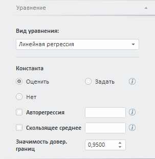

# Настройка параметров уравнения (веб-приложение)

Настройка параметров уравнения (веб-приложение)
-

# Настройка параметров уравнения

Для настройки параметров уравнения используйте вкладки на боковой панели.
 Набор вкладок зависит от вида уравнения.

Для выбора вида уравнения:

	- Убедитесь, что боковая панель отображается.

	- Выберите моделируемую переменную или одну из связей уравнения.

	- Перейдите на вкладку «Уравнение»
	 и задайте базовые параметры уравнения. Набор параметров на вкладке
	 зависит от вида уравнения. Например:

Для получения подсказки о назначении параметра
 нажмите на кнопку ,
 расположенную рядом с ним. Будет отображена всплывающая подсказка. Например:

[Доступные
 виды уравнений](javascript:TextPopup(this))

		- Регрессионные модели:

			- [линейная
			 регрессия](../SidePanel/Models/UiModelling_w_eq_LinearRegr.htm). Используется по умолчанию;

			- [нелинейная
			 регрессия](../SidePanel/Models/UiModelling_w_eq_NonLinearRegr.htm);

			- [ARIMA](../SidePanel/Models/UiModelling_w_eq_ARIMA.htm);

			- [модель коррекции
			 ошибок](../SidePanel/Models/w_eq_ECM.htm);

		- Методы сглаживания:

			- [тренд](../SidePanel/Models/UiModelling_w_eq_CurveEst.htm);

			- [фильтр
			 Ходрика-Прескотта](../SidePanel/Models/UiModelling_w_eq_Hpf.htm);

			- [фильтр
			 Бакстера-Кинга](../SidePanel/Models/UiModelling_w_eq_Bpf.htm);

			- [X11](../SidePanel/Models/w_eq_X11.htm).
			 Метод X11 поддерживается только в ОС Windows;

			- [экспоненциальное
			 сглаживание](../SidePanel/Models/UiModelling_w_eq_ExpSmooth.htm);

		- Методы преобразований:

			- [интерполяция](../SidePanel/Models/w_eq_Interpolation.htm);

			- [коллапс](../SidePanel/Models/w_eq_Collapse.htm);

		- [Детерминированное
		 уравнение](../SidePanel/Models/UiModelling_w_eq_Determ.htm);

		- Методы R:

			- [линейная
			 регрессия](../SidePanel/Models/UiModelling_w_eq_LinearRegr.htm);

			- [нелинейная
			 регрессия](../SidePanel/Models/UiModelling_w_eq_NonLinearRegr.htm);

			- [фильтр
			 Ходрика-Прескотта](../SidePanel/Models/UiModelling_w_eq_Hpf.htm);

			- [фильтр
			 Бакстера-Кинга](../SidePanel/Models/UiModelling_w_eq_Bpf.htm);

			- [экспоненциальное
			 сглаживание](../SidePanel/Models/UiModelling_w_eq_ExpSmooth.htm);

			- [ARIMA](../SidePanel/Models/UiModelling_w_eq_ARIMA.htm);

			- [пользовательский
			 код](../SidePanel/Models/User_code.htm).

	Настройка методов R совпадает с настройкой одноименных методов инструмента
	 «Моделирование и прогнозирование».

	Подробная информация об особенностях работы методов R приведена
	 в разделе: «[Какие
	 методы в «Форсайт. Аналитическая платформа»
	 можно рассчитать с помощью R?](uinav.chm::/FAQ/Use_of_R.htm)».

	Примечание.
	 Методы R доступны, если настроена интеграция «Форсайт. Аналитическая платформа»
	 и R. Подробнее см. раздел: «[Как
	 настроить интеграцию с R?](../../FAQ/R_Integration.htm)».

После выбора вида уравнения будут отображены дополнительные вкладки
 для настройки уравнения. Для работы с большинством уравнений используйте
 следующие вкладки на боковой панели:

	- [Периоды
	 расчета](../SidePanel/UiModelling_w_pp_CalcPeriod.htm). Предназначена для редактирования периодов расчета уравнения;

	- [Преобразования](../SidePanel/UiModelling_w_pp_Transformations.htm).
	 Предназначена для настройки преобразования данных моделируемой переменной;

	- [Обработка
	 пропусков](../SidePanel/UiModelling_w_pp_MissingData.htm). Предназначена для выбора метода обработки пропусков,
	 применяемого для расчета отсутствующих значений в переменных.

См. также:

[Работа с уравнениями](Web_Equation_Work.htm)

		Справочная
		 система на версию 10.9
		 от 18/08/2025,
		 © ООО «ФОРСАЙТ»,
