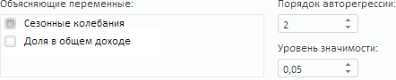
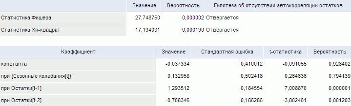

# Тест Бреуша-Годфри (LM-тест)

Тест Бреуша-Годфри (LM-тест)
-

# Тест Бреуша-Годфри (LM-тест)

Тест проверяет остатки модели линейной регрессии на автокорреляцию.

[Для выполнения
 теста](javascript:TextPopup(this))

		- Убедитесь, что [панель
		 результатов](../../UiModelling_w_ResultPanel.htm) отображается;

		- Выделите моделируемую переменную или одну из связей уравнения
		 [линейной
		 регрессии](../../SidePanel/Models/UiModelling_w_eq_LinearRegr.htm) в [области
		 представления данных](../../UiModeling_w_ViewArea.htm);

		- Перейдите на вкладку «Диагностические
		 тесты» в [панели
		 результатов](../../UiModelling_w_ResultPanel.htm);

		- Выполните команду «Тест
		 Бреуша-Годфри (LM-тест)» в меню переключателя «Тесты
		 на автокорреляцию».

Параметры теста:

	- Объясняющие переменные.
	 Факторы, которые воздействуют на поведение моделируемой переменной.
	 По умолчанию в списке содержатся все факторы тестируемой модели линейной
	 регрессии. Флажок фактора - признак его участия в тесте. По умолчанию
	 все факторы участвуют в тестировании. Для исключения фактора из теста
	 снимите флажок. Число объясняющих переменных, должно быть не менее
	 одного;

	- Порядок авторегрессии.
	 Значение порядка авторегрессии для тестируемой модели линейной регрессии;

	- Уровень значимости.
	 Значение уровня значимости, при котором гипотеза отвергается.

Результаты выводятся в виде таблицы, содержащей:

	- [статистику
	 Фишера](Lib.chm::/05_Statistics/UiModelling_Fisher.htm);

	- [статистику
	 Хи-квадрат](Lib.chm::/05_Statistics/UiModelling_ChiTest.htm);

Для каждой статистики приведено: значение,
 вероятность статистики и результат теста: принимается или отвергается
 гипотеза об отсутствии автокорреляции остатков;

	- коэффициенты модели.
	 Коэффициенты регрессии, рассчитанные при отмеченных факторах (включая
	 члены авторегрессии).

Примечание.
 Если параметры теста заданы неверно, то таблица результатов не отображается.
 На её месте будет выведено сообщение об ошибке.

Пример таблицы результатов:

См. также:

[Выполнение диагностических
 тестов](../../ResultsPanel/w_rp_diagnostics_tst.htm)

		Справочная
		 система на версию 10.9
		 от 18/08/2025,
		 © ООО «ФОРСАЙТ»,
