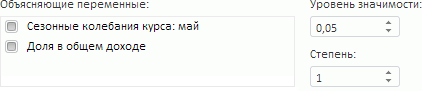
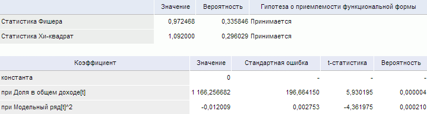

# RESET-тест Рамсея

RESET-тест Рамсея
-

# RESET-тест Рамсея

RESET-тест Рамсея - это обобщенный тест на наличие следующих ошибок спецификации модели линейной регрессии:

-
наличие пропущенных переменных. Регрессия содержит не все объясняющие переменные;

-
неверная функциональная форма. Некоторые или все переменные должны быть преобразованы с помощью логарифмической, степенной, обратной или какой-либо другой функции;

-
корреляция между фактором Х и случайной составляющей модели, которая может быть вызвана ошибками измерения факторов, рассмотрением систем уравнений или другими причинами.

Ошибки такого рода приводят к смещению среднего остатков регрессионной модели.

[Для выполнения теста](javascript:TextPopup(this))

-
Убедитесь, что [панель результатов](../../UiModelling_w_ResultPanel.htm) отображается;

-
Выделите моделируемую переменную или одну из связей уравнения [линейной регрессии](../../SidePanel/Models/UiModelling_w_eq_LinearRegr.htm) в [области представления данных](../../UiModeling_w_ViewArea.htm);

-
Перейдите на вкладку «Диагностические тесты» в [панели результатов](../../UiModelling_w_ResultPanel.htm);

-
Выполните команду «RESET-тест Рамсея» в меню переключателя «Структурные изменения и функциональная форма».

Параметры теста:

-
Объясняющие переменные. Факторы, которые воздействуют на поведение моделируемой переменной. По умолчанию в списке содержатся все факторы тестируемой модели линейной регрессии. Флажок фактора - признак его участия в тесте. По умолчанию все факторы участвуют в тестировании. Для исключения фактора из теста снимите флажок. Число объясняющих переменных, должно быть не менее одного;

-
Уровень значимости. Значение уровня значимости, при котором гипотеза отвергается;

-
Степень. Количество дополнительных регрессоров, входящих в тестовую регрессию.

Результаты представлены в виде таблицы, содержащей:

-
[статистику Фишера](Lib.chm::/05_Statistics/UiModelling_Fisher.htm);

-
[статистику Хи-квадрат](Lib.chm::/05_Statistics/UiModelling_ChiTest.htm);

Для каждой статистики приведено: значение, вероятность статистики и результат теста: принимается или отвергается гипотеза о приемлемости функциональной формы;

-
коэффициенты. Коэффициенты регрессии, рассчитанные при отмеченных факторах и дополнительных регрессорах.

Примечание. Если параметры теста заданы неверно, то таблица результатов не отображается. На её месте будет выведено сообщение об ошибке.

Пример таблицы результатов:

См. также:

[Выполнение диагностических тестов](../../ResultsPanel/w_rp_diagnostics_tst.htm)

		Справочная
		 система на версию 10.9
		 от 18/08/2025,
		 © ООО «ФОРСАЙТ»,
