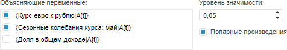
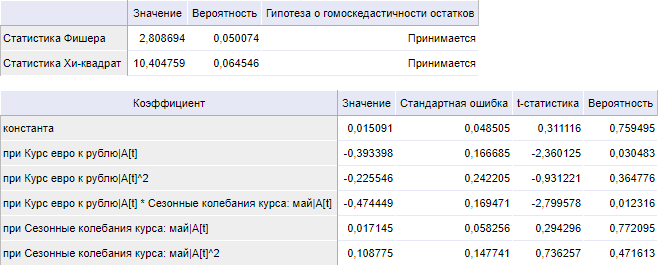

# Тест Уайта

Тест Уайта
-

# Тест Уайта

Тест проверяет гетероскедастичность остатков модели линейной регрессии.

[Для выполнения
 теста](javascript:TextPopup(this))

		- Убедитесь, что [панель
		 результатов](../../UiModelling_w_ResultPanel.htm) отображается.

		- Выделите моделируемую переменную или одну из связей уравнения
		 [линейной
		 регрессии](../../SidePanel/Models/UiModelling_w_eq_LinearRegr.htm) в [области
		 представления данных](../../UiModeling_w_ViewArea.htm).

		- Перейдите на вкладку «Диагностические
		 тесты» в [панели
		 результатов](../../UiModelling_w_ResultPanel.htm).

		- Выполните команду «Тест
		 Уайта» в меню переключателя «Тесты
		 на гетероскедастичность».

Параметры теста:

	- Объясняющие переменные.
	 Факторы, которые воздействуют на поведение моделируемой переменной.
	 По умолчанию в списке содержатся все факторы тестируемой модели линейной
	 регрессии. Флажок фактора - признак его участия в тесте. По умолчанию
	 все факторы участвуют в тестировании. Для исключения фактора из теста
	 снимите флажок. Число объясняющих переменных, должно быть не менее
	 одного;

	- Попарные
	 произведения. Установка флажка позволяет использовать не только
	 имеющиеся объясняющие ряды, но и их попарные произведения. Например,
	 рассматривается два ряда S1
	 и S2. При использовании попарных
	 произведений дополнительно рассматриваются регрессоры: S1*S1,
	 S1*S2, S2*S2.
	 Не рекомендуется включать попарные произведения, если количество объясняющих
	 переменных (регрессоров) велико.

	- Уровень значимости.
	 Значение уровня значимости, при котором гипотеза отвергается.

Результаты выводятся в виде таблицы, содержащей:

	- [статистику
	 Фишера](Lib.chm::/05_Statistics/UiModelling_Fisher.htm);

	- [статистику
	 Хи-квадрат](Lib.chm::/05_Statistics/UiModelling_ChiTest.htm);

Для каждой статистики приведено: значение,
 вероятность статистики и результат теста: принимается или отвергается
 гипотеза о гомоскедастичности остатков;

	- коэффициенты модели.
	 Коэффициенты регрессии, рассчитанные при отмеченных факторах (включая
	 попарные произведения, если они используются).

Примечание.
 Если параметры теста заданы неверно, то таблица результатов не отображается.
 На её месте будет выведено сообщение об ошибке.

Пример таблицы результатов:

См. также:

[Выполнение диагностических
 тестов](../../ResultsPanel/w_rp_diagnostics_tst.htm)

		Справочная
		 система на версию 10.9
		 от 18/08/2025,
		 © ООО «ФОРСАЙТ»,
