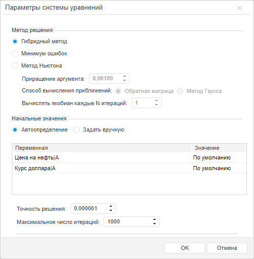

# Работа с системой уравнений (веб-приложение)

Работа с системой уравнений (веб-приложение)
-

# Работа с системой уравнений

Система уравнений позволяет объединить расчет нескольких уравнений в
 модели. В систему уравнений могут входить следующие виды уравнений:

	- [Нелинейная
	 регрессия](../SidePanel/Models/UiModelling_w_eq_NonLinearRegr.htm);

	- [Линейная
	 регрессия](../SidePanel/Models/UiModelling_w_eq_LinearRegr.htm);

	- [Детерминированное
	 уравнение](../SidePanel/Models/UiModelling_w_eq_Determ.htm);

	- [Модель коррекции
	 ошибок](../SidePanel/Models/w_eq_ECM.htm).

Вид системы уравнений в рабочей области:

Операции с системой уравнений:

[Создание
 системы уравнений](javascript:TextPopup(this))

		- Нажмите кнопку  «Порядок расчета» на вкладке
		 ленты «Расчет». Отобразится
		 диалог «[Порядок
		 расчета](Calculation_Order.htm)».

		- Нажмите кнопку «Добавить».

		- В открывшемся меню выполните команду «Система
		 уравнений». Пустая система будет добавлена после выделенного
		 элемента.

		- Перетащите требуемые уравнения в систему.

	Выбранные уравнения будут объединены в систему уравнений.

	Примечание.
	 При изменении вида уравнений, входящих в систему, учитывайте особенности,
	 описанные в разделе «[Изменение
	 вида уравнения](Web_Equation_Work.htm#change_type_equations)».

[Удаление
 системы уравнений](javascript:TextPopup(this))

		- Нажмите кнопку  «Порядок расчета» на вкладке
		 ленты «Расчет». Отобразится
		 диалог «[Порядок
		 расчета](Calculation_Order.htm)».

		- С помощью перетаскивания извлеките из системы все уравнения.

		- Выделите систему уравнений.

		- Нажмите кнопку «Удалить».

	Система уравнения будет удалена из модели.

## Настройка параметров системы уравнений

Для настройки параметров системы уравнений используйте диалог «Параметры системы уравнений».

[Для отображения
 диалога](javascript:TextPopup(this))

		- Нажмите кнопку  «Порядок расчета» на вкладке
		 ленты «Расчет». Отобразится
		 диалог «[Порядок
		 расчета](Calculation_Order.htm)».

		- Выберите систему уравнений.

		- Нажмите кнопку «Параметры
		 системы уравнений».

Задайте следующие параметры системы уравнений:

[Метод
 решения](javascript:TextPopup(this))

	Выберите метод решения системы уравнений:

		- Гибридный метод.
		 Для решения исходной системы используется модификация гибридного
		 алгоритма, реализованного в библиотеке математических методов
		 MINPACK-1;

		- Минимум ошибок.
		 Решается задача нахождения минимума функции с N
		 числом переменных;

		- Метод Ньютона. Решение
		 исходной системы находится путем итераций с нахождением частных
		 производных. Требуется задать дополнительные [параметры](#newton_parameters)
		 метода.

[Параметры
 метода Ньютона](javascript:TextPopup(this))

	Если для решения системы уравнений выбран метод Ньютона, то задайте
	 его параметры:

		- Приращение аргумента.
		 Укажите процент приращения аргумента при расчете частных производных.
		 Значение по умолчанию: «0,00100%». Минимально допустимое значение:
		 «0,00001%»;

		- Способ вычисления приближений.
		 Укажите способ вычисления следующего приближения для решения линеаризованной
		 системы уравнений. Данная система должна быть вычислена при решении
		 системы нелинейных уравнений методом Ньютона. Доступны следующие
		 способы:

			- Обратная матрица.
			 Следующее приближение вычисляется с помощью обратной матрицы.
			 Полученное решение будет более надежным;

			- Метод Гаусса.
			 Следующее приближение вычисляется методом Гаусса, состоящем
			 в постепенном понижении порядка системы и исключении неизвестных.
			 Решение будет найдено более быстро;

		- Вычислять якобиан каждые
		 N операций. Определяет частоту
		 вычисления якобиана при решении системы нелинейных уравнений.
		 Значение по умолчанию - единица, т.е. якобиан вычисляется
		 при каждой итерации. Чем больше значение данного свойства, тем
		 реже будет вычисляться якобиан и тем выше будет скорость решения
		 системы уравнений.

[Начальные
 значения](javascript:TextPopup(this))

	Задайте начальные значения искомых переменных. В группе «Начальные
	 значения» расположены переключатели, определяющие режим задания
	 начальных значений и таблица, отображающая начальные значения.

	Доступные режимы:

		- Автоопределение.
		 Используется по умолчанию. Начальные значения определяются автоматически.
		 В качестве начального значения искомой переменной принимается
		 последняя точка идентификационного периода;

		- Задать вручную.
		 Начальные значения определяются пользователем путем ввода значений
		 в таблице.

[Точность
 решения](javascript:TextPopup(this))

	В поле «Точность решения»
	 укажите точность решения системы уравнений. Значение по умолчанию:
	 «0,000001».

[Максимальное
 число итераций](javascript:TextPopup(this))

	В поле «Максимальное число итераций»
	 укажите максимальное число итераций для решения системы уравнений.
	 Значение по умолчанию: «1000».

См. также:

[Работа
 в веб-приложении](UiModelling_w_work.htm) | [Методы
 решения системы нелинейных уравнений](Lib.chm::/04_Other_models/UiModelling_LonLinearEq_method.htm) | [Метод
 Гаусса](Lib.chm::/04_Other_models/UiModelling_GaussMethod.htm)

		Справочная
		 система на версию 10.9
		 от 18/08/2025,
		 © ООО «ФОРСАЙТ»,
