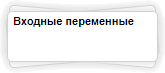
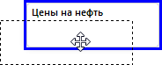
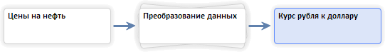
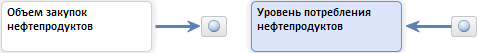

# Иерархическое структурирование модели (веб-приложение)

Иерархическое структурирование модели (веб-приложение)
-

# Иерархическое структурирование модели

Иерархическое структурирование позволяет объединить модели и их элементы
 в иерархическую структуру. Глубина создаваемой иерархии не ограничена.

Для создания иерархической структуры применяются папки. Например:

[Для создания
 папки](javascript:TextPopup(this))

		- С помощью ленты инструментов:

			- [Выделите объекты](UiModelling_w_work.htm#select),
			 которые требуется объединить в папку.

			- Нажмите кнопку  «Объединить в папку» на вкладке
			 «Главная» ленты инструментов.

		- С помощью перетаскивания:

			- Наведите указатель мыши на один из объектов, которые
			 требуется объединить в папку. Указатель должен принять следующий
			 вид четырехнаправленной стрелки.

			- Зажмите кнопку мыши и переместите указатель мыши на
			 второй объединяемый объект. Если объединение в папку возможно,
			 то объект будет подсвечен:

	

			- Отпустите кнопку мыши.

	Выбранные объекты будут объединены в папку. Папка добавлена в рабочую
	 область. Наименование папки будет переведено в режим редактирования.
	 Введите наименование папки и нажмите клавишу ENTER или щёлкните по свободному пространству рабочей области.

	Будет создана папка с указанным наименованием.

[Для перемещения
 объекта между папками](javascript:TextPopup(this))

		- С помощью ленты инструментов:

			- Выделите перемещаемый объект.

			- Нажмите кнопку  «Переместить в» на вкладке
			 «Главная» ленты инструментов.
			 Будет отображена полная иерархия модели.

			- Выберите папку, в которую требуется переместить объект.

		- С помощью перетаскивания:

			- Наведите указатель объект, который требуется переместить
			 в папку. Указатель должен принять следующий вид четырехнаправленной
			 стрелки.

			- Зажмите кнопку мыши и переместите указатель мыши на
			 требуемую папку. Если перемещение возможно, то папка будет
			 подсвечена.

			- Отпустите кнопку мыши.

	Выбранный объект будет перемещен в указанную папку.

## Навигация по иерархии

После создания папки структура связей между объектами остается прежней.
 Если объект в папке связан с объектом вне папки, то отображаются:

	- входящие связи. Связь
	 между объектом, находящимся на одном уровне иерархии с папкой и объектом,
	 находящимся в папке. Например:

Для перехода в папку:

		- выделите папку. Над ней будет отображена кнопка . Нажмите её;

		- дважды щёлкните по выбранной папке.

На схеме будет отображено содержимое папки;

	- исходящие связи. Связь
	 между объектом, находящимся в папке и объектом, находящимся на более
	 высоком уровне иерархии. Например:

Объект, расположенный на более высоком уровне
 иерархии отображается в виде кнопки.

Для определения типа объекта, с которым установлена
 связь предназначены их пиктограммы:

		-  - [переменная](UiModelling_w_Varable.htm),
		 [уравнение](Web_Equation_Work.htm);

		- 
		 - [визуализатор
		 данных](UiModelling_w_Varable.htm#show_variable_data);

		-  - [целевая
		 функция](OptimalControl/CriterionFunct.htm);

		-  - [ограничение
		 целевой функции](OptimalControl/OptimalControl_setup.htm);

		-  - [целевая
		 задача](OptimalControl/OptimalControl_calc.htm).

Для получения информации об объекте наведите
 указатель мыши на кнопку, соответствующую объекту. Будет отображена всплывающая
 подсказка с наименованием объекта.

Для просмотра параметров объекта щелкните
 по кнопке, которая ему соответствует. На боковой панели и [панели
 результатов](../UiModelling_w_ResultPanel.htm) будут отображены вкладки, предназначенные для настройки
 параметров объекта и просмотра его характеристик.

Для перехода к объекту, расположенному на
 более высоком уровне иерархии дважды щелкните по кнопке, которая ему соответствует.
 На схеме будет отображен уровень иерархии, содержащий данный объект. Объект
 будет выделен.

Для навигации по иерархии также предназначена панель, расположенная
 в верхней части рабочей области. Панель содержит кнопки и цепочку навигации,
 например:

Цепочка навигации начинается с кнопки  и формируется
 из наименований папок, которые находятся на более высоком уровне иерархии,
 чем объекты в текущей папке. Наименование текущей папки отображается последним
 в цепочке. Если пользователь находится в корне иерархии, то отображается
 только кнопка .

Основные операции, выполняемые с помощью данной панели:

	- отмена перехода на другой уровень
	 иерархии. Нажмите кнопку ;

	- повтор последнего отмененного
	 перехода на другой уровень иерархии. Нажмите кнопку ;

	- переход к одному из уровней
	 иерархии, посещенных ранее. Нажмите кнопку .
	 Будет отображен список посещенных ранее уровней иерархии. Выберите
	 требуемый уровень;

	- переход на более высокий уровень
	 иерархии. Нажмите кнопку ;

	- переход в корневой уровень
	 иерархии. Нажмите кнопку ;

	- переход к папке, содержащейся
	 в цепочке навигации. Щелкните по названию папки в цепочке навигации.

	- выбор папки для перехода из
	 цепочки навигации. Щелкните по кнопке ,
	 расположенной рядом с наименованием вкладки в цепочке навигации. Будет
	 отображен список папок, в которые можно перейти. Выберите требуемую
	 папку.

См. также:

[Работа с моделью](Web_Model_Work.htm)

		Справочная
		 система на версию 10.9
		 от 18/08/2025,
		 © ООО «ФОРСАЙТ»,
