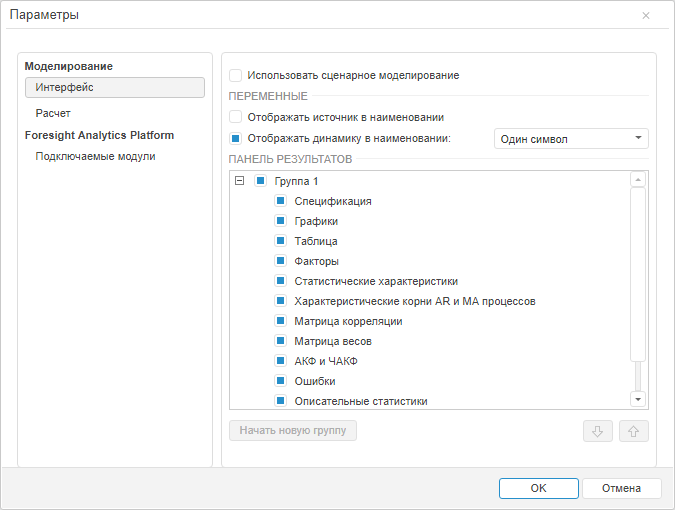

# Настройка параметров моделирования и прогнозирования в веб-приложении

Настройка параметров моделирования и прогнозирования в веб-приложении
-

# Настройка параметров моделирования и прогнозирования

Для настройки параметров инструмента «Моделирование
 и прогнозирование» и общих параметров продукта «Форсайт. Аналитическая платформа»
 используйте диалог «Параметры».

Для открытия диалога «Параметры»
 выполните команду «Сервис > Параметры»
 в главном меню. Команда доступна, если в рабочей области открыта какая-либо
 [модель](Web_Model_Work.htm).

Доступны следующие группы настроек:

[Настройки моделирования
 и прогнозирования](javascript:TextPopup(this))

	Используйте группу вкладок «Моделирование».
	 Задайте настройки на следующих вкладках:

		- Интерфейс.
		 Задайте параметры [сценарного
		 моделирования](UiModelling_w_Scenario.htm), параметры формирования [наименований
		 переменных](UiModelling_w_Varable.htm#var_names) и набор вкладок, отображающихся на [панели
		 результатов](../UiModelling_w_ResultPanel.htm#chng_tab_set);

		- Расчет. Задайте
		 параметры расчета. Если при расчете [описательных
		 статистик](Varables/Var_DescrStat.htm) и [диагностических
		 тестов](../ResultsPanel/w_rp_diagnostics_tst.htm) требуется использовать методы R, то установите флажок
		 «Использовать R при расчете описательных
		 статистик».

	Примечание.
	 Использование R доступно, если в «Форсайт. Аналитическая платформа»
	 подключен пакет R. Подробнее см. раздел: «[Как
	 настроить интеграцию с R?](../../FAQ/R_Integration.htm)».

[Настройки
 платформы](javascript:TextPopup(this))

	На вкладке «[Подключаемые модули](UiNav.Chm::/02_Navigator/CommonSettings/Integration.htm)»
	 задайте программные модули, расширяющие возможности продукта «Форсайт. Аналитическая платформа».

См. также:

[Работа в веб-приложении](UiModelling_w_work.htm)

		Справочная
		 система на версию 10.9
		 от 18/08/2025,
		 © ООО «ФОРСАЙТ»,
