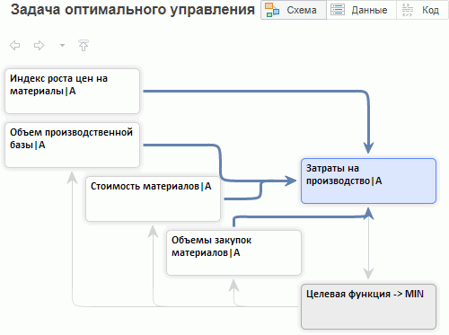

# Работа с целевой функцией (веб-приложение)

Работа с целевой функцией (веб-приложение)
-

# Работа с целевой функцией

Целевая функция - это функция, связывающая целевую переменную с управляющими
 переменными в задаче оптимизации. Задача оптимизации - это задача нахождения
 максимума или минимума целевой функции.

Примечание.
 Целевая функция рассчитывается только в [сценарном
 моделировании](../UiModelling_w_Scenario.htm). Если используется одновариантное моделирование, то
 при создании целевой функции сценарное моделирование будет включено автоматически.

Для создания целевой функции:

	- Выберите моделируемую переменную, которая должна быть оптимизирована.

	- Нажмите кнопку  «Целевая
	 функция» на вкладке ленты инструментов «Главная».

	- Будет отображен диалог:

Задайте следующие параметры целевой функции:

	-

		- Наименование. Укажите
		 наименование целевой функции. В дальнейшем изменение наименования
		 доступно на вкладке «[Основные](OptimalControl_Primary.htm)»
		 на боковой панели;

		- Динамика. Выберите
		 динамику для расчета целевой функции. Если в выражении целевой
		 функции присутствуют факторы с различной динамикой, то корректный
		 расчёт невозможен. Для исключения факторов с динамикой, отличной
		 от динамики целевой функции, установите флажок «Исключить
		 факторы с другой динамикой»;

		- Сценарий. Укажите
		 сценарий для расчёта целевой функции:

		-

			- Существующий.
			 Расчёт выполняется по существующему сценарию. Выберите необходимый
			 сценарий из раскрывающегося списка. Для создания копии существующего
			 сценария установите флажок «Создать
			 копию» и задайте наименование для копии сценария;

			- Создать новый.
			 Расчёт выполняется по новому сценарию. Укажите наименование
			 создаваемого сценария.

В рабочую область будет добавлена целевая функция для выбранной переменной.
 После создания целевой функции выполните:

	- Настройку целевой функции, состоящую
	 из следующих этапов:

		- [Настройка выражения
		 целевой функции](Optimal_control_funct.htm).

		- [Настройка параметров
		 расчета целевой функции](OptimalControl_Primary.htm).

		- [Настройка ограничений
		 и траектории целевой функции](OptimalControl_setup.htm).

	- [Настройку
	 управляющих переменных](OptimalControl_vars.htm).

	- [Настройку
	 сценариев для расчета целевой функции](../UiModelling_w_Scenario.htm#critfunc_scenario).

	- [Рассчитайте
	 целевую функцию](OptimalControl_calc.htm).

Пример целевой функции:

См. также:

[Работа
 с уравнениями](../Web_Equation_Work.htm)

		Справочная
		 система на версию 10.9
		 от 18/08/2025,
		 © ООО «ФОРСАЙТ»,
