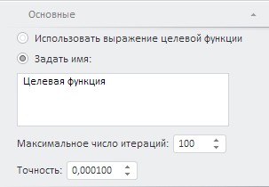

# Настройка параметров расчета и наименования целевой функции

Настройка параметров расчета и наименования целевой функции
-

# Настройка параметров расчета и наименования целевой функции

Для настройки параметров расчета и наименования целевой функции используйте
 вкладку «Основные» на боковой
 панели.

[Для отображения
 вкладки](javascript:TextPopup(this))

		- Убедитесь, что боковая панель
		 отображается.

		- Выберите целевую функцию.

		- На боковой панели установите переключатель «Целевая
		 функция».

		- Перейдите на вкладку «Основные»
		 на боковой панели.

Задайте следующие параметры:

[Режим формирования
 наименования целевой функции](javascript:TextPopup(this))

	Для использования выражения целевой функции в качестве её наименования
	 установите переключатель «Использовать
	 выражение целевой функции».

	Для ручного формирования наименования целевой функции установите
	 переключатель «Задать имя»
	 и введите наименование целевой функции в соответствующем поле.

[Максимальное
 число итераций для расчета целевой функции](javascript:TextPopup(this))

	Для установки максимального числа итераций, выполняемых для расчета
	 целевой функции используйте поле «Максимальное
	 число операций». Чем больше число итераций, тем больше времени
	 потребуется для расчета целевой функции.

[Точность расчета
 целевой функции](javascript:TextPopup(this))

	Для настройки точности расчета целевой функции используйте поле
	 «Точность».

См. также:

[Настройка целевой функции](OptimalControl_setup.htm)

		Справочная
		 система на версию 10.9
		 от 18/08/2025,
		 © ООО «ФОРСАЙТ»,
