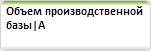
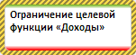

# Расчет целевой функции (веб-приложение)

Расчет целевой функции (веб-приложение)
-

# Расчет целевой функции

Для расчёта [целевой функции](CriterionFunct.htm) нажмите
 кнопку  «Рассчитать»
 на вкладке ленты «Целевая функция».
 По умолчанию выполняется расчет задачи оптимального управления.

Для выбора типа расчета нажмите нижнюю часть кнопки  «Рассчитать» на вкладке ленты «Расчет». Будет отображено меню,
 в котором выберите тип расчета:

	- задача прогнозирования.
	 Уравнения модели рассчитываются последовательно в каждой точке сценария:
	 сначала рассчитываются все уравнения по первой точке сценария, затем
	 происходит расчет всех уравнений по второй точке сценария и т.д.;

	- задача оптимального управления.
	 Доступна, если задана [целевая функция](CriterionFunct.htm).
	 Состоит в отыскании таких значений управляющих переменных, при которых
	 будет выполнено условие оптимизации значения целевой функции;

	- целевая задача. Доступна,
	 если для [целевой функции](CriterionFunct.htm) задана [траектория](OptimalControl_setup.htm#trajectory). Состоит
	 в отыскании таких значений управляющих переменных, при которых значение
	 целевой функции будет максимально соответствовать заданной траектории.

Результаты расчёта будут отображены на панели результатов и в рабочей
 области на представлении «[Схема](../../UiModeling_w_ViewArea.htm#scheme)».

Если ограничение сверху/снизу для управляющей переменной или целевой
 функции не было достигнуто, то оно отображается зелеными полосками сверху/снизу
 соответственно:

Таким образом, ограничение управляющей переменной или целевой функции
 в коррекции не нуждается.

Если ограничение сверху/снизу для управляющей переменной или целевой
 функции было превышено, то оно отображается красными полосками сверху/снизу
 соответственно:

Таким образом, требуется [коррекция](Restriction_setup.htm)
 или [ослабление ограничения](Restriction_setup.htm#weaken_restriction)
 управляющей переменной или целевой функции.

Если для [целевой функции](CriterionFunct.htm) задана [траектория](OptimalControl_setup.htm#trajectory) и ограничение
 сверху/снизу, которое было ослаблено, но всё равно превышено, то оно отображается
 ярко красными полосками сверху/снизу соответственно:

Таким образом, требуется [коррекция](Restriction_setup.htm)
 ограничения целевой функции.

## Получение отчёта по результатам целевой функции

Для получения отчёта по результатам расчета целевой функции:

	- Выделите целевую функцию в рабочей области.

	- Рассчитайте целевую функцию.

	- Нажмите кнопку  «Отчет» на вкладке ленты «Целевая
	 функция» или выполните команду «Отчет
	 сравнения сценариев» в раскрывающемся меню кнопки 
	 «Отчет» на вкладке ленты «Расчет».

В новом окне будет открыт экспресс-отчет, содержащий результирующие
 данные переменных, участвующих в расчёте.

См. также:

[Работа с целевой функцией](CriterionFunct.htm)

		Справочная
		 система на версию 10.9
		 от 18/08/2025,
		 © ООО «ФОРСАЙТ»,
