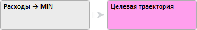

# Настройка ограничения и траектории целевой функции

Настройка ограничения и траектории целевой функции
-

# Настройка ограничения и траектории целевой функции

После настройки [выражения](Optimal_control_funct.htm) и
 [параметров расчета](OptimalControl_Primary.htm) целевой функции
 выполните настройку ограничения и траектории целевой функции.

## Настройка ограничений целевой функции

Для того чтобы решение целевой функции находилось в определенном интервале
 значений задайте ограничения целевой функции.

Для создания ограничений целевой функции:

	- Выделите целевую функцию в рабочей области.

	- Нажмите кнопку «Добавить ограничение»
	 
	 на вкладке «Целевая функция»
	 ленты инструментов. В рабочую область будет добавлено ограничение,
	 например:

По умолчанию наименование ограничения генерируется
 автоматически в формате «Ограничение
 N», где N - это порядковый
 номер ограничения. Переименование ограничения выполняется аналогично [переименованию
 переменной](../UiModelling_w_Varable.htm#rename_a_variable).

	- Задайте значение ограничения. Подробно см. раздел «[Настройка
	 ограничений](Restriction_setup.htm)».

	- Перейдите на вкладку «[Спецификация](../../ResultsPanel/UiModelling_w_rp_specification.htm)»
	 на панели результатов и настройте выражение ограничения. Настройка
	 выполняется аналогично [настройке
	 выражения целевой функции](Optimal_control_funct.htm).

Для целевой функции будут созданы ограничения.

Если для целевой функции задана траектория, то ограничения могут быть
 ослаблены. Подробно см. раздел «[Настройка
 ограничений](Restriction_setup.htm#weaken_restriction)».

## Настройка траектории целевой функции

Для указания желаемого решения целевой функции задайте траекторию целевой
 функции.

Примечание.
 Если целевая функция содержит траекторию, то будет рассчитываться целевая
 задача.

Для настройки траектории целевой функции:

	- Выделите целевую функцию в рабочей области;

	- Нажмите кнопку «Задать траекторию»
	 
	 на вкладке «Целевая функция»
	 ленты инструментов.

	- Будет отображен диалог «Новый
	 сценарий», в котором задайте наименование сценария для траектории
	 целевой функции. В рабочую область будет добавлен новый объект «Целевая траектория». Например:

	- Задайте значение целевой траектории на периоде прогнозирования:

		- перейдите на вкладку «[Графики](../../ResultsPanel/UiModelling_w_rp_chart.htm)»
		 на панели результатов и в [режиме
		 редактирования](../../ResultsPanel/UiModelling_w_rp_chart.htm#edit) нарисуйте на графике требуемую траекторию целевой
		 функции;

		- перейдите на вкладку «[Таблица](../../ResultsPanel/UiModelling_w_rp_table.htm)»
		 на панели результатов и введите в таблицу требуемые значения целевой
		 функции.

Для целевой функции будет задана траектория.

После создания траектории доступно ослабление ограничений и управляющих
 переменных. Подробно см. раздел «[Настройка
 ограничений](Restriction_setup.htm#weaken_restriction)».

См. также:

[Работа с целевой функцией](CriterionFunct.htm)

		Справочная
		 система на версию 10.9
		 от 18/08/2025,
		 © ООО «ФОРСАЙТ»,
