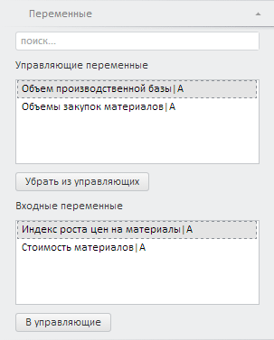

# Работа с управляющими переменными (веб-приложение)

Работа с управляющими переменными (веб-приложение)
-

# Работа с управляющими переменными

Все переменные целевой функции делятся на входные и управляющие.

Управляющие переменные - это переменные, значения которых могут изменяться
 в процессе поиска решения до тех пор, пока не будут выполнены ограничения,
 наложенные на управляющие переменные и целевую функцию, и не будет выполнено
 условие оптимизации целевой функции.

Входные переменные - это все переменные, которые участвуют в расчете
 целевой функции, но не являются управляющими переменными.

Для определения состава управляющих и входных переменных целевой функции
 используйте вкладку «Переменные»
 на боковой панели.

[Для отображения
 вкладки](javascript:TextPopup(this))

		- Убедитесь, что боковая панель
		 отображается.

		- Выберите целевую функцию в рабочей области.

		- На боковой панели установите переключатель «Целевая
		 функция».

		- Перейдите на вкладку «Переменные».

На вкладке отображаются списки управляющих и входных переменных целевой
 функции.

[Для
 настройки ограничений управляющей переменной](javascript:TextPopup(this))

		- Выделите управляющую переменную в рабочей области.

		- Задайте значение ограничения. Подробно см. раздел «[Настройка
		 ограничений](Restriction_setup.htm)».

	Для управляющей переменной будут созданы ограничения.

	Если для целевой функции задана [траектория](OptimalControl_setup.htm#trajectory),
	 то ограничения могут быть ослаблены. Подробно см. раздел «[Настройка
	 ограничений](Restriction_setup.htm#weaken_restriction)».

[Для
 преобразования управляющей переменной во входную](javascript:TextPopup(this))

		- Выделите управляющую переменную.

		- Нажмите кнопку «Убрать из
		 управляющих» или дважды щелкните по управляющей переменной.

	Выбранная управляющая переменная будет преобразована во входную
	 переменную. Если для управляющей переменной были заданы ограничения,
	 то они будут потеряны.

[Для
 преобразования входной переменной в управляющую](javascript:TextPopup(this))

		- Выделите входную переменную.

		- Нажмите кнопку «В управляющие»
		 или дважды щелкните по входной переменной.

	Выбранная входная переменная будет преобразована в управляющую переменную.

[Для
 поиска переменной](javascript:TextPopup(this))

	Введите наименование искомой переменной в строке поиска. В списке
	 переменных останутся лишь переменные, соответствующие условиям поиска.

	Примечание.
	 Поиск является регистрозависимым.

См. также:

[Работа с целевой функцией](CriterionFunct.htm)

		Справочная
		 система на версию 10.9
		 от 18/08/2025,
		 © ООО «ФОРСАЙТ»,
