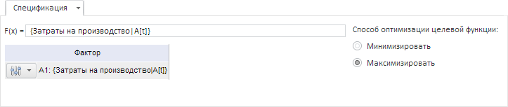
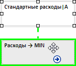

# Настройка выражения целевой функции

Настройка выражения целевой функции
-

# Настройка выражения целевой функции

Для настройки выражения целевой функции используйте вкладку «Спецификация»
 на панели результатов.

[Для отображения
 вкладки](javascript:TextPopup(this))

		- Убедитесь, что [панель
		 результатов](../../UiModelling_w_ResultPanel.htm) отображается.

		- Выберите целевую функцию в рабочей области.

		- Перейдите на вкладку «Спецификация»
		 на панели результатов.

Для формирования выражения целевой функции используйте поле «F(x)».
 Выражение может содержать знаки арифметических операций, круглые скобки
 и факторы.

Операции с целевой функцией:

[Выбор способа
 оптимизации целевой функции](javascript:TextPopup(this))

	Для задания способа оптимизации целевой функции используйте параметр
	 «Способ оптимизации целевой функции».
	 Для решения задачи:

		- минимизации целевой функции установите переключатель «Минимизировать»;

		- максимизации целевой функции установите переключатель «Максимизировать».

[Добавление фактора
 в выражение целевой функции](javascript:TextPopup(this))

		- В рабочей области наведите курсор мыши на переменную, которую
		 требуется добавить в качестве фактора. Указатель должен принять
		 следующий вид: .

		- Зажмите кнопку мыши и переместите курсор на целевую функцию.
		 Если фактор может быть добавлен в выражение, то целевая функция
		 подсвечивается, а связь отображается в виде пунктирной линии:

	

		- Отпустите кнопку мыши.

	Фактор будет добавлен в выражение целевой функции.

[Выполнение дополнительных
 операций с факторами](javascript:TextPopup(this))

	Дополнительно с фактором могут быть произведены различные операции:
	 настройка лага фактора, настройка преобразования данных фактора и
	 прочие.

	Для [выполнения дополнительных
	 операций](../Varables/Var_Fast_Transform.htm) с факторами, входящими в выражение целевой функции, используйте
	 кнопку . Кнопка расположена
	 слева от наименования фактора.

[Удаление фактора
 из выражения целевой функции](javascript:TextPopup(this))

		- Выделите связь, соединяющую фактор и целевую функцию.

		- Нажмите клавишу DELETE или нажмите кнопку «Удалить»
		  на вкладке ленты «Главная».

	Фактор будет удален из выражения целевой функции.

См. также:

[Настройка целевой функции](OptimalControl_setup.htm)

		Справочная
		 система на версию 10.9
		 от 18/08/2025,
		 © ООО «ФОРСАЙТ»,
