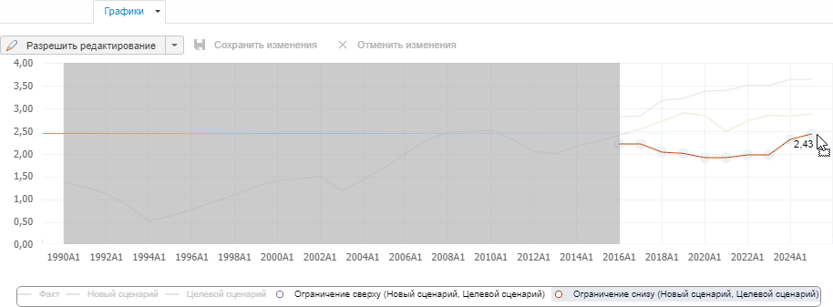
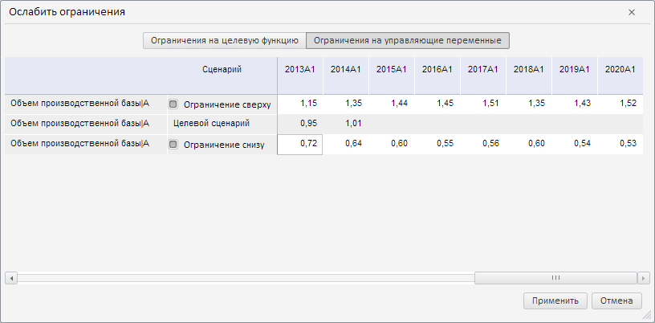

# Настройка ограничений

Настройка ограничений
-

# Настройка ограничений

При работе с целевой функцией ограничения могут быть наложены как на
 саму [целевую функцию](OptimalControl_setup.htm#func_restriction),
 так и на [управляющую
 переменную](OptimalControl_vars.htm#var_restriction). Ограничения позволяют указать интервал, в котором должны
 находится значения целевой функции и управляющих переменных.

## Ввод значений ограничений

Значения ограничений задаются только на периоде прогнозирования.

Для ввода значений ограничений:

	- Убедитесь, что панель результатов отображается.

	- Выделите в рабочей области ограничение целевой функции/управляющую
	 переменную.

	- Перейдите на вкладку «[Графики](../../ResultsPanel/UiModelling_w_rp_chart.htm)»
	 на панели результатов.

	- Убедитесь, что на вкладке «[Графики](../../ResultsPanel/UiModelling_w_rp_chart.htm)»
	 [разрешено
	 редактирование рисованием](../../ResultsPanel/UiModelling_w_rp_chart.htm#edit) и отображается легенда.

	- Задайте значение ограничения снизу:

		- Выделите в легенде элемент с названием «Ограничение
		 снизу (<название сценария>)». На графике будет подсвечен
		 период прогнозирования, доступный для ввода значений ограничения.

		- Наведите указатель на график в периоде прогнозирования.
		 Период, доступный для редактирования будет подсвечен.

		- Зажмите кнопку мыши и перемещайте указатель вправо
		 вдоль оси категорий. Текущее значение точки ограничения будет
		 отображаться рядом с ней. Например:

		- После ввода значений ограничения на всем периоде прогнозирования
		 отпустите кнопку мыши.

	- Повторите предыдущий шаг для ограничения сверху. Используйте
	 элемент легенды «Ограничение снизу
	 (<название сценария)».

	- Сохраните значения ограничений. Нажмите кнопку  «Сохранить изменения».

Для целевой функции/управляющей переменной будут созданы ограничения.
 Для переменной ограничение сверху и снизу отображается серыми полосками
 сверху и снизу соответственно:

Совет. Для ввода
 значений ограничений также может использоваться вкладка «[Таблица](../../ResultsPanel/UiModelling_w_rp_table.htm)»
 на панели результатов. Введите нужные значения по сценариям «Ограничение
 сверку» и «Ограничение снизу».

## Ослабление ограничений

Если для целевой функции задана [траектория](OptimalControl_setup.htm#trajectory),
 то доступно ослабление ограничений. Ослабление позволяет найти оптимальное
 значение целевой функции.

Для ослабления ограничений используйте диалог «Ослабить
 ограничения».

[Для отображения
 диалога](javascript:TextPopup(this))

		- Выделите целевую функцию в рабочей области.

		- Нажмите кнопку «Ослабить
		 ограничение»  на вкладке ленты «Целевая функция». Будет отображен
		 диалог «Ослабить ограничения».

В диалоге отображаются все ограничения, заданные для целевой функции
 и управляющих переменных.

Для отображения ограничений целевой функции установите переключатель
 «Ограничения на целевую функцию»,
 для отображения ограничений управляющих переменных - переключатель «Ограничения на управляющие переменные».

Для ослабления ограничения сверху или снизу снимите соответствующий
 флажок в столбце «Сценарий».

Для изменения значений ограничений введите требуемые значения в таблицу.

Совет. Для ослабления
 ограничений также может использоваться вкладка «[Таблица](../../ResultsPanel/UiModelling_w_rp_table.htm)»
 на панели результатов. Работа с ограничениями на вкладке «Таблица»
 аналогична работе с ограничениями в диалоге «Ослабить
 ограничения».

См. также:

[Расчет целевой функции](OptimalControl_calc.htm)

		Справочная
		 система на версию 10.9
		 от 18/08/2025,
		 © ООО «ФОРСАЙТ»,
