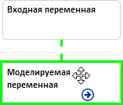
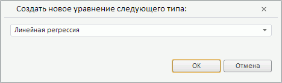

# Быстрое создание уравнения (веб-приложение)

Быстрое создание уравнения (веб-приложение)
-

# Быстрое создание уравнения

Для быстрого создания уравнения:

	- Выберите входную и моделируемую переменные.

	- Наведите указатель мыши на центр входной переменной. Указатель
	 должен принять следующий вид: .

	- Зажмите кнопку мыши и переместите указатель к моделируемой
	 переменной. Если связь может быть установлена, то переменная подсвечивается,
	 а связь отображается в виде пунктирной линии:

	- Отпустите кнопку мыши. Отобразится диалог выбора метода расчета
	 уравнения. Набор доступных методов зависит от параметров входной и
	 моделируемой переменных:

По умолчанию предлагается создать уравнение
 линейной регрессии.

После выбора метода устанавливается связь
 между переменными и создаётся уравнение. Цвет связи и цвет фона моделируемой
 переменной меняются:

Для быстрого создания последующих уравнений можно использовать способ,
 описанный выше, или следующий способ:

	- Выделите входную переменную.

	- Нажмите кнопку  «Связь» вкладки «Главная»
	 ленты инструментов. Будет отображен список последних переменных, с
	 которыми устанавливалась связь.

	- Выберите моделируемую переменную, с которой требуется создать
	 связь.

Уравнение будет создано. Тип уравнения будет совпадать с типом уравнения,
 используемого для выбранной моделируемой переменной.

См. также:

[Создание уравнения](Varables/Create_Equation.htm)
 | [Расширенное создание уравнения](Advanced_creation_equation.htm)

		Справочная
		 система на версию 10.9
		 от 18/08/2025,
		 © ООО «ФОРСАЙТ»,
