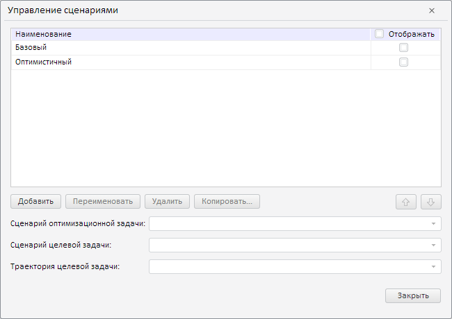
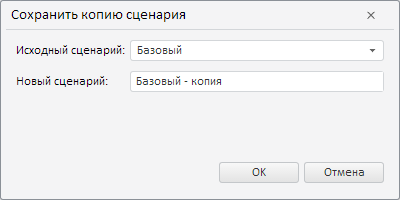
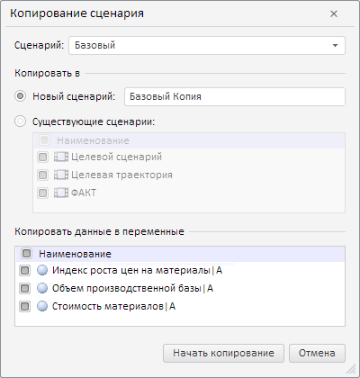
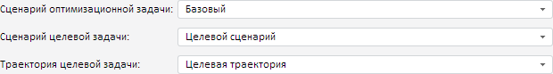

# Работа со сценариями моделирования (веб-приложение)

Работа со сценариями моделирования (веб-приложение)
-

# Работа со сценариями моделирования

Сценарий моделирования - объект, предназначенный для создания в моделируемой
 переменной ряда, в который будут выгружены данные после окончания расчета.

В инструменте «Моделирование и прогнозирование»
 доступно несколько режимов для работы со сценариями:

	- одновариантное моделирование. Рассматривается
	 единственный вариант развития модели;

	- сценарное моделирование.
	 Рассматривается несколько альтернативных вариантов развития модели.
	 Является одним из наиболее эффективных инструментов стратегического
	 анализа. Для получения результатов расчета задачи на весь период прогнозирования
	 по всем выходным переменным и по определенному сценарию учитывайте
	 [особенности
	 сценарного моделирования](../../2_Container_of_Modeling/2_3_Work_object/2_3_4_Problem/uimodelling_problem_3.htm#scenario_specific).

Для переключения между режимами используйте флажок «Использовать
 сценарное моделирование» на вкладке «Интерфейс»
 в диалоге «[Параметры](Modelling_setup.htm)»:

	- флажок снят. Значение
	 по умолчанию. Используется одновариантное моделирование по сценарию
	 «Факт».

	- флажок установлен. Используется
	 сценарное моделирование. По умолчанию в контейнере моделирования присутствует
	 только сценарий «Факт». Для
	 добавления и работы со сценариями используйте диалог «Управление
	 сценариями».

Примечание.
 Если флажок «Использовать сценарное моделирование»
 недоступен, то в модели присутствует [целевая
 функция](OptimalControl/CriterionFunct.htm), которая всегда рассчитывается с помощью сценарного моделирования.

## Управление сценариями

Для работы со сценариями моделирования используйте диалог «Управление
 сценариями».

[Для открытия
 диалога](javascript:TextPopup(this))

	Убедитесь, что установлен флажок «Использовать
	 сценарное моделирование» на вкладке «Интерфейс»
	 в диалоге «[Параметры](Modelling_setup.htm)».
	 Затем:

		- нажмите кнопку  «Управление сценариями» на вкладке
		 ленты «Главная»;

		- нажмите кнопку «Управление
		 сценариями» в раскрывающемся списке «Сценарии»
		 на вкладке ленты «Расчет».

Диалог содержит все сценарии моделирования, созданные пользователем.
 Если сценарий отмечен флажком, то он доступен при расчете модели. Например:

[Создание
 сценария](javascript:TextPopup(this))

	Для создания сценария моделирования:

		- Нажмите кнопку «Добавить».
		 Отобразится поле для ввода наименования сценария.

		- Задайте наименование сценария.

		- Нажмите клавишу ENTER или щелкните по пустому пространству
		 в диалоге.

	Новый сценарий будет добавлен в конец списка.

[Использование
 сценария в расчете](javascript:TextPopup(this))

	Для включения сценария в расчет модели установите флажок, соответствующий
	 сценарию, в столбце «Отображать».

	Для включения всех сценариев в расчет модели установите флажок «Отображать».

	Сценарии, отмеченные флажками, отображаются в списке «Сценарии»
	 на вкладке ленты «Расчет».

[Переименование
 сценария](javascript:TextPopup(this))

	Для переименования выделенного сценария:

		- Нажмите кнопку «Переименовать»
		 или дважды щелкните по сценарию. Наименование сценария будет переведено
		 в режим редактирования.

		- Измените наименование сценария.

		- Нажмите клавишу ENTER или щелкните по пустому пространству
		 в диалоге.

[Копирование
 сценария](javascript:TextPopup(this))

	Доступны следующие способы копирования сценариев:

		- стандартный. Нажмите
		 кнопку  «Сохранить
		 копию сценария» на вкладке «Расчет»
		 на ленте инструментов. Отобразится диалог:

	

	Выберите копируемый сценарий в поле «Исходный сценарий». Задайте наименование
	 копии сценария в поле «Новый сценарий»;

		- расширенный. Копирование
		 доступно только для сценариев, используемых в расчете.

	Для создания копии выделенного сценария
	 нажмите кнопку «Копировать»
	 в диалоге «Управление сценариями».
	 Отобразится диалог:

	

	Задайте параметры копирования:

			- Сценарий.
			 Укажите копируемый сценарий. В списке содержатся все сценарии,
			 используемые в расчете модели;

			- Копировать в.
			 Укажите, куда требуется скопировать сценарий:

				- Новый сценарий.
				 Укажите наименование нового сценария. По умолчанию наименование
				 формируется по схеме: <Наименование
				 копируемого сценария> Копия;

				- Существующий сценарий.
				 В списке содержатся все сценарии, используемые в расчете
				 задачи моделирования. Отметьте флажками сценарии, в которые
				 будут скопированы данные исходного сценария. По умолчанию
				 отмечены все сценарии. Для снятия/установки отметки всех
				 сценариев снимите/установите флажок «Наименование»;

			- Копировать данные в
			 переменные. В списке содержатся все переменные, используемые
			 в задаче моделирования. Отметьте флажками переменные, данные
			 которых будут скопированы в новый сценарий. По умолчанию отмечены
			 все сценарии. Для снятия/установки отметки всех сценариев
			 снимите/установите флажок «Наименование».

	Созданная копия сценария включается в расчет модели автоматически.

[Удаление
 сценария](javascript:TextPopup(this))

	Для удаления сценария:

		- Выделите сценарий.

		- Нажмите кнопку «Удалить».

	Примечание.
	 Удаление сценария недоступно, если он участвует в расчете модели.
	 Для исключения сценария из расчета снимите соответствующий ему флажок
	 в столбце «Отображать».

[Изменение
 порядка сценариев](javascript:TextPopup(this))

	Для изменения порядка сценария в списке используйте кнопки  «Вверх»
	 и  «Вниз».

[Работа
 со сценариями целевой функции](javascript:TextPopup(this))

	Если в модели присутствует [целевая
	 функция](OptimalControl/CriterionFunct.htm), то в диалоге «Управление
	 сценариями» становятся доступны дополнительные параметры для
	 выбора сценариев расчета целевой функции:

	

	Задайте соответствующие сценарии. Выбранные сценарии станут недоступны
	 в диалоге «Управление сценариями».

	Примечание.
	 Сценарий целевой задачи и траектория целевой задачи доступны, если
	 для целевой функции задана [траектория](OptimalControl/OptimalControl_setup.htm#trajectory).

См. также:

[Работа
 в веб-приложении](UiModelling_w_work.htm) | Боковая панель

		Справочная
		 система на версию 10.9
		 от 18/08/2025,
		 © ООО «ФОРСАЙТ»,
