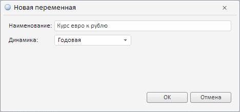
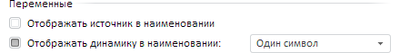
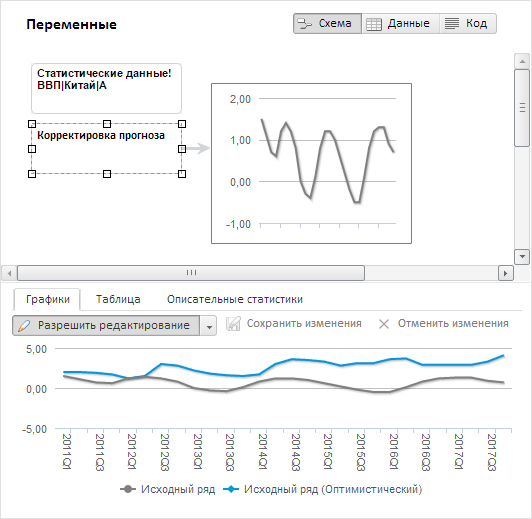

# Работа с переменными (веб-приложение)

Работа с переменными (веб-приложение)
-

# Работа с переменными

Переменные служат для получения исходных данных и выгрузки результатов
 выполнения расчёта.

Для работы с переменными включите представление «[Схема](../UiModeling_w_ViewArea.htm#scheme)» в области
 представления данных.

[Создание
 переменной](javascript:TextPopup(this))

	Для создания переменной:

		- дважды щелкните по области представления данных;

		- нажмите кнопку  «Переменная» на вкладке ленты
		 «Главная».

	Отобразится окно создания переменной, в котором задайте наименование
	 и укажите календарную динамику создаваемой переменной:

	

	Переменная будет добавлена в область представления данных.

[Добавление
 переменной из источника данных](javascript:TextPopup(this))

	Для добавления переменной из источника данных:

		- Включите отображение [дерева
		 рядов](../SeriesTree_web.htm).

		- Выберите источник данных. Доступные ряды отобразятся в дереве.

		- Перетащите ряд из дерева рядов в область представления данных.

[Открытие
 переменной](javascript:TextPopup(this))

	Для открытия переменной с определенным ключом:

		- Откройте браузер.

		- В адресной строке укажите адрес инструмента «Моделирование
		 и прогнозирование» в веб-приложении. Адрес модуля формируется
		 в виде: <адрес веб-приложения>/model.html.

		Например: http://biserver/FP_App_v10.x/app/model.html,
		 где «http://biserver/FP_App_v10.x/app» - это адрес
		 веб-приложения.

		- Добавьте в адрес специальный параметр «key»
		 и укажите ключ [модели](Web_Model_Work.htm). Затем
		 добавьте специальный параметр «entry»
		 и укажите ключ переменной. Формат адреса: <адрес
		 инструмента>#key=<ключ модели>&entry=<ключ переменной>.
		 Если требуется открыть несколько переменных, то укажите их ключи
		 через запятую.

		Например: http://biserver/FP_App_v10.x/app/model.html#key=11111&entry=12345,67890,
		 где «11111» - это ключ модели, а «12345» и «67890» - это ключи
		 открываемых переменных.

		- Перейдите по сформированному адресу.

	Модель, содержащая переменные, будет отображена в рабочей области.
	 Открываемая переменная будет выделена.

	Если модель или переменная с указанным ключом не найдены, то будет
	 отображено соответствующее сообщение. Поиск модели и переменных выполняется
	 в репозитории, заданном в файле [PP.xml](Setup.chm::/UiWebSetup/03_Setup_Web/PP_config_Java.htm)
	 для используемого веб-приложения.

[Просмотр
 параметров переменной](javascript:TextPopup(this))

	Для просмотра параметров переменной используйте вкладку «[Основные](Varables/Var_params.htm)» на боковой панели.

[Редактирование
 данных переменной](javascript:TextPopup(this))

	Редактирование данных может выполняться на следующих вкладках [панели результатов](../UiModelling_w_ResultPanel.htm):

		- [Таблица](../ResultsPanel/UiModelling_w_rp_table.htm).
		 Введите требуемые значения в таблицу данных;

		- [Графики](../ResultsPanel/UiModelling_w_rp_chart.htm).
		 Порядок редактирования:

		-

			- Разрешите редактирование
			 данных. Переведите кнопку  «Разрешить редактирование»
			 в нажатое состояние.

			- Выберите режим редактирования
			 и измените данные. Для выбора режима используйте раскрывающееся
			 меню кнопки  «Разрешить редактирование»:

				- Редактирование
				 по точкам. Редактирование каждой точки переменной
				 выполняется по отдельности.

				Выберите мышью переменную в легенде или на диаграмме. На
				 графике будут выделены точки, доступные для редактирования.
				 Наведите указатель на точку переменной (курсор примет
				 вид двунаправленной стрелки), зажмите кнопку
				 мыши и переместите точку в новое положение. Текущее значение
				 точки отображается рядом с ней;

				- Редактирование
				 рисованием. Редактирование нескольких точек переменной
				 выполняется одним движением.

				Выберите мышью переменную в легенде. На графике будут выделены
				 точки, доступные для редактирования. Наведите указатель
				 на точку переменной (фон переменной по оси значений будет
				 подсвечен), зажмите кнопку мыши и переместите точку
				 в новое положение. Редактирование соседних точек можно
				 продолжить, не отпуская кнопки. Текущее значение редактируемой
				 точки отображается рядом с ней.

	После редактирования сохраните измененные данные. Если данные не
	 были сохранены и редактируемая переменная утратила фокус, то будет
	 предложено сохранить измененные данные.

[Сохранение
 данных переменной](javascript:TextPopup(this))

	Для сохранения измененных данных нажмите кнопку  «Сохранить изменения» на вкладке
	 «[Графики](../ResultsPanel/UiModelling_w_rp_chart.htm)»
	 или «[Таблица](../ResultsPanel/UiModelling_w_rp_table.htm)»
	 на [панели результатов](../UiModelling_w_ResultPanel.htm).

[Отмена
 изменений в данных переменной](javascript:TextPopup(this))

	Для отмены изменений в несохраненных данных нажмите кнопку  «Отменить изменения»
	 на вкладке «[Графики](../ResultsPanel/UiModelling_w_rp_chart.htm)»
	 или «[Таблица](../ResultsPanel/UiModelling_w_rp_table.htm)»
	 на [панели результатов](../UiModelling_w_ResultPanel.htm).

[Переименование
 переменной](javascript:TextPopup(this))

	Для переименования переменной:

		- используйте область представления данных:

		-

			- Дважды щелкните по переменной. Её наименование будет
			 переведено в режим редактирования.

			- Измените наименование. Нажмите ENTER или щёлкните
			 в свободной от объектов области представления данных;

		- используйте вкладку «[Основные](Varables/Var_params.htm)»
		 на боковой панели.

[Настройка
 параметров формирования наименования переменной](javascript:TextPopup(this))

	Для настройки параметров формирования наименования переменной используйте
	 группу «Переменные» в диалоге
	 «[Параметры](Modelling_setup.htm)».
	 Для открытия диалога выполните команду «Сервис > Параметры»
	 в главном меню. Команда доступна, если в рабочей области открыта какая-либо
	 [модель](Web_Model_Work.htm).

	

	Для отображения в наименовании переменной:

		- наименования источника
		 данных переменной. Установите флажок «Отображать
		 источник в наименовнии». Параметр актуален, если переменная
		 добавлена из [источника данных](#var_ds).

		Наименование источника данных добавляется в начало наименования
		 переменной и отделяется от него восклицательным знаком. Например:
		 «Социально-экономические показатели!Мир|ТУРИЗМ|Данные госкомстата»;

		- наименования календарной
		 динамики переменной. Установите флажок «Отображать
		 динамику в наименовании» и в раскрывающемся списке укажите
		 формат отображения календарной динамики:

			- Один
			 символ. В наименовании переменной отображается аббревиатура
			 календарной динамики:

				- A. Годовая;

				- S. Полугодовая;

				- Q. Квартальная;

				- M. Месячная;

				- D. Дневная;

			- Полное
			 наименование. В наименовании переменной отображается
			 полное наименование календарной динамики.

	Тип календарной динамики добавляется
	 в конце наименования переменной и отделяется от него вертикальной
	 чертой. Например: «Курс евро к рублю|A», «Курс доллара к евро|Квартальная».

	Для исключения из наименования переменной:

		- наименования источника
		 данных переменной. Снимите флажок «Отображать
		 источник в наименовнии»;

		- наименования календарной
		 динамики переменной. Снимите флажок «Отображать
		 календарную динамику в наименовании».

[Визуализация
 данных переменных](javascript:TextPopup(this))

	Для визуализации данных:

		- Выделите одну или несколько переменных в рабочей области.

		- Нажмите кнопку  «Диаграмма»
		 на вкладке ленты «Главная».

	Данные выделенных переменных будут отображены в виде диаграммы в
	 рабочей области. Например:

	

	Если используется [сценарное
	 моделирование](UiModelling_w_Scenario.htm), то диаграмма будет отображать данные по всем сценариям
	 переменной.

	Для визуализации дополнительной переменной на существующей диаграмме:

		- Выделите необходимую переменную в рабочей области.

		- Наведите курсор мыши на центр переменной. Указатель должен
		 принять следующий вид: .

		- Зажмите кнопку мыши и переместите курсор к существующей
		 диаграмме в рабочей области. Если связь может быть установлена,
		 то диаграмма подсвечивается, а связь отображается в виде жирной
		 пунктирной линии.

		- Отпустите кнопку мыши.

	Выбранная переменная будет добавлена в визуализацию.

	Для удаления диаграммы-визуализации выделите её в рабочей области,
	 затем:

		- нажмите клавишу DELETE;

		- нажмите кнопку  «Удалить» на вкладке ленты «Главная».

	Будет запрошено подтверждение выполняемого действия.

	Для удаления переменной из диаграммы-визуализации выделите связь
	 от переменной к диаграмме-визуализации, затем:

		- нажмите клавишу DELETE;

		- нажмите кнопку  «Удалить» на вкладке ленты «Главная».

	Будет запрошено подтверждение выполняемого действия. Если из диаграммы-визуализации
	 удаляется последняя переменная, то сама визуализация тоже будет удалена.

[Фильтрация
 данных переменных](javascript:TextPopup(this))

	Для фильтрации данных всех переменных, содержащихся в рабочей области,
	 используйте кнопку  «Фильтрация» на вкладке ленты инструментов
	 «Главная». В раскрывающемся
	 меню кнопки выберите режим фильтрации:

		- Скрыть все пустые столбцы.
		 Скрывает все пустые столбцы в таблице;

		- Скрыть все пустые столбцы
		 на границах. Скрывает все пустые столбцы в таблице только
		 справа и слева от временного ряда.

	Для выключения фильтрации переведите кнопку  «Фильтрация» в ненажатое состояние
	 или установите переключатель «Нет»
	 в раскрывающемся меню данной кнопки.

[Расчёт
 описательных статистик переменной](javascript:TextPopup(this))

Описательные статистики предоставляют широкий набор методов для анализа
 данных, позволяющих выявить зависимости между переменными, направление
 этой зависимости, а также рассчитать разного рода статистические характеристики.

Для расчета описательных статистик выделите одну или несколько переменных
 в области представления данных. Результаты расчёта отображаются на вкладке
 «[Описательные
 статистики](Varables/Var_DescrStat.htm)» на [панели
 результатов](../UiModelling_w_ResultPanel.htm).

[Расчёт
 корреляционной зависимости переменных](javascript:TextPopup(this))

	Для расчёта матрицы корреляции выделите несколько переменных в области
	 представления данных. Результаты расчёта отображаются на вкладке «[Матрица
	 корреляции](../ResultsPanel/UiModelling_w_rp_Correlation.htm)» на [панели
	 результатов](../UiModelling_w_ResultPanel.htm).

[Выполнение
 автокорреляционного анализа](javascript:TextPopup(this))

	Для выполнения [автокорреляционного
	 анализа](Lib.chm::/05_Statistics/UiModelling_Autocorrelation.htm) переменной и получения значений автокорреляционной
	 и частной автокорреляционной функций выберите:

		- переменную, не участвующую в расчёте
		 уравнения;

		- входную переменную уравнения,
		 в котором входная переменная не является моделируемой.

	Результаты анализа будут отображены на вкладке «АКФ
	 и ЧАКФ» на панели результатов.

[Выполнение
 дополнительных операций с переменными](javascript:TextPopup(this))

	[Дополнительные операции](Varables/Var_Fast_Transform.htm)
	 доступны при работе с переменными, входящими в [уравнение](Web_Equation_Work.htm)
	 или участвующими в [расчёте описательной
	 статистики](Varables/Var_DescrStat.htm).

	Дополнительными операциями являются:

		- задание лага переменной;

		- быстрое преобразование данных переменной;

		- создание копии переменной внутри уравнения/расчёта описательной
		 статистики;

		- удаление переменной из уравнения/расчёта описательных статистик;

	Если для переменной доступны дополнительные операции, то рядом с
	 ней отображается кнопка . Нажатие кнопки открывает
	 меню, содержащее команды для выполнения операций.

[Получение
 ключа переменной](javascript:TextPopup(this))

	Ключ переменной является уникальным и предназначен для однозначной
	 идентификации переменной в рамках контейнера моделирования.

	Для получения ключа переменной:

		- Откройте [модель](Web_Model_Work.htm), содержащую
		 переменную.

		- Выделите переменную. Для получения ключей нескольких переменных
		 выделите несколько переменных.

		- Перейдите в адресную строку браузера.

	Ключ переменной отображается в адресе веб-приложения после специального
	 параметра «entry». Если выделено
	 несколько переменных, то их ключи будут указаны через запятую. Например:
	 http://biserver/FP_App_v10.x/app/model.html#key=11111&entry=12345,
	 где «12345» - это ключ переменной.

Пример рабочей области, содержащей переменные моделирования:

См. также:

[Работа
 в веб-приложении](UiModelling_w_work.htm)

		Справочная
		 система на версию 10.9
		 от 18/08/2025,
		 © ООО «ФОРСАЙТ»,
