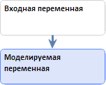
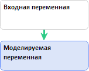

# Создание уравнения (веб-приложение)

Создание уравнения (веб-приложение)
-

# Создание уравнения

Для создания уравнения создайте связь между переменными. Возможны следующие
 способы:

	- [быстрый](../Quickly_create_equations.htm). Создание
	 уравнения с минимальным набором доступных настроек;

	- [расширенный](../Advanced_creation_equation.htm).
	 Создание уравнения и связей между объектами с расширенным набором
	 доступных настроек.

Для создания факторного уравнения создайте связь между входной и моделируемой
 переменными:

Для создания нефакторного уравнения:

	- в котором моделируемая переменная совпадает с входной переменной,
	 создайте связь переменной с самой собой:

	- в котором моделируемая переменная отличается от входной переменной,
	 создайте связь между входной и моделируемой переменными:

См. также:

[Работа с уравнениями](../Web_Equation_Work.htm)

		Справочная
		 система на версию 10.9
		 от 18/08/2025,
		 © ООО «ФОРСАЙТ»,
