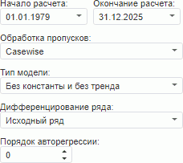
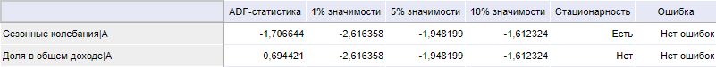

# Расширенный тест Дики-Фуллера (веб-приложение)

Расширенный тест Дики-Фуллера (веб-приложение)
-

# Расширенный тест Дики-Фуллера

Расширенный тест Дики-Фуллера является средством проверки стационарности
 временного ряда. Входит в группу тестов на единичные корни.

[Для выполнения
 теста](javascript:TextPopup(this))

		- Убедитесь, что [панель
		 результатов](../../UiModelling_w_ResultPanel.htm) отображается;

		- Выделите одну или несколько переменных в [области
		 представления данных](../../UiModeling_w_ViewArea.htm);

		- Перейдите на вкладку «Описательные
		 статистики» в [панели
		 результатов](../../UiModelling_w_ResultPanel.htm);

		- Выполните команду «Тест
		 Дики-Фуллера» в меню переключателя «Тесты
		 на единичные корни».

Параметры теста:

	- Начало расчёта. Укажите
	 начальную точку расчёта;

	- Окончание расчёта. Укажите
	 конечную точку расчёта;

	- Обработка пропусков.
	 Выберите метод обработки пропусков в данных. По умолчанию используется
	 метод «Casewise», т.е. пустые
	 значения исключаются. Расчёты ведутся без их учета. Более подробно
	 методы обработки пропусков описаны в разделе «[Обработка
	 пропусков](../../SidePanel/UiModelling_w_pp_MissingData.htm)»;

	- Тип модели. Тест позволяет
	 работать с моделями трех типов. Выберите требуемый тип из раскрывающегося
	 списка:

	-

		- Без константы и без тренда.
		 Используется для тестирования случайных процессов;

		- С константой. Используется
		 для тестирования случайных процессов со смещением;

		- С константой и с трендом.
		 Используется для тестирования случайных процессов со смещением
		 и линейным детерминистическим трендом;

	- Дифференцирование ряда.
	 Укажите порядок дифференцирования:

	-

		- Исходный ряд. Дифференцирование
		 не используется;

		- Дифференцированный ряд;

		- Дважды дифференцированный
		 ряд;

	- Порядок авторегрессии.
	 Укажите порядок авторегрессии переменной.

Тест выполняется последовательно для каждой выбранной переменной. Рассчитывается
 ADF-статистика и сравнивается
 с N процентным (N = 1%,
 5%, 10%) уровнем значимости. На основе данного сравнения делается вывод
 о стационарности/нестационарности ряда. Результаты выводятся в табличной
 форме, например:

См. также:

[Просмотр описательных статистик переменной](Var_DescrStat.htm)
 | Библиотека методов и моделей: [тест Дики-Фуллера](Lib.chm::/05_Statistics/UiModelling_DF_test.htm)

		Справочная
		 система на версию 10.9
		 от 18/08/2025,
		 © ООО «ФОРСАЙТ»,
