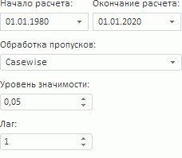
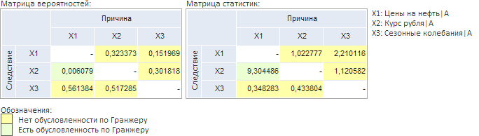

# Тест Гранжера

Тест Гранжера
-

# Тест Гранжера

Тест Гранжера предназначен для проверки причинно-следственной зависимости
 временных рядов. Входит в группу тестов для проверки свойств переменных.

[Для выполнения
 теста](javascript:TextPopup(this))

		- Убедитесь, что [панель
		 результатов](../../UiModelling_w_ResultPanel.htm) отображается;

		- Выделите две или более переменных в [области
		 представления данных](../../UiModeling_w_ViewArea.htm);

		- Перейдите на вкладку «Описательные
		 статистики» в [панели
		 результатов](../../UiModelling_w_ResultPanel.htm);

		- Выполните команду «Тест
		 Гранжера» в меню переключателя «Тесты
		 проверки свойств переменных».

Параметры теста:

	- Начало расчёта. Укажите
	 начальную точку расчёта;

	- Окончание расчёта. Укажите
	 конечную точку расчёта;

	- Обработка пропусков.
	 Выберите метод обработки пропусков в данных. По умолчанию используется
	 метод «Casewise», т.е. пустые
	 значения исключаются. Расчёты ведутся без их учета. Более подробно
	 методы обработки пропусков описаны в разделе «[Обработка
	 пропусков](../../SidePanel/UiModelling_w_pp_MissingData.htm)»;

	- Уровень значимости.
	 Укажите значение уровня значимости, при котором гипотеза о причинно-следственной
	 зависимости временных рядов будет отвергнута. Значение уровня значимости
	 должно лежать в интервале (0, 1);

	- Лаг. Задайте лаг для
	 значений переменной. Рекомендуется проводить тест для нескольких различных
	 значений лага и выяснить, насколько сильно размер лага влияет на результаты
	 теста.

Совет. Для корректного
 расчёта теста длина переменной должна удовлетворять соотношению: L ≥ 3 * m + 3. Где: L
 - количество точек переменной; m
 - значение лага.

Тест выполняется одновременно для всех выделенных переменных. Рассчитываются
 матрицы вероятностей и статистик. Значения вероятностей сравниваются с
 заданным уровнем значимости. Малое значение вероятности говорит о возможной
 зависимости между переменными.

В зависимости от полученного результата, ячейки со значениями подсвечиваются
 соответствующими цветами:

	- Желтый. Отсутствие причинно-следственной
	 зависимости;

	- Зеленый. Наличие причинно-следственной
	 зависимости.

Например:

См. также:

[Просмотр описательных статистик переменной](Var_DescrStat.htm)
 | Библиотека методов и моделей: [тест Гранжера](Lib.chm::/05_Statistics/UiModelling_GrangerTest.htm)

		Справочная
		 система на версию 10.9
		 от 18/08/2025,
		 © ООО «ФОРСАЙТ»,
