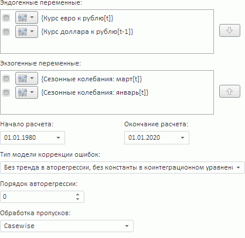
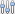
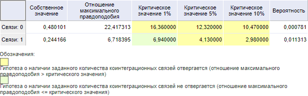

# Тест Йохансена (веб-приложение)

Тест Йохансена (веб-приложение)
-

# Тест Йохансена

Тест Йохансена позволяет выявить наличие стационарных линейных комбинаций
 временных рядов, являющихся интегрированными первого порядка, и является
 одним из методов оценки систем, использующий метод максимального правдоподобия
 применительно к векторным авторегрессионным моделям. Входит в группу тестов
 на коинтеграцию.

[Для выполнения
 теста](javascript:TextPopup(this))

		- Убедитесь, что [панель
		 результатов](../../UiModelling_w_ResultPanel.htm) отображается;

		- Выделите две или более переменных в [области
		 представления данных](../../UiModeling_w_ViewArea.htm);

		- Перейдите на вкладку «Описательные
		 статистики» в [панели
		 результатов](../../UiModelling_w_ResultPanel.htm);

		- Выполните команду «Тест
		 Йохансена» в меню переключателя «Тесты
		 на коинтеграцию».

Параметры теста:

	- Эндогенные переменные.
	 Сформируйте список переменных, тестируемых на коинтеграцию. По умолчанию
	 в список входят все выделенные переменные. Для выполнения тестирования
	 требуется не менее двух эндогенных переменных;

	- Экзогенные переменные.
	 Сформируйте список переменных, влияющих на тестируемые переменные.
	 По умолчанию экзогенные переменные отсутствуют;

[Операции
 с эндогенными и экзогенными переменными](javascript:TextPopup(this))

			- Управление составом
			 переменных, участвующих в тестировании. Каждой переменной
			 соответствует флажок. Если флажок установлен, то переменная
			 участвует в тестировании; если снят - тестирование выполняется
			 без участия переменной;

			- Перемещение переменной
			 между списками. Выделите одну или несколько переменных
			 в списке и используйте кнопки  и ;

			- [Выполнение
			 дополнительных операций с переменными](Var_Fast_Transform.htm). Нажмите
			 кнопку . Используйте
			 команды в отобразившемся меню.

	- Начало расчёта. Укажите
	 начальную точку расчёта;

	- Окончание расчёта. Укажите
	 конечную точку расчёта;

	- Тип модели коррекции ошибок.
	 Выберите используемую модель коррекции ошибок:

	-

		- Без тренда в авторегрессии, без константы в коинтеграционном
		 уравнении;

		- Модель без тренда или константы в коинтеграционном уравнении
		 и авторегрессии;

		- Модель с константой в коинтеграционном уравнении и авторегрессии;

		- Модель с линейным трендом и константой в коинтеграционном
		 уравнении, без тренда в авторегрессии, с линейным трендом в данных;

		- Модель с трендом и константой в авторегрессии и коинтеграционном
		 уравнении, с квадратичным трендом в данных;

	- Порядок авторегрессии.
	 Укажите порядок авторегрессии переменных;

	- Обработка пропусков.
	 Выберите метод обработки пропусков в данных. По умолчанию используется
	 метод «Casewise», т.е. пустые
	 значения исключаются. Расчёты ведутся без их учета. Более подробно
	 методы обработки пропусков описаны в разделе «[Обработка
	 пропусков](../../SidePanel/UiModelling_w_pp_MissingData.htm)».

Тест выполняется одновременно для всех выделенных переменных. Для выявления
 коинтеграционных связей сравниваются значения отношения максимального
 правдоподобия с N процентным
 (N = 1%, 5%, 10%) уровнем
 значимости. Если значение отношения максимального правдоподобия больше
 уровня значимости, то отвергается гипотеза о наличии коинтеграционных
 связей.

Например:

См. также:

[Просмотр описательных статистик переменной](Var_DescrStat.htm)
 |Библиотека методов и моделей: [тест
 Йохансена](Lib.chm::/05_Statistics/UiModelling_Johansen_test.htm)

		Справочная
		 система на версию 10.9
		 от 18/08/2025,
		 © ООО «ФОРСАЙТ»,
