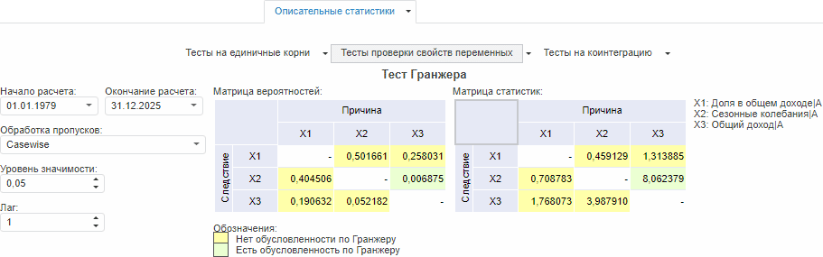

# Расчёт описательных статистик переменных (веб-приложение)

Расчёт описательных статистик переменных (веб-приложение)
-

# Расчёт описательных статистик переменных

Для расчёта описательных статистик и просмотра результатов расчёта предназначена
 вкладка «Описательные статистики»,
 расположенная на [панели
 результатов](../../UiModelling_w_ResultPanel.htm).

[Для отображения
 вкладки](javascript:TextPopup(this))

		- Убедитесь, что [панель
		 результатов](../../UiModelling_w_ResultPanel.htm) отображается;

		- Выделите одну или несколько переменных в [области
		 представления данных](../../UiModeling_w_ViewArea.htm);

		- Перейдите на вкладку «Описательные
		 статистики».

Пример вкладки:

На вкладке содержатся параметры расчёта статистики и результаты расчёта.

Набор параметров и результаты зависят от выбранной описательной статистики.
 Для выбора статистики используйте элементы в верхней части вкладки:

Все описательные статистики делятся на несколько групп. Каждой группе
 статистик соответствует переключатель и кнопка для вызова меню со списком
 статистик, входящих в группу. Для расчёта и просмотра результата описательной
 статистики выберите её в меню.

Доступные описательные статистики:

	- Тесты на единичные корни:

	-

		- [Расширенный тест Дики-Фуллера](Dickey-Fuller_test.htm);

	- Тесты проверки свойств переменных:

	-

		- [Тест Гранжера](Granger_test.htm);

	- Тесты на коинтеграцию:

	-

		- [Тест Йохансена](Johansen_test.htm).

Совет. Для расчета
 описательных статистик с помощью методов R установите флажок «Использовать
 R при расчете описательных статистик» на вкладке «Расчет»
 в диалоге «[Параметры](../Modelling_setup.htm)».
 Возможность доступна, если в «Форсайт. Аналитическая платформа»
 подключен пакет R. Подробнее см. раздел: «[Как
 настроить интеграцию с R?](../../../FAQ/R_Integration.htm)».

См. также:

[Работа с переменными](../UiModelling_w_Varable.htm)

		Справочная
		 система на версию 10.9
		 от 18/08/2025,
		 © ООО «ФОРСАЙТ»,
