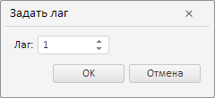

# Выполнение дополнительных операций с переменными

Выполнение дополнительных операций с переменными
-

# Выполнение дополнительных операций с переменными

[Дополнительные операции](Var_Fast_Transform.htm) доступны
 при работе с переменными, входящими в [уравнение](../Web_Equation_Work.htm),
 участвующими в [расчёте описательной статистики](Var_DescrStat.htm)
 или [целевой функции](../OptimalControl/CriterionFunct.htm).

Если для переменной доступны дополнительные операции, то рядом с ней
 отображается кнопка . Нажатие
 кнопки открывает меню, содержащее команды для выполнения операций:

[Задание лага
 переменной](javascript:TextPopup(this))

	Лаг - это сдвиг значений переменной во временном периоде. Для задания
	 лага используйте команды из группы «Лаг»:

		- Увеличить. Увеличивает на
		 один шаг лаг переменной;

		- Уменьшить. Уменьшает на
		 один шаг лаг переменной;

		- Задать. Открывает
		 диалог для задания значения лага:

	

	Введите требуемое значение лага.

	Обозначение лага добавляется в конец наименования переменной в формате:
	 [t +/- лаг].
	 Например: [t] - лаг не используется;
	 [t+1] - лаг уменьшен на один
	 шаг; [t-2] - лаг увеличен
	 на два шага.

[Быстрое преобразование
 данных переменной](javascript:TextPopup(this))

	Быстрое преобразование используется для трансформации значений переменной
	 без изменения исходных данных. Для выбора метода трансформации используйте
	 команды из группы «Преобразования»:

		- pch PoP. Темп прироста
		 к предыдущему периоду;

		- pch YoY. Темп прироста
		 к соответствующему периоду предыдущего года;

		- diff PoP. Разность
		 за предыдущий период;

		- diff YoY. Разность
		 за соответствующий период предыдущего года;

		- log. Логарифм;

		- dlog PoP. Разность
		 логарифмов за предыдущий период;

		- dlog YoY. Разность
		 логарифмов за соответствующий период предыдущего года;

		- Другие:

		-

			- diff YTD. Разность
			 за конец предыдущего года;

			- dlog YTD. Разность
			 логарифмов за конец предыдущего года;

			- norm. Нормализация;

			- OA. Устранение
			 выбросов;

			- pch YTD. Темп
			 прироста к концу предыдущего года;

			- pchA. Годовой
			 темп прироста;

			- ratio PoP. Коэффициент
			 роста за предыдущий период;

			- ratio YoY. Коэффициент
			 роста за соответствующий период предыдущего года;

			- ratio YTD. Коэффициент
			 роста за конец предыдущего года;

			- SA Additive.
			 Аддитивное устранение сезонности;

			- SA Auto. Автоматическое
			 устранение сезонности;

			- SA Multiplicative.
			 Мультипликативное устранение сезонности;

			- std. Стандартизация;

			- TS Inverse.
			 Детрендирование (обратный тренд);

			- TS Linear. Детрендирование
			 (линейный тренд);

			- TS Logarithmic.
			 Детрендирование (логарифмический тренд);

			- TS Polynomial.
			 Детрендирование (полиномиальный тренд).

	Более подробное описание методов приведено в разделе «[Преобразования
	 над переменными или факторами](../../../2_Container_of_Modeling/2_3_Work_object/UiModelling_work_Changes.htm)».

[Создание копии
 переменной](javascript:TextPopup(this))

	Выполните команду «Создать копию».
	 Будет создана копия переменной, доступная только при расчёте уравнения/описательной
	 статистики.

[Удаление переменной
 из расчёта](javascript:TextPopup(this))

	Выполните команду «Удалить».
	 Переменная удаляется из расчёта без дополнительного подтверждения.

[Определение
 группы переменной в модели коррекции ошибок](javascript:TextPopup(this))

	Для каждой экзогенной переменной в [модели
	 коррекции ошибок](../../SidePanel/Models/w_eq_ECM.htm) можно задать группу, определяющую тип коинтеграционной
	 связи: долгосрочная или краткосрочная. В меню переменной установите
	 соответствующий флажок:

		- Группа
		 1 (Уравнение долгосрочной динамики). Переменная относится
		 к группе, описывающей долгосрочные коинтеграционные связи;

		- Группа 2 (Регрессионное
		 уравнение). Переменная относится к группе, описывающей
		 краткосрочные коинтеграционные связи.

	Если переменная входит в две группы одновременно, то тип связи для
	 нее считается неопределенным. Если переменная не входит ни в одну
	 из групп, то она исключается из расчета модели.

См. также:

[Работа с переменными](../UiModelling_w_Varable.htm)

		Справочная
		 система на версию 10.9
		 от 18/08/2025,
		 © ООО «ФОРСАЙТ»,
