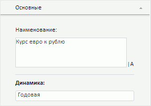
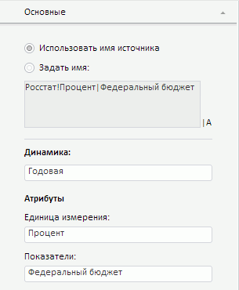

# Просмотр параметров переменной

Просмотр параметров переменной
-

# Просмотр параметров переменной

Для просмотра параметров переменной и редактирования её наименования
 предназначена Вкладка «Основные»,
 расположенная на боковой панели.

[Для отображения
 вкладки](javascript:TextPopup(this))

		- Убедитесь, что боковая панель отображается;

		- Выберите переменную в [области
		 представления данных](../../UiModeling_w_ViewArea.htm);

		- Перейдите на вкладку «Основные».

[Для переименования
 переменной](javascript:TextPopup(this))

	Процедура переименования зависит от типа переменной:

		- если переменная из контейнера моделирования, то отредактируйте
		 значение в поле «Наименование»;

		- если переменная из внешнего источника данных, то установите
		 переключатель «Задать имя»
		 и введите требуемое наименование в соответствующем поле.

	Сохранение изменений выполняется автоматически.

## Работа с переменной из контейнера моделирования

При работе с переменной из контейнера моделирования вкладка содержит
 информацию о наименовании и календарной динамике переменной. Например:

	- Наименование. Текущее
	 наименование переменной. Доступно для редактирования;

	- Динамика. Календарная
	 динамика переменной. Доступна только для чтения.

## Работа с переменной из внешнего источника данных

При работе с переменной из внешнего источника данных вкладка имеет вид:

	- Использовать имя источника.
	 Если переключатель установлен, то отображается наименование переменной,
	 сформированное на основе значений атрибутов переменной и наименования
	 источника данных. Доступно только для чтения;

	- Задать имя. Если переключатель
	 установлен, то отображается текущее наименование переменной. Доступно
	 для редактирования;

	- Динамика. Календарная
	 динамика переменной. Доступна только для чтения;

	- Атрибуты. Атрибуты переменной,
	 заданные в источнике данных. Доступны только для чтения.

См. также:

[Работа с переменными](../UiModelling_w_Varable.htm)

		Справочная
		 система на версию 10.9
		 от 18/08/2025,
		 © ООО «ФОРСАЙТ»,
