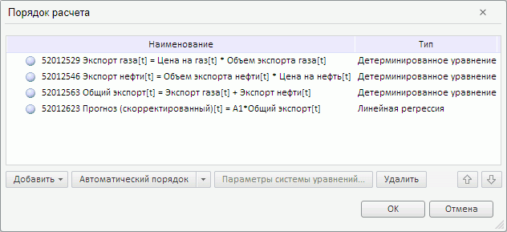
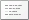
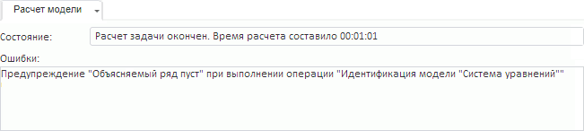

# Работа с моделированием и прогнозированием в режиме просмотра

Работа с моделированием и прогнозированием в режиме просмотра
-

# Работа с моделированием и прогнозированием в режиме просмотра

[Режим просмотра](../Launching.htm) используется для работы
 с готовыми моделями в веб-приложении. Создание и редактирование моделей
 недоступно.

Для работы с моделью в режиме просмотра:

	- запустите навигатор объектов и выберите требуемую модель:

		- нажмите кнопку  «Открыть» на вкладке «Главная»
		 ленты инструментов;

		- выполните команду «Открыть»
		 в контекстном меню модели;

	- [откройте модель](Web_Model_Work.htm#open_a_model)
	 со специальным параметром «mode»,
	 имеющим значение «view».

Выбранная модель будет открыта в режиме просмотра. На ленте инструментов
 будут доступны только вкладки «Расчет»
 и «Вид».

## Основные операции с моделью в режиме просмотра

[Создание копии
 модели](javascript:TextPopup(this))

Выполните команду «Сохранить как»
 в главном меню. Будет отображен
 диалог для выбора места хранения копии модели в текущем репозитории. В
 диалоге укажите новое имя объекта и, по желанию, идентификатор. Если идентификатор
 не указан, он создается автоматически при сохранении.

Важно. Идентификатор
 сохраняемого объекта не должен содержать буквы русского алфавита и пробелы.

[Обновление модели](javascript:TextPopup(this))

	Для обновления модели нажмите кнопку  на вкладке
	 «Вид» ленты инструментов.

[Просмотр параметров
 расчета уравнения](javascript:TextPopup(this))

	Для просмотра параметров расчета уравнения используйте вкладки на
	 боковой панели. Набор вкладок зависит от вида настраиваемого уравнения.
	 В данном наборе всегда присутствует вкладка «Уравнение»,
	 предназначенная для настройки базовых параметров уравнения.

	Для отображения вкладок:

		- Убедитесь, что боковая панель отображается.

		- Выберите моделируемую переменную или одну из связей [уравнения](Web_Equation_Work.htm).

	Подробное описание отображаемых параметров приведено в разделе «[Настройка параметров уравнения](Configure_equation_parameters.htm)».

[Просмотр порядка
 расчета модели](javascript:TextPopup(this))

	Для просмотра порядка расчета нажмите кнопку  «Порядок расчета» на вкладке ленты
	 «Расчет». Отобразится диалог
	 «Порядок расчета», содержащий
	 все уравнения модели, выстроенные в порядке расчета:

	

	Примечание.
	 Изменение порядка расчета недоступно.

[Расчет модели](javascript:TextPopup(this))

	Расчет выполняется с помощью кнопок, расположенных на вкладке ленты
	 «Расчет». Для расчета модели:

		- Ознакомьтесь с периодами расчета в группах «Период
		 идентификации» и «Прогнозный
		 период». Изменение периодов расчета недоступно.

		- Если применяется сценарное моделирование, то в раскрывающемся
		 списке «Сценарии» отметьте
		 флажками те [сценарии](UiModelling_w_Scenario.htm),
		 по которым требуется рассчитать модель. По умолчанию расчет выполняется
		 только по сценарию «Факт».

	Совет.
	 Как узнать: используется ли сценарное моделирование?

	Сценарное моделирование используется, если установлен флажок «Использовать сценарное моделирование»
	 на вкладке «Интерфейс» в диалоге
	 «[Параметры](Modelling_setup.htm)».

		- Выберите тип расчета. Нажмите нижнюю часть кнопки  «Рассчитать». Будет отображено
		 меню, в котором выберите тип расчета модели:

			- задача прогнозирования.
			 Уравнения модели рассчитываются последовательно в каждой точке
			 сценария: сначала рассчитываются все уравнения по первой точке
			 сценария, затем происходит расчет всех уравнений по второй
			 точке сценария и т.д.;

			- задача оптимального
			 управления. Доступна, если задана [целевая
			 функция](OptimalControl/CriterionFunct.htm). Состоит в отыскании таких значений управляющих
			 переменных, при которых будет выполнено условие оптимизации
			 значения целевой функции;

			- целевая задача.
			 Доступна, если для [целевой
			 функции](OptimalControl/CriterionFunct.htm) задана [траектория](OptimalControl/OptimalControl_setup.htm#trajectory).
			 Состоит в отыскании таких значений управляющих переменных,
			 при которых значение целевой функции будет максимально соответствовать
			 заданной траектории.

		- Нажмите кнопку  «Рассчитать».

	Текущее состояние расчета модели и возникающие ошибки/предупреждения
	 выводятся в [панель результатов](../UiModelling_w_ResultPanel.htm)
	 на вкладку «Расчет модели».
	 Для отображения вкладки нажмите кнопку  «Журнал расчета» на вкладке ленты
	 инструментов «Вид».

	Например:

	

[Просмотр результатов
 расчета уравнения](javascript:TextPopup(this))

	Для просмотра результатов расчета уравнения используйте вкладки
	 на [панели результатов](../UiModelling_w_ResultPanel.htm).

	Для отображения вкладок:

		- Убедитесь, что [панель
		 результатов](../UiModelling_w_ResultPanel.htm) отображается.

		- Выберите моделируемую переменную или одну из связей [уравнения](Web_Equation_Work.htm).

	Набор вкладок зависит от вида рассчитанного уравнения.

[Получение отчета
 о модели](javascript:TextPopup(this))

Для модели доступны следующие виды отчетов:

	- отчет по переменным.
	 Предоставляются данные всех переменных, входящих в модель;

	- отчет сравнения сценариев.
	 Доступен, если используется [сценарное
	 моделирование](UiModelling_w_Scenario.htm). Предоставляются данные всех переменных с возможностью
	 сравнить данные по всем сценариям, присутствующим в модели.

Для получения отчета о модели:

	- Нажмите нижнюю часть кнопки  «Отчет» на вкладке ленты «Расчет».

	- В отобразившемся меню установите переключатель напротив требуемого
	 вида отчета.

В новом окне будет открыт экспресс-отчет, содержащий данные о модели.

Оба отчета содержат лист «Переменные»,
 содержащий входные и моделируемые переменные в табличном виде за выбранный
 период по всем учитываемым сценариям. Например:

Отчет сравнения сценариев дополнительно содержит лист «Сравнение
 сценариев», содержащий входные и моделируемые переменные, представленные
 в виде пузырьковой диаграммы. В качестве объектов наблюдений используются
 сценарии, в качестве метрик - переменные. Особенностью данной пузырьковой
 диаграммы является то, что для каждого пузырька рисуется траектория его
 движения. Например:

[Экспорт модели](javascript:TextPopup(this))

Примечание.
 Возможность доступна только для представления «[Схема](../UiModeling_w_ViewArea.htm#scheme)».

Для экспорта модели выполните команду «Экспорт -> Схема»
 в главном меню «Модель»
 и выберите формат экспорта:

	- файл в формате PNG (Схема.png);

	- файл в формате SVG (Схема.svg).

Схема модели будет экспортирована в файл указанного формата в папку
 загрузки, используемую браузером.

[Расчет описательных
 статистик переменной](javascript:TextPopup(this))

Описательные статистики предоставляют широкий набор методов для анализа
 данных, позволяющих выявить зависимости между переменными, направление
 этой зависимости, а также рассчитать разного рода статистические характеристики.

Для расчета описательных статистик выделите одну или несколько переменных
 в области представления данных. Результаты расчёта отображаются на вкладке
 «[Описательные
 статистики](Varables/Var_DescrStat.htm)» на [панели
 результатов](../UiModelling_w_ResultPanel.htm).

[Выполнение
 диагностических тестов уравнения](javascript:TextPopup(this))

Диагностические тесты предназначены для проверки модели [линейной
 регрессии](../SidePanel/Models/UiModelling_w_eq_LinearRegr.htm) на предмет нарушения тех или иных основополагающих гипотез.
 Также тесты помогают проверить: насколько правильно специфицирована регрессионная
 модель.

Для выполнения тестов выберите моделируемую переменную или одну из связей
 уравнения [линейной
 регрессии](../SidePanel/Models/UiModelling_w_eq_LinearRegr.htm). Результаты расчетов отображаются на вкладке «[Диагностические тесты](../ResultsPanel/w_rp_diagnostics_tst.htm)»
 на панели результатов.

См. также:

[Запуск моделирования и прогнозирования](../Launching.htm)

		Справочная
		 система на версию 10.9
		 от 18/08/2025,
		 © ООО «ФОРСАЙТ»,
