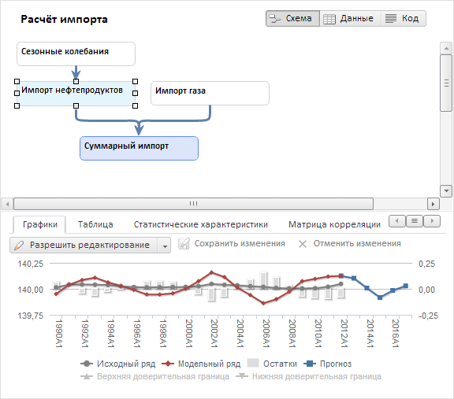

# Работа с уравнениями

Работа с уравнениями
-

# Работа с уравнениями

Уравнение предназначено для расчета результирующих переменных путем
 преобразования исходных переменных статистическими и математическими методами.
 Расчеты ведутся с учетом календарной динамики модели (годы, полугодия,
 кварталы, месяцы, дни).

В веб-приложении уравнением является набор [переменных](UiModelling_w_Varable.htm),
 объединенных между собой связями. Каждая переменная может иметь несколько
 связей. Для работы с уравнением выделите его или одну из его связей в
 рабочей области и используйте команды на ленте инструментов и вкладки
 боковой панели.

[Создание
 уравнения](javascript:TextPopup(this))

	Для создания уравнения требуется создать связь между переменными.
	 Подробное описание процесса создания связи приведено в разделе «[Создание уравнения](Varables/Create_Equation.htm)».

[Открытие
 уравнения](javascript:TextPopup(this))

	Для открытия уравнения с определенным ключом:

		- Откройте браузер.

		- В адресной строке укажите адрес инструмента «Моделирование
		 и прогнозирование» в веб-приложении. Адрес модуля формируется
		 в виде: <адрес веб-приложения>/model.html.

		Например: http://biserver/FP_App_v10.x/app/model.html,
		 где «http://biserver/FP_App_v10.x/app» - это адрес
		 веб-приложения.

		- Добавьте в адрес специальный параметр «key»
		 и укажите ключ [модели](Web_Model_Work.htm). Затем
		 добавьте специальный параметр «entry»
		 и укажите ключ уравнения. Формат адреса: <адрес
		 инструмента>#key=<ключ модели>&entry=<ключ уравнения>.
		 Если требуется открыть несколько уравнений, то укажите их ключи
		 через запятую.

		Например: http://biserver/FP_App_v10.x/app/model.html#key=11111&entry=12345,67890,
		 где «11111» - это ключ модели, а «12345» и «67890» - это ключи
		 открываемых уравнений.

		- Перейдите по сформированному адресу.

	Модель, содержащая уравнение, будет отображена в рабочей области.
	 Открываемое уравнение будет выделено.

	Если модель или уравнение с указанным ключом не найдены, то будет
	 отображено соответствующее сообщение. Поиск модели и уравнения выполняется
	 в репозитории, заданном в файле [PP.xml](Setup.chm::/UiWebSetup/03_Setup_Web/PP_config_Java.htm)
	 для используемого веб-приложения.

[Сохранение
 уравнения](javascript:TextPopup(this))

	Для сохранения уравнения:

		- выполните команду «Сохранить»
		 в главном меню «Модель»;

		- нажмите сочетание клавиш CTRL+S. Сочетание доступно, если
		 в рабочей области отсутствуют открытые окна;

		- нажмите кнопку , расположенную рядом
		 с главным меню «Модель».

	Будет сохранена вся [модель](Web_Model_Work.htm), в которую
	 входит данное уравнение.

[Удаление
 уравнения](javascript:TextPopup(this))

	Для удаления уравнения требуется удалить все связи между переменными,
	 которые его образуют. Выделите связь (для выделения нескольких связей
	 зажмите клавишу CTRL), затем:

		- нажмите клавишу DELETE;

		- нажмите кнопку  «Удалить» на вкладке ленты «Главная».

[Настройка
 параметров уравнения](javascript:TextPopup(this))

	Для настройки параметров уравнения используйте вкладки на боковой
	 панели. Набор вкладок зависит от вида настраиваемого уравнения. В
	 данном наборе всегда присутствует вкладка «Уравнение»,
	 предназначенная для настройки базовых параметров уравнения. Подробнее
	 см. раздел «[Настройка
	 параметров уравнения](Configure_equation_parameters.htm)».

[Изменение
 вида уравнения](javascript:TextPopup(this))

	Для изменения вида уравнения:

		- Убедитесь, что боковая панель отображается.

		- Выберите моделируемую переменную или одну из связей уравнения.

		- Перейдите на вкладку «Уравнение»
		 и в раскрывающемся списке «Вид
		 уравнения» выберите требуемый вид.

	Уравнение будет перестроено в соответствии с выбранным видом.

	При изменении вида уравнения, входящего в [систему
	 уравнений](Calculation_Order.htm#create_equation_system), учитывайте следующие особенности:

		- если выбранный вид уравнения является нефакторным и недопустим
		 для системы уравнений, то будет предложено изменить вид уравнения
		 и исключить его из системы или оставить вид уравнения без изменений;

		- если выбранный вид уравнения является факторным и недопустим
		 для системы уравнений, то будет предложено изменить вид уравнения
		 и преобразовать систему в цикл или оставить вид уравнения без
		 изменений.

[Настройка
 целевой функции](javascript:TextPopup(this))

	Для уравнения доступно создание целевой функции, позволяющей рассчитать
	 целевую задачу и задачу оптимального управления. Подробное описание
	 процесса создания и настройки целевой функции приведено в разделе
	 «[Настройка целевой функции](OptimalControl/CriterionFunct.htm)».

[Расчет
 уравнения](javascript:TextPopup(this))

	Расчет уравнения выполняется автоматически. Если при расчете уравнения
	 возникли ошибки или предупреждения, то они отображаются на вкладке
	 панели результатов «[Ошибки](../ResultsPanel/UiModelling_w_rp_Errors.htm)».

[Просмотр
 результатов расчета уравнения](javascript:TextPopup(this))

	Результаты расчета уравнения отображаются на вкладках [панели
	 результатов](../UiModelling_w_ResultPanel.htm):

		- [Спецификация](../ResultsPanel/UiModelling_w_rp_specification.htm);

		- [Графики](../ResultsPanel/UiModelling_w_rp_chart.htm);

		- [Таблица](../ResultsPanel/UiModelling_w_rp_table.htm);

		- [Факторы](../ResultsPanel/w_rp_factors.htm);

		- [Статистические
		 характеристики](../ResultsPanel/UiModelling_w_rp_Statstics.htm);

		- [Матрица
		 корреляции](../ResultsPanel/UiModelling_w_rp_Correlation.htm);

		- [Характеристические
		 корни AR и MA процессов](../ResultsPanel/w_rp_root_AR_MA.htm);

		- [Матрица
		 весов](../ResultsPanel/UiModelling_w_rp_Weight_Matrix.htm);

		- [АКФ
		 и ЧАКФ](../ResultsPanel/UiModelling_w_rp_Acf_pacf.htm);

		- [Ошибки](../ResultsPanel/UiModelling_w_rp_Errors.htm).

	Набор отображаемых вкладок зависит от используемого метода расчета.

[Выполнение
 диагностических тестов](javascript:TextPopup(this))

Диагностические тесты предназначены для проверки модели [линейной
 регрессии](../SidePanel/Models/UiModelling_w_eq_LinearRegr.htm) на предмет нарушения тех или иных основополагающих гипотез.
 Также тесты помогают проверить: насколько правильно специфицирована регрессионная
 модель.

Для выполнения тестов выберите моделируемую переменную или одну из связей
 уравнения [линейной
 регрессии](../SidePanel/Models/UiModelling_w_eq_LinearRegr.htm). Результаты расчетов отображаются на вкладке «[Диагностические тесты](../ResultsPanel/w_rp_diagnostics_tst.htm)»
 на панели результатов.

[Получение
 ключа уравнения](javascript:TextPopup(this))

	Ключ уравнения является уникальным и предназначен для однозначной
	 идентификации уравнения в рамках контейнера моделирования.

	Для получения ключа уравнения:

		- Откройте [модель](Web_Model_Work.htm), содержащую
		 уравнение.

		- Выделите моделируемую переменную или одну из связей уравнения.
		 Для получения ключей нескольких уравнений выделите несколько моделируемых
		 переменных или связи нескольких уравнений.

		- Перейдите в адресную строку браузера.

	Ключ уравнения отображается в адресе веб-приложения после специального
	 параметра «entry». Если выделено
	 несколько уравнений, то их ключи будут указаны через запятую. Например:
	 http://biserver/FP_App_v10.x/app/model.html#key=11111&entry=12345,
	 где «12345» - это ключ уравнения.

Пример рабочей области, содержащей уравнения:

См. также:

[Работа
 в веб-приложении](UiModelling_w_work.htm)

		Справочная
		 система на версию 10.9
		 от 18/08/2025,
		 © ООО «ФОРСАЙТ»,
