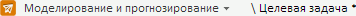
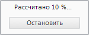
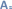
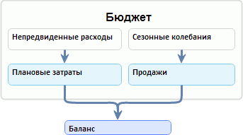

# Работа с моделью (веб-приложение)

Работа с моделью (веб-приложение)
-

# Работа с моделью

Модель - объект, выполняющий последовательный расчет уравнений с целью
 получения выходных данных в результирующих переменных. По окончании расчета
 результаты выгружаются в переменные.

В веб-приложении модель не отображается как отдельный объект, а является
 совокупностью уравнений, расположенных в [рабочей
 области](../UiModelling_w_WorkingArea.htm).

Все действия в инструменте «Моделирование
 и прогнозирование» выполняются в рамках модели. Имя текущей модели
 отображается в верхней части рабочей области.

После сохранения модели у неё создаются дочерние кубы, которые могут
 использоваться в качестве источников данных в следующих инструментах:
 «Аналитические панели», «Аналитические запросы (OLAP)» и
 «Отчеты». Набор кубов для всех
 задач одинаковый. Наименования кубов формируются по следующему принципу:

	- «<Наименование модели>. Входные переменные». Содержит
	 данные входных переменных модели;

	- «<Наименование модели>. Выходные переменные». Содержит
	 данные выходных переменных модели;

	- «<Наименование модели>. Сравнение сценариев». Содержит
	 данные всех переменных с возможностью сравнения по всем сценариям,
	 присутствующим в модели.

Например, «Сальдо торгового баланса.
 Выходные переменные» - это куб, содержащий данные выходных переменных
 для модели «Сальдо торгового баланса».

[Создание
 модели](javascript:TextPopup(this))

	Для создания модели:

		- Выполните команду «Новая
		 модель» в главном меню «Модель».
		 Будет открыт диалог сохранения модели.

		- В открывшемся диалоге укажите контейнер моделирования, в
		 котором необходимо создать модель. Если контейнер моделирования
		 не существует, то укажите папку, в которой он будет создан автоматически.

	Примечание.
	 Если в репозитории задан контейнер моделирования, [используемый по умолчанию](UiNav.chm::/02_Navigator/Repo_Default.htm), то выбор контейнера не требуется. По
	 умолчанию модель будет создана в данном контейнере. При необходимости
	 можно выбрать другой контейнер моделирования или создать новый.

		- Укажите имя и идентификатор создаваемой модели и нажмите
		 клавишу ENTER. Если имя или идентификатор не заданы, то они будут
		 установлены автоматически.

	Модель будет открыта для редактирования. Далее следует создать [переменные](UiModelling_w_Varable.htm) и [уравнения](Web_Equation_Work.htm).

[Открытие
 модели](javascript:TextPopup(this))

	Для открытия модели:

		- выполните команду «Открыть»
		 в главном меню «Модель».
		 В открывшемся диалоге укажите требуемую модель;

		- в навигаторе объектов для модели выполните команду контекстного
		 меню «Просмотр» или «Просмотр в новом окне», чтобы
		 открыть модель в новом окне.

	Модель будет отображена в рабочей области.

	Примечание.
	 Модель не сможет быть открыта в веб-приложении, если она создана в
	 настольном приложении и цепочка расчета данной модели содержит уравнение
	 [расширенной
	 агрегации](../../2_Container_of_Modeling/2_3_Work_object/2_3_2_Model/Specification/aggregation/UiModelling_Aggregation_Attr_CrossDim.htm) или несколько уравнений, использующих одну и ту же переменную
	 в качестве моделируемой переменной.

	Для открытия модели с определенным ключом:

		- Откройте браузер.

		- В адресной строке укажите адрес инструмента «Моделирование
		 и прогнозирование» в веб-приложении. Адрес инструмента
		 формируется в виде: <адрес
		 веб-приложения>/model.html.

		Например: http://biserver/FP_App_v10.x/app/model.html,
		 где «http://biserver/FP_App_v10.x/app» - это адрес
		 веб-приложения.

		- Добавьте в адрес специальный параметр «key»
		 и укажите ключ модели. Формат адреса: <адрес
		 инструмента>#key=<ключ модели>. Например: http://biserver/FP_App_v10.x/app/model.html#key=11111,
		 где «11111» - это ключ открываемой модели.

		- Перейдите по сформированному адресу.

	Модель будет отображена в рабочей области.

	Если модель с указанным ключом не найдена, то будет отображено соответствующее
	 сообщение. Поиск модели выполняется в репозитории, заданном в файле
	 [PP.xml](Setup.chm::/UiWebSetup/03_Setup_Web/PP_config_Java.htm)
	 для используемого веб-приложения.

[Сохранение
 модели](javascript:TextPopup(this))

	Если в модели присутствуют несохраненные изменения, то рядом с её
	 именем, отображаемым рядом с меню выбора инструмента, присутствует
	 символ «*». Например:

	

	Для сохранения модели:

		- выполните команду «Сохранить»
		 в главном меню «Модель»;

		- нажмите сочетание клавиш CTRL+S. Сочетание доступно, если
		 в рабочей области отсутствуют открытые окна;

		- нажмите кнопку , расположенную рядом
		 с главным меню «Модель».

	Модель будет сохранена.

[Создание
 копии модели](javascript:TextPopup(this))

Выполните команду «Сохранить как»
 в главном меню. Будет отображен
 диалог для выбора места хранения копии модели в текущем репозитории. В
 диалоге укажите новое имя объекта и, по желанию, идентификатор. Если идентификатор
 не указан, он создается автоматически при сохранении.

Важно. Идентификатор
 сохраняемого объекта не должен содержать буквы русского алфавита и пробелы.

[Расчет
 модели](javascript:TextPopup(this))

	Расчет выполняется с помощью кнопок, расположенных на вкладке ленты
	 «Расчет». Для расчета модели:

		- Задайте периоды расчета в группах «Период
		 идентификации» и «Прогнозный
		 период».

	Примечание.
	 Модель будет рассчитана, если периоды расчета модели не выходят за
	 границы периодов источника данных контейнера моделирования, содержащего
	 модель.

		- Если применяется сценарное моделирование, то в раскрывающемся
		 списке «Сценарии» отметьте
		 флажками те [сценарии](UiModelling_w_Scenario.htm),
		 по которым будет рассчитана модель. По умолчанию расчет выполняется
		 только по сценарию «Факт».

	Совет.
	 Как узнать: используется ли сценарное моделирование?

	Сценарное моделирование используется, если установлен флажок «Использовать сценарное моделирование»
	 на вкладке «Интерфейс» в диалоге
	 «[Параметры](Modelling_setup.htm)».

		- Нажмите кнопку  «Порядок расчета» и настройте
		 [порядок расчета уравнений в модели](Calculation_Order.htm).

		- Выберите тип расчета. Нажмите нижнюю часть кнопки  «Рассчитать». Будет отображено
		 меню, в котором выберите тип расчета модели:

			- задача прогнозирования.
			 Уравнения модели рассчитываются последовательно в каждой точке
			 сценария: сначала рассчитываются все уравнения по первой точке
			 сценария, затем происходит расчет всех уравнений по второй
			 точке сценария и т.д.;

			- задача оптимального
			 управления. Доступна, если задана [целевая
			 функция](OptimalControl/CriterionFunct.htm). Состоит в нахождении таких значений управляющих
			 переменных, при которых будет выполнено условие оптимизации
			 значения целевой функции;

			- целевая задача.
			 Доступна, если для [целевой
			 функции](OptimalControl/CriterionFunct.htm) задана [траектория](OptimalControl/OptimalControl_setup.htm#trajectory).
			 Состоит в нахождении таких значений управляющих переменных,
			 при которых значение целевой функции будет максимально соответствовать
			 заданной траектории.

		- Нажмите кнопку  «Рассчитать».

	Совет.
	 Иногда для наглядности требуется задать задержку расчета модели. Подробнее
	 о том, как это сделать вы можете узнать в разделе «[Как
	 настроить задержку расчета модели?](../../FAQ/Delays.htm)».

	Текущее состояние расчета модели и возникающие ошибки/предупреждения
	 выводятся в [панель результатов](../UiModelling_w_ResultPanel.htm)
	 на вкладку «Расчет модели».
	 Для отображения вкладки нажмите кнопку  «Журнал расчета» на вкладке ленты
	 инструментов «Вид».

	Например:

	

[Прерывание
 расчета модели](javascript:TextPopup(this))

	Для прерывания расчета модели нажмите кнопку «Остановить»
	 в сообщении, отображаемом в процессе расчета модели. Например:

	

[Получение
 отчета о модели](javascript:TextPopup(this))

Для модели доступны следующие виды отчетов:

	- отчет по переменным.
	 Предоставляются данные всех переменных, входящих в модель;

	- отчет сравнения сценариев.
	 Доступен, если используется [сценарное
	 моделирование](UiModelling_w_Scenario.htm). Предоставляются данные всех переменных с возможностью
	 сравнить данные по всем сценариям, присутствующим в модели.

Для получения отчета о модели:

	- Нажмите нижнюю часть кнопки  «Отчет» на вкладке ленты «Расчет».

	- В отобразившемся меню установите переключатель напротив требуемого
	 вида отчета.

В новом окне будет открыт экспресс-отчет, содержащий данные о модели.

Оба отчета содержат лист «Переменные»,
 содержащий входные и моделируемые переменные в табличном виде за выбранный
 период по всем учитываемым сценариям. Например:

Отчет сравнения сценариев дополнительно содержит лист «Сравнение
 сценариев», содержащий входные и моделируемые переменные, представленные
 в виде пузырьковой диаграммы. В качестве объектов наблюдений используются
 сценарии, в качестве метрик - переменные. Особенностью данной пузырьковой
 диаграммы является то, что для каждого пузырька рисуется траектория его
 движения. Например:

[Переименование
 модели](javascript:TextPopup(this))

	Для переименования модели:

		- Дважды щелкните по наименованию модели. Оно будет переведено
		 в режим редактирования.

		- Измените наименование. Нажмите ENTER или щёлкните в свободной
		 от объектов области представления данных.

[Обновление
 модели](javascript:TextPopup(this))

	Для обновления модели нажмите кнопку  на вкладке
	 «Главная» или «Вид»
	 ленты инструментов. Если в модели имеются несохранённые данные, то
	 будет предложено сохранить их.

[Структурирование
 модели](javascript:TextPopup(this))

	Структурирование позволяет расположить модели и их элементы в определенном
	 порядке или по определенной схеме. Структурирование не влияет на порядок
	 расчета модели.

	Возможны следующие способы структурирования модели:

		- иерархическое. Позволяет
		 объединить модели и их элементы в иерархическую структуру. Подробное
		 описание приведено в разделе «[Иерархическое
		 структурирование модели](Hierarchical_structuring_model.htm)»;

		- визуальное. Позволяет
		 объединить уравнения и переменные в логические группы.

	Данные способы структурирования могут применяться совместно.

	Для создания визуальной структуры модели используйте надписи и прямоугольники.
	 Добавляйте их с помощью кнопок  «Надпись» и  «Прямоугольник» на вкладке ленты
	 «Главная». Надписи создаются
	 перед, а прямоугольники - за уравнениями и переменными.

	Пример визуальной структуры:

	

[Получение
 ключа модели](javascript:TextPopup(this))

	Ключ модели является уникальным и предназначен для однозначной идентификации
	 модели в рамках контейнера моделирования.

	Для получения ключа модели:

		- Откройте модель.

		- Перейдите в адресную строку браузера.

	Ключ модели отображается в адресе веб-приложения после специального
	 параметра «key». Например:
	 http://biserver/FP_App_v10.x/app/model.html#key=111111,
	 где «111111» - это ключ открытой модели.

[Экспорт
 модели](javascript:TextPopup(this))

Примечание.
 Возможность доступна только для представления «[Схема](../UiModeling_w_ViewArea.htm#scheme)».

Для экспорта модели выполните команду «Экспорт -> Схема»
 в главном меню «Модель»
 и выберите формат экспорта:

	- файл в формате PNG (Схема.png);

	- файл в формате SVG (Схема.svg).

Схема модели будет экспортирована в файл указанного формата в папку
 загрузки, используемую браузером.

[Закрытие
 модели](javascript:TextPopup(this))

	Для закрытия модели выполните команду «Закрыть»
	 в главном меню «Модель».

См. также:

[Работа
 в веб-приложении](UiModelling_w_work.htm)

		Справочная
		 система на версию 10.9
		 от 18/08/2025,
		 © ООО «ФОРСАЙТ»,
