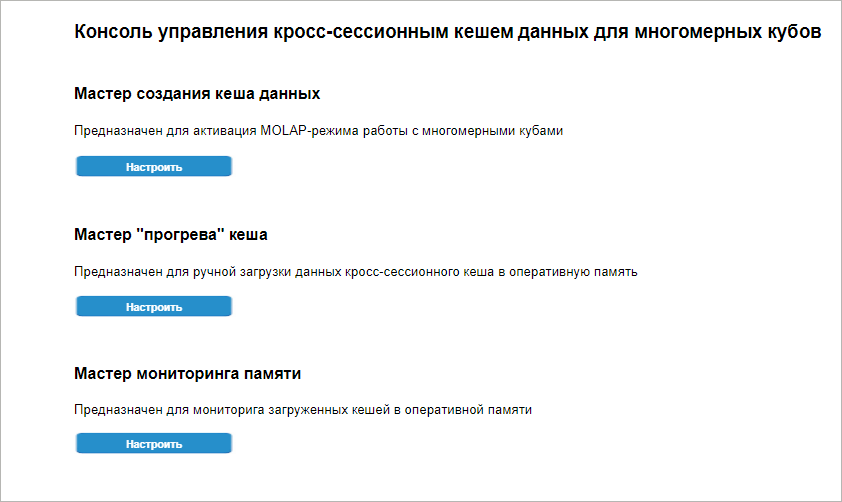
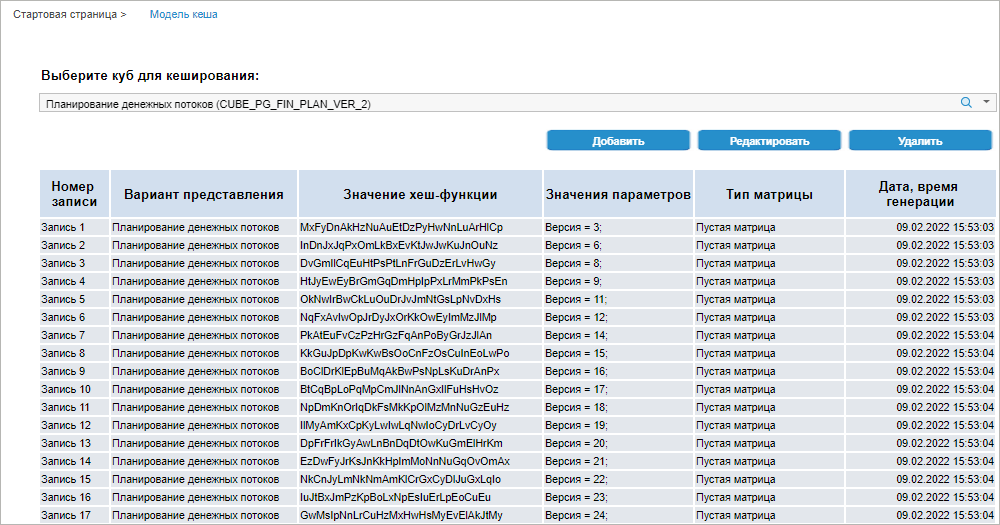
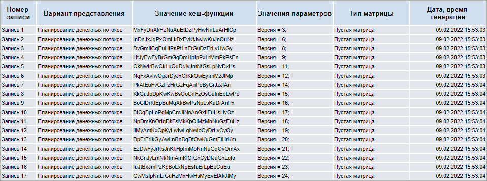
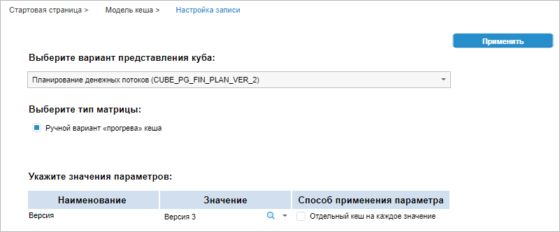
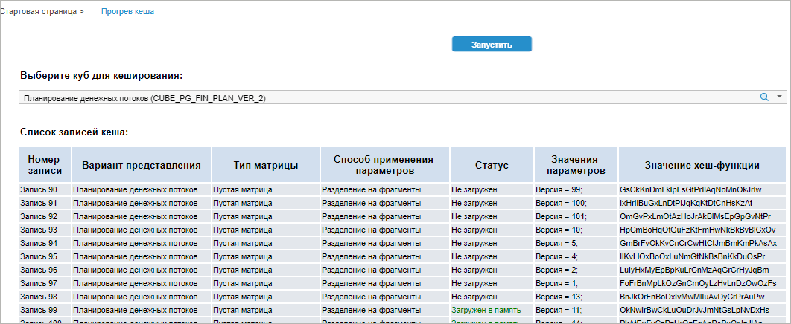
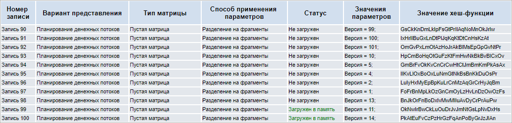
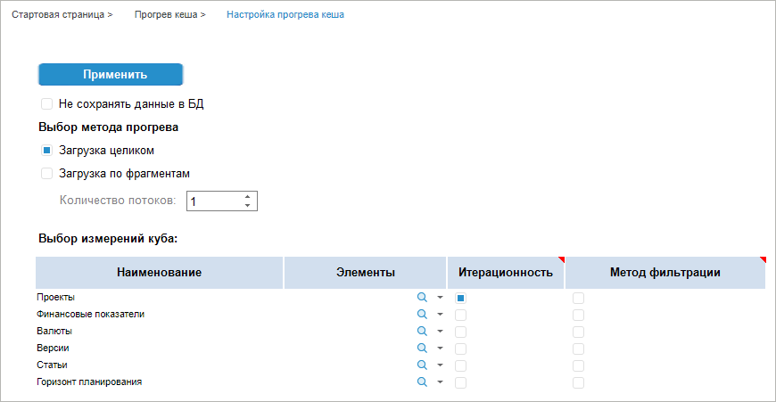
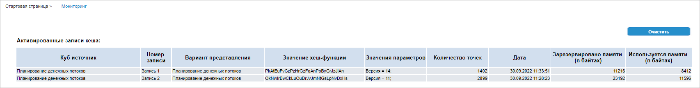

# Работа с глобальным кешем

Работа с глобальным кешем
-

# Работа с глобальным кешем

	Многомерные кубы и справочники хранят данные в плоских реляционных
	 структурах. При работе с многомерными кубами производится запрос выборки
	 данных из реляционных структур, далее результаты выборок необходимо
	 загружать и отстраивать в многомерные структуры. При больших объемах
	 данных, фрагментации индексной информации реляционных структур, большом
	 количестве условий в выборах на выполнение запроса, загрузки и отстройки
	 в многомерных структурах может потребоваться много времени. Для ускорения
	 работы в «Форсайт. Аналитическая платформа»
	 реализована возможность работы с кешем данных [справочников](UiNavObj.chm::/reference_book/Create.htm),
	 [стандартных
	 кубов](UiNavObj.chm::/Cube/CreateCube/Master_Standart/UiMd_Cube_CreateCube_Master_Standart.htm), а также построенных на них [представлений-кубов](UiNavObj.chm::/Cube/CreateCube/Master_Conception/UiMd_Cube_CreateCube_Master_Conception.htm)
	 и [виртуальных
	 кубов](UiNavObj.chm::/Cube/CreateCube/Master_Virtual_Cube/UiMd_Cube_CreateCube_Master_Virtual.htm). При использовании кеша заранее загруженная
	 и отстроенная многомерная структура сохраняется в СУБД и при первом
	 обращении к объекту загружается в оперативную память.

	Поддерживается два режима работы с кешем:

		- Сессионный или персональный
		 кеш. При использовании сессионного кеша для каждой сессии
		 пользователя в оперативной памяти сервера приложения выделяется
		 отдельное место для хранения. Этот режим подходит, когда в рамках
		 одного сеанса с «Форсайт. Аналитическая платформа»
		 пользователь много раз обращается к одним и тем же данным. Например,
		 если справочник территорий используется во всех кубах, то после
		 первого обращения он загрузится в оперативную память BI-сервера,
		 и SQL-запросы к базе данных больше не будут генерироваться. Использование
		 сессионного кеша приводит к увеличению потребления оперативной
		 памяти, так как для каждого пользователя в оперативную память
		 загружается свой экземпляр кешированного справочника. Количество
		 требуемой оперативной памяти будет прямо пропорционально количеству
		 активных сессий BI-сервера;

		- Кросс-сессионный или общий
		 кеш. При использовании кросс-сессионного кеша в рамках
		 одного узла BI-сервера формируется одна общая матрица с данными
		 или общий справочник сразу для всех активных сессий. Изменения
		 данных, сделанные одним пользователем, сразу будут видны другим.
		 Этот режим подходит для чтения данных, но без сложной ролевой
		 модели, которая разграничивает доступ пользователей к отдельным
		 фрагментам данных.

	Для кеширования данных справочников и кубов можно использовать оба
	 режима.

## Настройка кеширования

	Для использования кеширования данных кубов и справочников глобальным
	 кешем сохраните объекты в многомерном виде в СУБД.

	Доступность настройки кеширования данных кубов и справочников в
	 зависимости от режима кеширования в веб-приложении в ОС Linux и в
	 ОС Windows:

			 Режим кеширования
			 Куб
			 Справочник

			 Сессионный
			 
			 

			 Кросс-сессионный
			 
			 

	Доступность настройки кеширования данных кубов и справочников в
	 зависимости от режима кеширования в настольном приложении в ОС Windows:

			 Режим кеширования
			 Куб
			 Справочник

			 Сессионный
			 
			 

			 Кросс-сессионный
			 
			 

	Условные обозначения:

	 - настройка доступна;

	 - настройка недоступна.

	Примечание.
	 Работа с настроенным и созданным кешем доступна для кубов и справочников
	 любого типа приложений и используемой ОС.

### Настройки сессионного кеширования

		 Кубы Справочники

			Для использования сессионного кеширования кубов в настольном
			 приложении для ОС Windows:

				- Укажите значение global
				 для строкового параметра CacheType
				 в разделе InMem
				 в файле [settings.xml](Setup.chm::/UiWebSetup/03_Setup_Web/BI_Server_Settings_XML.htm#inmem)
				 или в [настройках
				 системного реестра](Setup.chm::/UiWebSetup/03_Setup_Web/BI_Server_Registry_Key.htm#inmem) ОС Windows.

			Примечание.
			 Если раздел InMem
			 или строковый параметр CacheType
			 отсутствуют, то их необходимо создать вручную. Раздел [InMem](../../Setup/UiWebSetup/03_Setup_Web/BI_Server_Registry_Key.htm#inmem)
			 должен быть заполнен на всех клиентских компьютерах.

				- Выберите куб, данные которого необходимо закешировать,
				 в навигаторе объектов.

				- Включите кеширование для выбранного объекта с помощью
				 флажка «Кешируемый объект»
				 на вкладке «[Кеш](../03_Objects/UiNav_Obj_BasicPropCache.htm)» в
				 свойствах объекта.

				- Выберите базу данных, в которой будет создана специальная
				 структура хранения, в раскрывающемся списке. Если в текущем
				 репозитории задана [база данных
				 по умолчанию](Repo_Default.htm), то она будет подставлена в раскрывающемся
				 списке. При смене базы данных кеш будет удалён, а в выбранной
				 базе будет создана новая пустая специальная структура
				 хранения.

				- Нажмите кнопку «Обновить
				 кеш», чтобы отстроенный многомерный объект сохранился
				 в базе данных. Учитывайте, что для кубов в базе данных
				 сохраняются все данные куба. Чтобы сохранить кеш для кубов
				 по определенной отметке нужно использовать «Консоль
				 управления глобальным кешем». Особенности работы
				 с кешем:

					- если объект параметрический, то кеш необходимо
					 создать для всех необходимых наборов значений параметра.
					 Диалог задания параметра будет показан при нажатии
					 кнопки «Обновить
					 кеш»;

					- если создаются ярлыки для стандартных кубов,
					 то для ярлыка может быть создан и настроен отдельный
					 кеш. Если для ярлыка отсутствует кеш, то используется
					 кеш исходного куба.

			Для использования сессионного кеширования справочников в
			 настольном приложении для ОС Windows:

				- Укажите значение global
				 для строкового параметра CacheType
				 в разделе InMem
				 в файле [settings.xml](Setup.chm::/UiWebSetup/03_Setup_Web/BI_Server_Settings_XML.htm#inmem)
				 или в [настройках
				 системного реестра](Setup.chm::/UiWebSetup/03_Setup_Web/BI_Server_Registry_Key.htm#inmem) ОС Windows.

			Примечание.
			 Если раздел InMem
			 или строковый параметр CacheType
			 отсутствуют, то их необходимо создать вручную. Раздел [InMem](../../Setup/UiWebSetup/03_Setup_Web/BI_Server_Registry_Key.htm#inmem)
			 должен быть заполнен на всех клиентских компьютерах.

				- Выберите справочник, данные которого необходимо
				 закешировать, в навигаторе объектов.

				- Включите кеширование для выбранного объекта с помощью
				 флажка «Кешируемый объект»
				 на вкладке «[Кеш](../03_Objects/UiNav_Obj_BasicPropCache.htm)» в
				 свойствах объекта.

				- Выберите базу данных, в которой будет создана специальная
				 структура хранения, в раскрывающемся списке. Если в текущем
				 репозитории задана [база данных
				 по умолчанию](Repo_Default.htm), то она будет подставлена в раскрывающемся
				 списке. При смене базы данных кеш будет удалён, а в выбранной
				 базе будет создана новая пустая специальная структура
				 хранения.

				- Нажмите кнопку «Обновить
				 кеш», чтобы отстроенный объект сохранился в базе
				 данных. Учитывайте, что для справочников в базе данных
				 сохраняются все элементы. Особенности работы с кешем:

					- если объект параметрический, то кеш необходимо
					 создать для всех необходимых наборов значений параметра.
					 Диалог задания параметра будет показан при нажатии
					 кнопки «Обновить
					 кеш».

	В результате выполнения действий справочник или куб можно использовать
	 в режиме сессионного кеша, когда при первом обращении к объекту он
	 будет загружен в оперативную память, и при последующих обращениях
	 к объекту в рамках текущей сессии дополнительных запросов к СУБД не
	 будет.

### Настройки кросс-сессионного кеширования

	Для использования кросс-сессионного кеша:

		- Укажите значение global
		 для строкового параметра CacheType
		 в разделе InMem в файле
		 [settings.xml](Setup.chm::/UiWebSetup/03_Setup_Web/BI_Server_Settings_XML.htm#inmem)
		 или в [настройках
		 системного реестра](Setup.chm::/UiWebSetup/03_Setup_Web/BI_Server_Registry_Key.htm#inmem) ОС Windows или [ОС
		 Linux](Setup.chm::/UiWebSetup/03_Setup_Web/config_and_setting.htm).

	Примечание.
	 Если раздел InMem или строковый
	 параметр CacheType отсутствуют,
	 то их необходимо создать вручную. Раздел [InMem](../../Setup/UiWebSetup/03_Setup_Web/BI_Server_Registry_Key.htm#inmem)
	 должен быть заполнен на всех клиентских компьютерах, если используется
	 настольное приложение, или на BI-сервере, если используется веб-приложение.

		- Настройте дополнительно:

			- для кубов используйте «Консоль
			 управления кешем данных». Консоль доступна в настольном
			 приложении и в веб-приложении;

			- для справочников укажите значение 1 для целочисленного
			 параметра Cache в
			 разделе Dimensions
			 в файле [settings.xml](Setup.chm::/UiWebSetup/03_Setup_Web/BI_Server_Settings_XML.htm#inmem)
			 или в [настройках
			 системного реестра](Setup.chm::/UiWebSetup/03_Setup_Web/BI_Server_Registry_Key.htm#inmem).

	Примечание.
	 Если раздел Dimensions или
	 целочисленный параметр Cache
	 отсутствуют, то их необходимо создать вручную. Раздел Dimensions
	 должен быть заполнен на всех клиентских компьютерах, если используется
	 настольное приложение, или на BI-сервере, если используется веб-приложение.

	В результате выполнения дополнительных
	 настроек справочник можно использовать в режиме кросс-сессионного
	 кеша, когда при первом обращении к объекту он будет загружен в оперативную
	 память, и при последующих обращениях к объекту в рамках любой активной
	 сессии для текущего узла BI-сервера дополнительных запросов к СУБД
	 не будет.

## Загрузка данных в глобальный кеш

	Загрузка данных в глобальный кеш возможна с использованием различных
	 вариантов:

		- на вкладке «Кеш»
		 в свойствах объекта настольного приложения. В этом случае в кеш
		 сохраняются все данные куба или справочника, либо данные для конкретного
		 набора параметров, если объект параметрический;

		- при использовании консоли управления глобальным кешем в
		 веб-приложении и настольном приложении. При данном способе формирования
		 кеша данные можно разделить не только параметрами, но и сформировать
		 кеш по определенной отметке в кубе. Сохранение в кеш всех данных
		 здесь так же доступно.

	Примечание.
	 После задания или изменения настроек в файле [settings.xml](Setup.chm::/UiWebSetup/03_Setup_Web/BI_Server_Settings_XML.htm#inmem)
	 или в настройках системного реестра перезапустите настольное приложение
	 или BI-сервер.

	Выбор варианта загрузки данных в глобальный кеш зависит от решаемых
	 задач и структуры источников данных.

## Загрузка кешированных данных в оперативную
	 память

	Загрузка кешированного объекта в оперативную память происходит при
	 первом обращении к этому объекту. Затем в зависимости от настроек
	 данные объекта будут доступны только текущему пользователю при использовании
	 сессионного режима или всем пользователям при использовании кросс-сессионного
	 режима. Все дальнейшие обращения будут происходить к объекту в оперативной
	 памяти, дополнительных запросов к СУБД не будет.

### Полный кеш

	При использовании полного кеша для куба при обращении к данным по
	 любому срезу в оперативную память загружается сразу весь кеш, что
	 может быть медленнее, чем работа без кеша, если отметка, по которой
	 необходимо получить данные, небольшая. Так же в этом случае потребление
	 памяти будет выше, чем без кеша, так как в оперативной памяти будут
	 лежать сразу все данные куба.

	Если работа с данными не предполагает использования полного объема
	 данных, то в этом случае можно разбивать данные параметрами для сохранения
	 в кеш по частям или задать отметку при формировании кеша.

### Кеш по параметрам

	Если кеш был сохранен для разных значений параметров, то загрузка
	 кеша в оперативную память может выполняться для каждого параметра
	 параллельно разными пользователями.

	Примечание.
	 Для кубов и справочников с параметрами доступен только кеш по параметрам.

## Сохранение данных при использовании глобального
	 кеша

	Если были изменены данные, загруженные в оперативную память, и сохранены
	 в источник, то они будут видны пользователям до тех пор, пока кеш
	 лежит в оперативной памяти. Если кеш был выгружен из оперативной памяти
	 и загружен снова, то изменённые данные видны не будут.

	Так как глобальный кеш хранится отдельно от данных кубов и справочников,
	 то и при изменении данных в исходных объектах, в кеш они не загружаются
	 автоматически.

	Для обновления данных в кеше нажмите кнопку «Обновить
	 кеш» в свойствах объекта или заново «прогрейте» кеш, используя
	 мастер «прогрева» кеша консоли управления глобальным кешем. Учитывайте
	 особенности сохранения данных для полного кеша и для кеша по параметрам
	 в многопользовательском режиме:

		- Полный кеш. Все
		 одновременно изменяемые в разных сессиях записи выстраиваются
		 «в очередь» и будут записываться в общую матрицу последовательно.
		 Это регулирует диспетчер управления потоками данных в кеше. Такая
		 реализация связана с тем, что матрица имеет сложную внутреннюю
		 систему многомерной индексации данных и параллельно для нескольких
		 новых значений формировать ее невозможно;

		- Кеш по параметрам.
		 Каждой комбинации значений параметров в оперативной памяти создается
		 отдельная локальная матрица. Запись значений в локальные матрицы
		 выполняется параллельно, каждый поток в свою матрицу. Используйте
		 данный вариант сохранения при одновременном выполнении высоконагруженных
		 расчетов или загрузки данных по разным сценариям. Сохранение данных
		 для всех сценариев выполняется одновременно, каждый из них идет
		 в своем потоке в свою локальную матрицу. Разные локальные матрицы
		 можно объединить в виртуальном кубе за счет виртуализации данных
		 и использовать инструменты отчетности для визуализации общего
		 результата и сравнения матриц между собой.

## Консоль управления глобальным кешем

	Для запуска консоли:

		- в веб-приложении выполните команду  «Кеширование кубов» на боковой
		 панели [навигатора
		 объектов](getstarted.chm::/interface/interface_navigator.htm). После чего на отдельной вкладке браузера
		 будет открыта страница с адресом в формате:

	http://<IP-адрес или DNS-имя сервера>/fp10.x/app/cache.html#repo=<идентификатор репозитория>

		- в настольном приложении откройте на просмотр отчёт с идентификатором
		 RO_CACHE_UTIL.

	Примечание.
	 Для работы с консолью управления глобальным кешем в репозитории должно
	 быть [установлено
	 расширение](Setup.chm::/Extensions/install_extensions_in_repository.htm) «Кеш
	 кубов».

	

	Доступные настройки:

		- [создание кеша данных](#create);

		- [«прогрев» кеша](#load);

		- [мониторинг загруженных в настоящий момент
		 данных в оперативную память на BI-сервере](#tracking).

### Создание кеша данных

	Для создания кеша данных и выбора объекта кеширования нажмите кнопку
	 «Настроить» в области мастера
	 создания кеша на стартовой странице консоли.

	После выполнения действия будет открыта вкладка «Модель
	 кеша»:

	

	Задайте настройки:

	[Выбор куба
	 для кеширования](javascript:TextPopup(this))

		Для выбора источника в поле «Выберите
		 куб для кеширования» выберите куб из раскрывающегося списка
		 или нажмите кнопку  «Поиск»
		 и начните печатать название куба.

		После выбора куба будет сформирована таблица со списком записей
		 кеша:

		

		Таблица состоит из столбцов:

			- Номер записи.
			 Отображается порядковый номер записи кеша данных;

			- Вариант представления.
			 Выводится вариант отображения куба - Destination, для
			 которого активирован кеш;

			- Значение хеш-функции.
			 Отображается уникальный идентификатор записи кеша, с его использованием
			 идет обращение к данным из «Форсайт. Аналитическая платформа»;

			- Значения параметров.
			 Отображаются значения параметров, для которых собран экземпляр
			 кеша;

			- Тип матрицы.
			 Отображается тип матрицы: пустая матрица, которая в дальнейшем
			 может быть «прогрета» по нужной отметке;

			- Дата, время генерации.
			 Отображается дата и точное время формирования записи
			 кеша.

		Если у куба добавлены параметры, то для каждой уникальной комбинации
		 параметров может быть создана своя индивидуальная запись кеша.
		 Например, на рисунке выше куб содержит только один параметр «Версия».
		 Это связанный справочник, в котором есть 100 элементов: версия
		 1, версия 2 и т.д. Для куба добавлено 100 записей кеша. Каждая
		 запись соответствует одной версии из параметра.

		Важно.
		 В списке будут отображаться экземпляры кеша не для всех возможных
		 значений параметров, а только для тех, для которых они были добавлены.
		 Если для каких-то значений параметров не был создан экземпляр
		 кеша, то данные куба будут загружены путем выполнения SQL-запросов
		 к СУБД.

		После формирования списка записей кеша, можно с каждой из них
		 выполнить действия удаления или настройки, а также добавить дополнительные
		 записи с новыми значениями параметров.

	[Создание
	 и редактирование записей кеша](javascript:TextPopup(this))

		Для добавления новой записи кеша нажмите кнопку «Добавить».
		 Для редактирования уже имеющейся записи кеша выделите её и нажмите
		 кнопку «Редактировать».

		После выполнения действия откроется новая вкладка «Настройка
		 записи»:

		

		Для настройки записи:

			- Выберите вариант представления куба из раскрывающегося
			 списка. Если вариант представления не выбран, то будет использован
			 вариант представления по умолчанию.

			- Флажок «Ручной вариант
			 «прогрева» кеша» всегда
			 установлен, при этом создается запись кеша с ручным вариантом
			 наполнения.

		Важно.
		 У такого типа матрицы после каждого рестарта BI-сервера или для
		 каждой новой сессии необходимо вручную заполнять кеш данными с
		 помощью мастера «прогрева» кеша.

			- Укажите значение параметров.
			 Можно указать одно или несколько значений. В случае если в
			 качестве параметра будет выбран справочник и при этом выбрано
			 несколько элементов справочника, то можно создать кеш:

				- По умолчанию.
				 Создаётся одна запись кеша для всех выделенных элементов
				 справочника;

				- Отдельный кеш на
				 каждое значение. Для каждого элемента создаётся
				 своя запись кеша.

			- Нажмите кнопку «Применить»
			 для завершения настройки новой записи кеша.

		После выполнения действий запись кеша будет отредактирована
		 и/или сформирована новая запись кеша с заданными настройками и
		 отображена в таблице записей кеша на вкладке «Модель
		 кеша».

	[Удаление
	 записи кеша](javascript:TextPopup(this))

		Для удаления записи кеша необходимо выбрать запись и нажать
		 кнопку «Удалить».

### Мастер «прогрева» кеша

	Для наполнения записи кеша данными нажмите кнопку «Настроить»
	 в области мастера «прогрева» кеша на стартовой странице консоли.

	После выполнения действия будет открыта вкладка «Прогрев
	 кеша»:

	

	Задайте настройки:

	[Выбор куба
	 для прогрева кеша](javascript:TextPopup(this))

		Для выбора источника в поле «Выберите
		 куб для кеширования» выберите куб из раскрывающегося списка
		 или нажмите кнопку  «Поиск»
		 и начните печатать название куба.

		После выбора куба будет сформирована таблица со списком записей
		 кеша:

		

		Таблица состоит из столбцов:

			- Номер записи.
			 Отображается порядковый номер записи кеша данных;

			- Представление.
			 Отображается вариант отображения куба - Destination, для которого
			 создан кеш;

			- Тип матрицы.
			 Отображается тип матрицы;

			- Способ применения параметров.
			 Отображается метод «прогрева» кеша: загрузка целиком или разделение
			 данных на фрагменты;

			- Статус. Отображается
			 состояние загрузки записи кеша: загружен в память или не загружен;

			- Значение хеш-функции.
			 Отображается уникальный идентификатор записи кеша, с его использованием
			 идет обращение к данным из «Форсайт. Аналитическая платформа».

	[Настройка
	 метода прогрева кеша](javascript:TextPopup(this))

		Для активации «прогрева» выделите экземпляр кеша и нажмите кнопку
		 «Запустить» на вкладке
		 «Прогрев кеша».

		Примечание.
		 Перед «прогревом» кеша выполняется проверка свободной оперативной
		 памяти. По умолчанию допустимо 20%, «прогрев» кеша доступен при
		 загруженности оперативной памяти на 80% и ниже. Для изменения
		 порога свободной оперативной памяти создайте параметр [MemoryThreshold](setup.chm::/UiWebSetup/03_Setup_Web/BI_Server_Registry_Key.htm#inmem)
		 типа REG_DWORD в разделе реестра [HKEY_CURRENT_USER\SOFTWARE\Foresight\Foresight Analytics Platform\10.0\InMem] или в
		 соответствующем разделе файла [settings.xml](setup.chm::/UiWebSetup/03_Setup_Web/BI_Server_Settings_XML.htm#inmem).
		 При превышении порога запуск «прогрева» кеша недоступен.

		После выполнения действия будет открыта вкладка «Настройка
		 прогрева кеша»:

		

		Для настройки метода прогрева:

			- Выберите метод прогрева. Установите переключатель на
			 одном из вариантов: загрузка целиком или по фрагментам.

			- При выборе метода «Разделение
			 данных на фрагменты» укажите количество потоков для
			 многопоточной загрузки данных кеша в поле «Количество
			 потоков». Фрагментация по потокам будет осуществляться
			 по элементам измерения, для которого установлен флажок в столбце
			 «Итерационность».
			 Флажок может быть установлен только для одного измерения.

			- В столбце «Элементы»
			 задайте отметку элементов измерений, в соответствии с которой
			 в экземпляр кеша будут загружены данные. Таким образом
			 можно ограничить объем загружаемых данных. Если по измерению
			 не задана отметка, то считается полная отметка элементов.

			- Для измерений с полной или пустой отметкой установите
			 флажок в столбце «Метод фильтрации».
			 Для таких измерений будет временно изменяться стратегия фильтрации
			 и будут извлекаться все записи независимо от отметки. Смена
			 стратегии фильтрации влияет на формируемый SQL-запрос к данным
			 и соответственно на скорость построения кеша. Если флажок
			 снят, то используется стратегия фильтрации, заданная для измерений
			 в настройках куба.

		Примечание.
		 Флажок «Метод фильтрации»
		 не может быть установлен для измерений, для которых установлен
		 флажок «Итерационность».

			- Нажмите кнопку «Применить»
			 для завершения настройки метода «прогрева» кеша.

		После выполнения действий произойдет возврат на вкладку «Прогрев кеша», где будет отражена
		 таблица со списком записей кеша.

### Мониторинг

	Для просмотра записей, загруженных в память BI-сервера, нажмите
	 кнопку «Настроить» в области
	 мастера мониторинга памяти на стартовой странице консоли.

	

	На странице будет отображён список записей кеша, которые в текущий
	 момент загружены в память. Для очистки матрицы с данными у какой-либо
	 записи кеша выделите её и нажмите кнопку «Очистить».
	 Сама запись при этом остаётся загруженной, но количество точек для
	 неё будет равно нулю.

	Если с какой-либо записью происходит параллельная работа из прикладного
	 кода и эта запись заблокирована на чтение/изменение, то в столбцах
	 «Количество точек», «Дата», «Зарезервировано
	 памяти» и «Используется памяти»
	 будет отображен текст «Запись недоступна».
	 Очистка такой записи будет невозможна.

## Потребление памяти и производительность

	Перед тем как принимать решение об использовании кеширования для
	 данных, ознакомьтесь со значениями скорости работы и потреблением
	 памяти. Представленные значения показателей зависят от аппаратного
	 обеспечения, нагрузки на сервере СУБД и прочих условий.

	Потребление памяти зависит от:

		- для справочников: количества элементов, количества и типа
		 данных атрибутов;

		- для кубов: количества измерений, количества фактов и типа
		 данных.

	Усреднённые показатели потребления памяти и производительности справочников:

			 Количество элементов справочника, млн.

			 Количество и тип данных пользовательских
			 атрибутов

			 Первое открытие без кеша, с.

			 Первое открытие с кешем, с.

			 Второе открытие с «прогретым» кешем, с.

			 Память, MБ

			 1

			 -

			 5,93

			 1,81

			 0

			 273,2

			 1

			 3 целых, 2 строковых

			 6,49

			 2

			 0

			 320,5

			 1

			 5 целых, 5 строковых

			 6,59

			 2,05

			 0

			 355,6

			 3

			 -

			 16,95

			 5,15

			 0

			 849

			 3
			 3 целых, 2 строковых

			 17,99

			 5,7

			 0

			 952,5

			 3
			 5 целых, 5 строковых

			 18,43

			 6,31

			 0

			 1055,2

	Усреднённые показатели потребления памяти и производительности кубов
	 с вещественным типом данных:

			 Количество
			 записей, млн.

			 Количество
			 измерений

			 Количество
			 фактов

			 Первое открытие без кеша, с.

			 Первое открытие с кешем, с.

			 Второе открытие с прогретым кешем, с.

			 Память, ГБ

			 10

			 5

			 1

			 19.7

			 3.6

			 0

			 0.52

			 10

			 5

			 5

			 52.0

			 31.6

			 0

			 2.3

			 10

			 10

			 1

			 43.2

			 4.6

			 0

			 0.68

			 10

			 10

			 5

			 67.2

			 35.7

			 0.01

			 3.2

			 10

			 18

			 1

			 67

			 9

			 0.01

			 1.2

			 10

			 18

			 5

			 90.3

			 48.4

			 0.01

			 4.8

			 100

			 5

			 1

			 216.6

			 40.4

			 0.01

			 4.7

			 100

			 10

			 1

			 279.4

			 48.2

			 0.01

			 6.5

			 100

			 18

			 1

			 567.6

			 135.4

			 0.01

			 9.3

	Также учитывайте влияние настроек и структуры кубов на количество
	 требуемой оперативной памяти:

		- если после выборки данных производятся расчёты, которые
		 приводят к увеличению количества данных, например, матричная агрегация,
		 то количество требуемой оперативной памяти будет увеличено пропорционально
		 количеству новых точек;

		- если при использовании представлений-кубов, построенных
		 на стандартных кубах с кешем, над матрицей с кешем создается копия
		 матрицы, учитывающая фиксацию в представлении-кубе, то необходима
		 дополнительная оперативная память. В зависимости от структуры
		 представления-куба, может потребоваться увеличение оперативной
		 памяти в два раза.

	Если при загрузке кеша закончилась оперативная память:

		- удалите из оперативной памяти неиспользуемые объекты кеша,
		 нажав кнопку «Очистить»
		 в мастере мониторинга памяти консоли управления глобальным кешем;

		- разбейте кеш на более мелкие фрагменты с помощью параметров
		 и отметки.

## Сценарии использования глобального кеша

	Используйте глобальный кеш, если у вас реализован сценарий:

		- использование аналитических панелей. Используются одни и
		 те же данные из источника, и объем этих данных небольшой, порядка
		 десятков или сотен млн. записей, ролевая модель не используется
		 и не требуется ввод и сохранение данных;

		- использование многомерных расчётов с большими объемами данных.
		 Большой объем данных нужно получить или рассчитать за короткое
		 время. В этом случае кеш используется как промежуточный буфер,
		 а данные из него копируются в основное хранилище регулярно: каждую
		 ночь, в выходные или асинхронно после финального утверждения;

		- использование разных выборок данных со сложными условиями
		 фильтрации. Условия фильтрации в SQL-запросах сильно зависят от
		 бизнес-логики и структуры куба. Чем больше исходных данных и сложнее
		 условия в запросе, тем меньше скорость выборки. Кеш данных в продукте
		 «Форсайт. Аналитическая платформа»
		 имеет собственную систему двойной индексации, которая хорошо адаптирована
		 для обработки многомерных данных. Поэтому выборка данных для больших
		 многомерных условий в ряде случаев в кеше будет выполняться намного
		 быстрее, чем на стороне СУБД.

	Принимая решение об использовании кеширования данных в продукте
	 «Форсайт. Аналитическая платформа»,
	 учитывайте:

		- объём информации в кеше будет
		 влиять на скорость её обработки, то есть время выполнения запроса
		 для таблицы в 1 млн. записей или в 1 млрд. записей будет разное;

		- не все данные в кеше нужны одновременно.
		 Например, если используется расчёт по сценариям или обработка
		 данных по филиалам, доступным пользователю в рамках его ролевой
		 модели.

	Для получения возможности работать с разными фрагментами данных
	 в различные моменты времени используйте кеш по параметрам вместо полного
	 кеша. Для использования кеша по параметрам определите один или несколько
	 параметров для объекта и сформируйте свой фрагмент кеша для каждой
	 комбинации параметров. «Прогрев» каждого такого фрагмента кеша управляется
	 отдельно и любой из них всегда можно добавить или удалить из общего
	 пула фрагментов.

## Логирование выполняемых действий

	При работе с консолью управления кешем данных осуществляется логирование
	 действий, которые выполняет пользователь. При первом открытии консоли
	 внутри расширения «Кеш кубов»
	 в папке «Служебные объекты» будут созданы таблицы для хранения лога.
	 Запуск консоли должен осуществляться пользователем, который является
	 администратором репозитория.

	Создаются следующие таблицы:

		- Журнал экземпляра кеша
		 (CACHE_ITEM_TABLE). Содержит информацию о кубах, их вариантах
		 отображения и набор значений параметров, для которых созданы экземпляры
		 кеша;

		- Журнал прогрева экземпляра
		 кеша (CACHE_WARMING_TABLE). Содержит информацию о списке
		 записей кеша, отметку, которая использовалась при создании записей;

		- Журнал загрузки данных
		 в кеш (CACHE_LOG_TABLE). Содержит полную информацию о загрузках
		 данных в кеш:

			- Даты и время фиксации записей в журнал;

			- Статус загрузки;

			- Информацию о потоках, количество загруженных точек с
			 данными;

			- Информацию, позволяющую идентифицировать пользователя,
			 который выполнял загрузку.

	Примечание.
	 Для корректного создания таблиц, в которых хранится лог работы с кешем,
	 репозиторий должен быть создан на базе СУБД [PostgreSQL](Setup.chm::/01_SysReq/database_Support.htm),
	 и в репозитории должна быть настроена [база
	 данных по умолчанию](Repo_Default.htm#objects_default).

	По умолчанию доступ к таблицам будет у всех пользователей репозитория.
	 При необходимости администратор должен настроить права доступа в соответствии
	 с требованиями разрабатываемой системы.

## Ограничения работы глобального кеша

	Перед тем как принимать решение об использовании кеширования для
	 данных ознакомьтесь c ограничениями:

		- длительное время «прогрева» матрицы данных при старте BI-сервера
		 при кросс-сессионном режиме кеша, так как в оперативную память
		 подгружается вся информация;

		- отсутствие возможности работы с кубами с настроенной функциональностью:

			- [агрегация
			 измерения фактов](UiNavObj.chm::/Cube/CreateCube/Master_Standart/UiMd_Cube_CreateCube_Master_Standart_2.htm#agregation);

			- [агрегация
			 по уровням измерений](UiNavObj.chm::/Cube/CreateCube/Master_Standart/UiMd_Cube_CreateCube_Master_Standart_7.htm);

			- [вычисляемые
			 факты](UiNavObj.chm::/Cube/CreateCube/Master_Standart/UiMd_Cube_CreateCube_Master_Standart_5.htm);

			- [единицы
			 измерения](UiNavObj.chm::/Cube/CreateCube/Master_Standart/UiMd_Cube_CreateCube_Master_Standart_unit_dim.htm);

			- [детализация
			 данных](UiAnalyticalArea.chm::/Working_with_table_data/Drill_down.htm#agregation) .

		- отсутствие поддержки изменения набора элементов измерения:
		 удаление/добавление элементов в справочник, включение прав доступа
		 для пользователя или перестроение параметрического справочника
		 после применения параметров, - в кубах после сохранения кеша;

		- отсутствие поддержки разграничения прав доступа на элементы
		 справочников и на данные в кубах.

	При выполнении анализа данных и построении отчётов, построенных
	 на кубах с включенным глобальным кешем, с помощью инструментов «[Аналитические
	 запросы (OLAP)](UIExpress.chm::/purpose/UiExpress_Purpose.htm)», «[Аналитические
	 панели](UIAdhoc.chm::/UiAdhoc_Purpose.htm)», «[Отчёты](UIReport.chm::/UiReport_purpose.htm)»,
	 «[Интерактивные
	 формы ввода данных](DataEntryForms.chm::/DataEntryForms_Purpose.htm)» недоступна следующая
	 функциональность:

		- [добавление
		 вычисляемых элементов](UiAnalyticalArea.chm::/Work_with_dimensions/Edited_elements.htm);

		- [расчёт
		 итогов из источника](UiAnalyticalArea.chm::/Totals/Calculate_totals_from_the_source.htm);

		- [валидация
		 данных](UiAnalyticalArea.chm::/Analysis/Data_validation.htm);

		- [прикрепление
		 вложений к ячейкам](UiAnalyticalArea.chm::/Attachments.htm);

		- [объединение
		 запросов при вычислении](DataEntryForms.chm::/Web/Starting/Starting.htm#multiexecutor).

См. также:

[Кеширование
 данных по технологии In-Memory](In-Memory.htm)

		Справочная
		 система на версию 10.9
		 от 18/08/2025,
		 © ООО «ФОРСАЙТ»,
