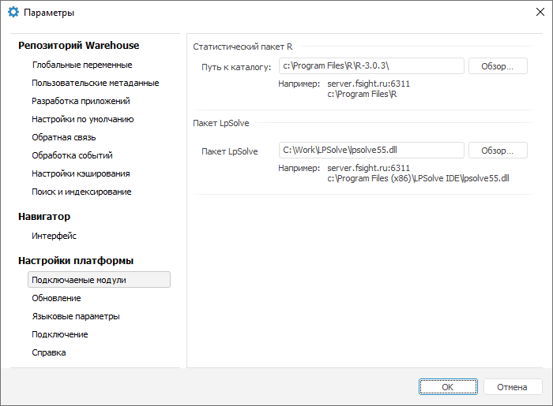

# Подключение дополнительных модулей к «Форсайт. Аналитическая платформа»

Подключение дополнительных модулей к «Форсайт. Аналитическая платформа»
-

# Подключение дополнительных модулей к «Форсайт. Аналитическая платформа»

## Интеграция с Python

	Интеграция с языком программирования Python позволяет расширить
	 функциональные возможности «Форсайт. Аналитическая платформа»
	 в инструментах «[Моделирование и прогнозирование](UiModelling.chm::/UiModelling_Purpose.htm)», «[Анализ
	 временных рядов](UiDw.chm::/UiDw_Title.htm)», «[Отчеты](UiReport.chm::/UiReport_purpose.htm)».
	 В указанных инструментах функции Python применяются в универсальном
	 [редакторе выражения](../../GUI/ExpressionEditor.htm).

	Примечание.
	 Поддерживается интеграция с Python от версии 3.5 до 3.12. Поддержка
	 более новых версий требует отдельных исследований. Разрядность Python
	 и «Форсайт. Аналитическая платформа»
	 должна совпадать.

	В Astra Linux SE 1.7 уже имеется предустановленная версия Python 3.7,
	 поэтому должна использоваться именно она. Если по каким-либо причинам
	 данная версия не находится, то добавьте символьную ссылку на библиотеку,
	 выполнив команду: sudo ln -s /usr/lib/python3.7/config-3.7m-x86_64-linux-gnu/libpython3.7m.so
	 /opt/foresight/fp10.x-biserver/bin/

	Шаги по интеграции с Python отличаются в зависимости от используемой
	 операционной системы.

		 OC Linux OC Windows

			Для интеграции с Python на OC Linux предварительно необходимо
			 произвести сборку исходных файлов Python.

### Сборка Python
			 из исходных файлов на OC Linux

			Рассмотрим пример сборки исходных файлов Python версии 3.6.9
			 на OC Astra Linux CE.

			Выполните действия:

				- Скачайте [архив с исходными
				 файлами](https://www.python.org/ftp/python/) Python версии 3.6.9:

			wget https://www.python.org/ftp/python/3.6.9/Python-3.6.9.tgz

				- Распакуйте файл из архива:

			tar xvf Python-3.6.9.tgz

			cd Python-3.6.9

				- Добавьте в файл configure, поставляемый вместе с исходными
				 файлами Python, параметры --enable-shared для генерации
				 динамической библиотеки, которую использует платформа,
				 и --prefix с указанием места установки Python:

			./configure
			 --enable-shared --prefix=/opt/python

				- Выполните компиляцию исходного кода Python, используя
				 altinstall:

			sudo make
			 altinstall

			Примечание.
			 Команда make altinstall используется для предотвращения замены
			 бинарного файла Python, который по умолчанию находится по
			 пути S/usr/bin/python, где S - путь до папки установки Python.

			Результат компиляции должен быть
			 примерно следующим:

			Collecting
			 setuptools

			Collecting pip

			Installing collected packages: setuptools, pip

			Successfully installed pip-18.1 setuptools-40.6.2

### Интеграция с Python на OC Linux

			Рассмотрим пример интеграции Python версии 3.6.9 на OC Astra
			 Linux CE. Убедитесь, что предварительно была произведена [сборка исходных файлов](#assembly_from_source_files)
			 Python.

			Для интеграции с Python на OC Astra Linux CE:

				- Проверьте, что сборка исходных файлов прошла успешно
				 и была установлена новая версия Python.

			Если версия в системе по умолчанию
			 не была переписана, то проверьте текущую версию Python с помощью
			 команды:

			python3.6
			 --version

				- Выполните одно из действий, если команда не была
				 найдена:

					- добавьте путь к папке с установленным Python
					 в системной переменной Path:

			echo export
			 PATH=$PATH:/opt/python/bin >> ~/.bashrc

			source ~/.bashrc

					- укажите путь до местоположения библиотеки Python
					 libpython3.*m.so, которая была создана с помощью параметра
					 --enable-shared в шаге 3:

			echo export
			 LD_LIBRARY_PATH="/opt/python/lib:$LD_LIBRARY_PATH"
			 >> ~/.bashrc

			source ~/.bashrc

			При первом использовании Python
			 платформа будет искать библиотеку из списка:

			libpython3.9.so,
			 libpython3.8.so, libpython3.7m.so, libpython3.6m.so, libpython3.5m.so

			Платформа будет использовать
			 первую найденную библиотеку до перезапуска. Перезапустите
			 BI-сервер:

			sudo systemctl
			 restart apache2-fp10.x

			Для интеграции с Python на OC Windows:

				- Загрузите [дистрибутив Python](https://www.python.org/downloads/).

				- Установите Python на тот же компьютер, на котором
				 установлено настольное приложение «Форсайт. Аналитическая платформа».
				 Если Python планируется использовать и в веб-приложении,
				 то установите Python на компьютер, на котором расположен
				 BI-сервер.

					- При установке включите флажок «Add
					 Python <Version> to PATH» для добавления
					 пути к папке с установленным Python в системной переменной
					 Path.

			Если Python устанавливается с помощью какого-либо пакета,
			 например Anaconda, то во время установки также необходимо
			 включить флажок «Add...to
			 PATH». Таким образом, будет выполнена интеграция продукта
			 «Форсайт. Аналитическая платформа»
			 с Python. Все выполняемые скрипты должны находиться в папке
			 «Форсайт. Аналитическая платформа».

			Для указания дополнительной папки со скриптами:

				- создайте в реестре строковый параметр PythonPath
				 и задайте в нём необходимый путь до дополнительной папки
				 со скриптами. Параметр создается в ветке реестра [HKEY_CURRENT_USER\SOFTWARE\Foresight\Foresight Analytics Platform\10.0\DevEnv\Python];

				- используйте метод [IPythonUtils.AddFolderToPythonPath](KePython.chm::/Interface/IPythonUtils/IPythonUtils.AddFolderToPythonPath.htm).

	Если несколько версий Python установлено в ОС Linux, то выполните
	 следующие действия:

		- Добавьте символьную ссылку на нужную библиотеку, например:

	ln -s /opt/python/lib/libpython3.9.so
	 /opt/foresight/fp10.x-biserver/bin/

		- В ОС Windows в ветке реестра [HKEY_CURRENT_USER\SOFTWARE\Foresight\Foresight Analytics Platform\10.0\DevEnv\Python]
		 создайте строковый параметр PythonLib, в качестве значения укажите
		 наименование библиотеки Python нужной версии, например "libpython3.9.so".
		 Сохраните настройки в файл с расширением *.reg в папку /opt/foresight/fp10.x-biserver/bin.

	Примечание.
	 Ветка реестра [HKEY_CURRENT_USER] может быть заменена на [HKEY_LOCAL_MACHINE],
	 если путь до библиотеки Python указывается для всех пользователей,
	 а не только для текущего.

	Если для установки Python использовалась система управления пакетами
	 pip, то при возникновении проблем с поиском библиотек Python произведите
	 установку с использованием команды sudo pip3. Без использования sudo
	 установка производится в папку пользователя /home/user/.local/bin,
	 в которой BI-сервер не сможет обнаружить библиотеки Python.

	Если было установлено несколько версий Python и требуется использовать
	 определённую, то при работе в ОС Windows создайте в ветке реестра
	 [HKEY_CURRENT_USER\SOFTWARE\Foresight\Foresight Analytics Platform\10.0\DevEnv\Python] строковый
	 параметр PythonLib и укажите для него в качестве значения имя библиотеки
	 Python нужной версии, например "python39.dll".

	Для получения подробной информации
	 о создании Python-модулей, в которых будут храниться коды макросов
	 на языке Python, обратитесь к разделу «[Создание
	 Python-модулей](UiDevEnv.chm::/01_Development_Environment/02_Work_in_Development_Environment/DevEnv_Object/python_module.htm)».

## Интеграция с Java

	Интеграция с языком программирования Java позволяет расширить функциональные
	 возможности «Форсайт. Аналитическая платформа»
	 в инструментах «[Моделирование и прогнозирование](UiModelling.chm::/UiModelling_Purpose.htm)», «[Анализ
	 временных рядов](UiDw.chm::/UiDw_Title.htm)», «[Отчеты](UiReport.chm::/UiReport_purpose.htm)».
	 В указанных инструментах функции Java применяются в универсальном
	 [редакторе выражения](../../GUI/ExpressionEditor.htm).

		ОС Linux ОС Windows

### Установка Java в ОС Linux

			Если язык Java уже установлен в среде Linux, то следующие
			 пункты 1-8 можно пропустить. Для установки языка Java:

				- В терминале выполните команды:

			sudo mkdir
			 /usr/lib/jvm

			cd /usr/lib/jvm

				- Скачайте .gz пакет по адресу [https://www.oracle.com/java/technologies/downloads/#java8](https://www.oracle.com/java/technologies/downloads#java8).

				- Выполните команду:

			sudo tar
			 -xvzf ~/Downloads/jdk-8u<Ver>-linux-x64.tar.gz

			Примечание.
			 Путь до .gz-файла может отличаться. Укажите тот путь, куда
			 был сохранён пакет.

				- Откройте на редактирование файл с переменными:

			sudo gedit
			 /etc/environment

				- Добавьте в конец файла строки:

			J2SDKDIR="/usr/lib/jvm/jdk1.8.0_<Ver>"

			J2REDIR="/usr/lib/jvm/jdk1.8.0_<Ver>/jre"

			JAVA_HOME="/usr/lib/jvm/jdk1.8.0_<Ver>"

			DERBY_HOME="/usr/lib/jvm/jdk1.8.0_<Ver>/db"

				- Если в файле отсутствует переменная PATH, то добавьте
				 следующее значение:

			PATH="/usr/lib/jvm/jdk1.8.0_<Ver>/bin:/usr/lib/jvm/jdk1.8.0_<Ver>/db/bin:/usr/lib/jvm/jdk1.8.0_<Ver>/jre/bin:$PATH"

			Если переменная имеется, то добавьте
			 в список значение:

			/usr/local/games:/usr/lib/jvm/jdk1.8.0_<Ver>/bin:/usr/lib/jvm/jdk1.8.0_<Ver>/db/bin:/usr/lib/jvm/jdk1.8.0_<Ver>/jre/bin

				- Выполните в терминале:

			sudo update-alternatives
			 --install "/usr/bin/java" "java" "/usr/lib/jvm/jdk1.8.0_<Ver>/bin/java"
			 0

			sudo update-alternatives
			 --install "/usr/bin/javac" "javac" "/usr/lib/jvm/jdk1.8.0_<Ver>/bin/javac"
			 0

			sudo update-alternatives
			 --set java /usr/lib/jvm/jdk1.8.0_<Ver>/bin/java

			sudo update-alternatives
			 --set javac /usr/lib/jvm/jdk1.8.0_<Ver>/bin/javac

				- Перезапустите терминал. Для проверки установленной
				 версии выполните команду:

			java -version

### Интеграция с Java на OC Linux

				- Добавьте символьную ссылку:

			sudo ln -s
			 /usr/lib/jvm/jdk1.8.0_<Ver>/jre/lib/amd64/server/libjvm.so
			 /opt/foresight/fp10.x-biserver/bin/libjvm.so

				- В ОС Windows в ветке реестра [HKEY_CURRENT_USER\SOFTWARE\Foresight\Foresight Analytics Platform\10.0\DevEnv\Java]
				 создайте подраздел «Java», в котором добавьте строковый
				 параметр Options. Данный параметр будет использоваться
				 для указания дополнительных опций, используемых при создании
				 и работе Java-машины. Значения в параметре Options указываются
				 через запятую. Сохраните настройки в файл с расширением
				 *.reg в папку /opt/foresight/fp10.x-biserver/bin/registry.

				- Откройте полученный *.reg файл на редактирование
				 в среде Linux и задайте значение для параметра Options:

			"Options"="-Djava.home=/usr/lib/jvm/jdk1.8.0_<Ver>/jre"

				- Если во время работы будет возникать ошибка «Проверьте
				 значение CLASSPATH», то добавьте через запятую в параметр
				 Options значение «-Dfile.encoding=UTF-8».

				- Дополнительно в Options могут быть указаны пути
				 до файлов с пользовательскими классами (архивов с пользовательскими
				 классами). Пути между собой разделяются двоеточием, например,
				 «-Djava.class.path=/opt/foresight/fp10.x-biserver/:/usr/local».

			Примечание.
			 В указанных выше командах <Ver> - версия языка Java.

			Для интеграции с языком Java установите на компьютере соответствующее
			 программное обеспечение:

				- Java SE Runtime Environment (JRE);

				- Java SE Development Kit (JDK).

			Примечание.
			 Версии устанавливаемого программного обеспечения Java должны
			 быть 8 или выше. Разрядность Java и «Форсайт. Аналитическая платформа»
			 должна совпадать.

			После установки выполните настройки:

				- В системную переменную Path добавьте путь до библиотеки
				 jvm.dll в папке установки JRE (например, c:\Program Files\Java\jre1.8.0_<Ver>\bin\server\).

				- В ветке реестра [HKEY_CURRENT_USER\SOFTWARE\Foresight\Foresight Analytics Platform\10.0\DevEnv]
				 создайте подраздел «Java», в котором добавьте строковый
				 параметр Options. Данный параметр будет использоваться
				 для указания дополнительных опций, используемых при создании
				 и работе Java-машины. Значения в параметре Options указываются
				 через запятую.

				- Задайте в Options путь до установленного JDK (указывается
				 путь до подкаталога jre в папке установки JDK), например,
				 «-Djava.home=c:/Program Files/Java/jdk1.8.0_<Ver>/jre/»;

				- Дополнительно в Options могут быть указаны пути
				 до файлов с пользовательскими классами (архивов с пользовательскими
				 классами). Пути между собой разделяются точкой с запятой,
				 например, «-Djava.class.path=d:/Work/Java/;D:/Test/».

			Для получения подробной
			 информации о создании Java-модулей, в которых будут храниться
			 коды модулей на языке Java, обратитесь к разделу «[Создание
			 Java-модулей](UiDevEnv.chm::/01_Development_Environment/02_Work_in_Development_Environment/DevEnv_Object/Java_module.htm)».

			Примечание.
			 В указанных выше командах <Ver> - версия языка Java.

## Интеграция с R

	Подключение R позволяет расширить функциональные возможности «Форсайт. Аналитическая платформа»
	 в инструментах «[Моделирование и прогнозирование](UiModelling.chm::/UiModelling_Purpose.htm)», «[Анализ
	 временных рядов](UiDw.chm::/UiDw_Title.htm)» и универсальном [редакторе
	 выражения](../../GUI/ExpressionEditor.htm).

	Для подключения R:

		- Установите R на локальный компьютер и [сервер приложений](Setup.chm::/UiWebSetup/AppServer.htm),
		 если предполагается использование инструмента «[Планировщик
		 задач](uiappsrv.chm::/UiAppSrv_purpose.htm)» для запуска расчета задач моделирования.

	Шаги по установке R отличаются в зависимости
	 от используемой операционной системы.

		Astra Linux ОС Windows

			Для установки R на Astra Linux:

				- Настройте [прокси-сервер для
				 командной оболочки Bash](https://wiki.astralinux.ru/pages/viewpage.action?pageId=44893520#id-%D0%98%D1%81%D0%BF%D0%BE%D0%BB%D1%8C%D0%B7%D0%BE%D0%B2%D0%B0%D0%BD%D0%B8%D0%B5PROXY-Bash).

				- Настройте [прокси-сервер для
				 программы Apt-Get](https://wiki.astralinux.ru/pages/viewpage.action?pageId=44893520#id-%D0%98%D1%81%D0%BF%D0%BE%D0%BB%D1%8C%D0%B7%D0%BE%D0%B2%D0%B0%D0%BD%D0%B8%D0%B5PROXY-APT), предназначенной для установки,
				 обновления и удаления программных пакетов на Debian-подобных дистрибутивах ОС Linux.

				- Подключитесь к внешнему репозиторию Debian для скачивания
				 файлов R. Для этого откройте на редактирование файл /etc/apt/sources.list
				 и добавьте в него команду:

			deb http://ftp.ru.debian.org/debian/
			 stretch main

				- Проверьте подписи пакетов из репозитория. Для этого
				 [скачайте
				 ключ GPG](https://ftp-master.debian.org/keys.html) для репозитория Debian и установите его с
				 помощью команды:

			sudo apt-key
			 add <файл ключа>

				- Обновите списки пакетов в подключённом репозитории
				 с помощью команды:

			sudo apt-get
			 update

				- Установите R с помощью команды:

			sudo apt-get
			 install r-base

			Примечание.
			 Для получения подробной информации об установке R обратитесь
			 к [документации
			 к R](http://cran.r-project.org/manuals.html).

				- Установите пакет Rserve для взаимодействия продукта
				 «Форсайт. Аналитическая платформа»
				 с R с помощью команды:

			sudo apt-get
			 install r-cran-rserve

			Примечание. Для получения
			 подробной информации об установке пакета Rserve обратитесь
			 к [документации
			 к Rserve](http://rforge.net/Rserve/doc.html).

				- Запустите R.

				- Подключите пакет Rserve с помощью команды:

			library(Rserve)

				- Запустите пакет Rserve с помощью команды:

			Rserve()

				- Установите требуемые пакеты R с помощью команды:

			install.packages("<наименование пакета>")

			Список
			 требуемых пакетов представлен в разделе «[Какие методы в «Форсайт. Аналитическая
			 платформа» можно рассчитать с помощью R?](../../FAQ/Use_of_R.htm)».

				- Зарегистрируйте пакет Rserve в качестве службы:

		- Создайте файл rserve.service в каталоге /etc/systemd/system:

[Unit]

Description=Rserve

[Service]

Environment="ARG=--save --RS-encoding latin1"

Environment="R_HOME=/usr/lib/R"

ExecStart=/usr/lib/R/site-library/Rserve/libs//Rserve $ARG

Type=forking

[Install]

WantedBy=default.target

Где:

			- Environment со значением
			 ARG. Аргумент для запуска RServe с использованием кодировки
			 latin1 для корректной обработки запросов при расчёте [формул](UiNav.chm::/GUI/ExpressionEditor.htm),
			 содержащих [методы
			 R](UiNav.chm::/GUI/Function/R_methods/Func_R_methods.htm);

			- Environment со значением
			 R_HOME. Путь до папки установки R;

			- ExecStart. Путь
			 до пакета RServe;

			- WantedBy. Целевой
			 файл default.target, содержащийся в каталоге /etc/systemd/system.

		- Запустите Rserve:

systemctl daemon-reload

systemctl start rserve

			Примечание.
			 Регистрация пакета Rserve в качестве службы необязательна,
			 но рекомендуется для автоматического запуска R при запуске
			 продукта «Форсайт. Аналитическая платформа».

			После выполнения действий R будет установлен на Astra Linux.

			Для установки R на ОС Windows:

				- Загрузите [инсталлятор
				 R](http://www.r-project.org/).

				- Установите R.

			Примечание.
			 Для получения подробной информации об установке R обратитесь
			 к [документации
			 к R](http://cran.r-project.org/manuals.html).

				- Добавьте в системную переменную Path путь до папки
				 «S\bin», где S - это папка установки R.

				- Запустите R и установите пакет RServe для взаимодействия
				 продукта «Форсайт. Аналитическая платформа»
				 с пакетом R с помощью команды:

			install.packages("RServe");

			После выполнения действия в процессе
			 установки пакета RServe будет выдан диалог для выбора сервера,
			 с которого будут загружаться файлы пакета. При успешной установке
			 пакета будет выведено соответствующее сообщение.

			Примечание.
			 Для получения подробной информации об установке пакета RServe
			 обратитесь к [документации
			 к RServe](http://rforge.net/Rserve/doc.html).

				- Скопируйте файлы Rserve.dll,
				 Rserve.exe, Rserve_d.exe:

					- для
					 32-разрядных систем: из «S\library\Rserve\libs\i386»
					 в «S\bin\i386»;

					- для
					 64-разрядных систем: из «S\library\Rserve\libs\x64»
					 в «S\bin\x64»;

			где S
			 - это папка установки R.

				- Выполните команду в главном меню «Пакеты > Установить
				 пакет(ы)» и установите требуемые пакеты R. Если
				 пакеты уже загружены на компьютер, то для их установки
				 выполните команду в главном меню «Пакеты > Установить
				 пакет(ы) из локальных файлов».
				 Подробная информация о пакетах, требуемых для расчёта
				 методов R, приведена в разделе: «[Какие методы в «Форсайт. Аналитическая платформа»
				 можно рассчитать с помощью R?](../../FAQ/Use_of_R.htm)».

			После выполнения действий R будет установлен на ОС Windows.

		- В продукте «Форсайт. Аналитическая платформа»
		 укажите путь, по которому установлен R, или сервер, на котором
		 развёрнут R.

	Примечание.
	 Данный шаг необходим, если R установлен на рабочей станции отличной
	 от рабочей станции, на которой установлен «Форсайт. Аналитическая платформа».
	 Если R установлен на той же рабочей станции, что и «Форсайт. Аналитическая платформа»,
	 то путь к каталогу R уже будет указан.

			- Выполните команду «Сервис
			 > Параметры» в главном меню:

				- навигатора объектов в настольном приложении;

				- инструмента «Анализ
				 временных рядов» в настольном приложении;

				- инструмента «Моделирование
				 и прогнозирование» в веб-приложении. Команда доступна,
				 если в рабочей области открыта какая-либо [модель](uimodelling.chm::/Web/Work/Web_Model_Work.htm).

	Будет открыт диалог «Параметры».

			- Перейдите на вкладку «Подключаемые
			 модули» и укажите путь, по которому установлен R, например:

				- для ОС Linux: /usr/lib/R/site-library/Rserve/libs/;

				- для ОС Windows: C:\Program Files\R\R-3.0.3\.

	

	Таким образом, будет выполнена интеграция продукта «Форсайт. Аналитическая платформа»
	 с R.

## Интеграция с LPSolve

	Подключение LPSolve позволяет расширить функциональные возможности
	 «Форсайт. Аналитическая платформа»:

		- в веб-приложении: для [блока
		 линейной оптимизации](calculationalgorithm.chm::/web/Linear_optimization_block/Linear_optimization_block.htm) в расширении «[Алгоритмы
		 расчёта](CalculationAlgorithm.chm::/Purpose.htm)»;

		- в настольном приложении: для [блока
		 линейной оптимизации](calculationalgorithm.chm::/Desktop/Linear_optimization_block/Linear_optimization_block.htm) в расширении «[Алгоритмы
		 расчёта](CalculationAlgorithm.chm::/Purpose.htm)»,в инструментах «[Моделирование
		 и прогнозирование](UiModelling.chm::/UiModelling_Purpose.htm)», «[Анализ
		 временных рядов](UiDw.chm::/UiDw_Title.htm)».

		ОС Linux ОС Windows

			Для
			 использования модуля решения линейных задач LPSolve:

				- Загрузите и распакуйте библиотеку liblpsolve55.so.
				 Загрузку можно произвести с одного из сайтов:

					- [http://lpsolve.sourceforge.net/5.5/distribution.htm](http://lpsolve.sourceforge.net/5.5/distribution.htm)

					- [https://sourceforge.net/projects/lpsolve/files/lpsolve/5.5.2.11/](https://sourceforge.net/projects/lpsolve/files/lpsolve/5.5.2.11/)

			Расположите библиотеку в каталоге
			 /opt/foresight/fp10.x-biserver/bin/.

				- Рассчитайте контрольную сумму библиотеки по алгоритму
				 ГОСТ Р 34.11-2012, с длиной хеш-кода 256 бит, и создайте
				 файл LpSplveHash. Для расчёта контрольной суммы библиотеки
				 liblpsolve55.so и создания файла можно использовать [OpenSSL](https://www.openssl.org/):

			openssl dgst
			 -engine gost -md_gost12_256 /opt/foresight/fp10.x-biserver/bin/liblpsolve55.so
			 > /opt/foresight/fp10.x-biserver/bin/LpSolveHash

			При использовании OpenSSL убедитесь,
			 что установлена библиотека для шифрования по алгоритму ГОСТ
			 Р 34.11-2012:

					- для Debian-подобных дистрибутивов: libgost-astra;

					- для RedHat-подобных дистрибутивов и ALT Linux:
					 openssl-gost-engine.

				- Откройте на редактирование файл /opt/foresight/fp10.x-biserver/bin/LpSolveHash
				 и удалите строку:

			md_gost12_256(/opt/foresight/fp10.x-biserver/bin/liblpsolve55.so)=

			В файле должно остаться только
			 значение суммы.

				- Убедитесь, что владельцем добавленных файлов: liblpsolve55.so
				 и LpSplveHash - установлен www-data:

			sudo chown
			 -R www-data:www-data /opt/foresight/fp10.x-biserver/bin/LpSolveHash

			sudo chown
			 -R www-data:www-data /opt/foresight/fp10.x-biserver/bin/liblpsolve55.so

				- Перезапустите BI-сервер:

			sudo systemctl
			 restart apache2-fp10.x

			Для
			 использования модуля решения линейных задач LPSolve:

				- Загрузите и распакуйте библиотеку lpsolve55.dll.
				 Загрузку можно произвести с одного из сайтов:

					- [http://lpsolve.sourceforge.net/5.5/distribution.htm](http://lpsolve.sourceforge.net/5.5/distribution.htm)

					- [https://sourceforge.net/projects/lpsolve/files/lpsolve/5.5.2.11/](https://sourceforge.net/projects/lpsolve/files/lpsolve/5.5.2.11/)

				- Укажите путь, по которому расположена библиотека lpsolve55.dll:

					- Выполните команду
					 «Сервис > Параметры»
					 в главном меню:

						- навигатора объектов в настольном приложении;

						- инструмента «Анализ
						 временных рядов» в настольном приложении.

					- Перейдите на вкладку «Подключаемые
					 модули» и укажите путь к библиотеке. Например:

			

					- Нажмите кнопку «ОК».

			После выполнения действий будет
			 указан путь к библиотеке lpsolve55.dll.

				- Рассчитайте контрольную
				 сумму библиотеки по алгоритму ГОСТ Р 34.11-2012, с длиной
				 хеш-кода 256 бит. Для расчёта контрольной суммы библиотеки
				 lpsolve55.dll можно использовать утилиту cpverify.exe
				 от КриптоПро:

			cpverify.exe
			 -mk -alg GR3411_2012_256 <полный
			 путь до библиотеки>

				- Сохраните результат контрольной суммы в произвольный
				 файл или в файл с наименованием LpSolveHash без расширения:

					- если предполагается использование произвольного
					 файла, то создайте строковый параметр EtalonHashPath
					 и задайте ему полный путь до файла в разделе реестра
					 [HKEY_CURRENT_USER\SOFTWARE\Foresight\Foresight Analytics Platform\10.0\Debug]
					 на BI-сервере, если используется веб-приложение, или
					 на локальных компьютерах всех пользователей, если
					 используется настольное приложение;

					- если предполагается использование файла с наименованием
					 LpSolveHash без расширения, то разместите его в папке
					 установки «Форсайт. Аналитическая платформа».

	Таким образом, будет выполнена интеграция продукта «Форсайт. Аналитическая платформа»
	 с LPSolve.

## Интеграция с TRAMO и SEATS

	При работе со статистическими методами TRAMO и SEATS в ОС Linux
	 необходимо произвести дополнительную настройку, для ОС Windows дополнительных
	 настроек не требуется.

	Для выполнения дополнительной настройки в ОС Linux:

		- Убедитесь, что установлена библиотека glibc версии 2.29
		 или выше.

		- Скачайте .tar.gz архив по адресу [https://sourceforge.net/projects/gretl/files/tramo/tramo-seats-linux-64.tar.gz/download](https://sourceforge.net/projects/gretl/files/tramo/tramo-seats-linux-64.tar.gz/download).

		- Распакуйте архив с помощью команды:

	tar -zxvf tramo-seats-linux-64.tar.gz

		- Перейдите в распакованный каталог opt
		 с помощью команды:

	cd opt

		- Переместите каталог tramo
		 в системную папку opt
		 с помощью команды:

	sudo cp -r tramo
	 /opt

		- Создайте ссылку на программу TRAMO:

	sudo ln -s /opt/tramo/bin/tramo
	 /usr/bin/tramo

		- Создайте ссылку на программу SEATS:

	sudo ln -s /opt/tramo/bin/seats
	 /usr/bin/seats

	После выполнения указанных действий в ОС Linux будут доступны статистические
	 методы TRAMO и SEATS.

См. также:

[Какие
 методы в «Форсайт. Аналитическая платформа»
 можно рассчитать с помощью R?](../../FAQ/Use_of_R.htm)

		Справочная
		 система на версию 10.9
		 от 18/08/2025,
		 © ООО «ФОРСАЙТ»,
