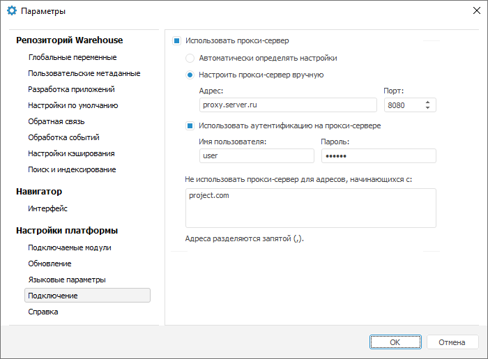

# Подключение к прокси-серверу

Подключение к прокси-серверу
-

# Подключение к прокси-серверу

При работе в инструментах «[Импорт
 данных](UiNavObj.chm::/Data_import_wizard/Data_import_wizard.htm)»
 и «[Задача
 ETL](UiETL.chm::/Desktop/01_General_Info/UiETL_General.htm)» может
 потребоваться доступ к сети Internet для получения или отправки данных.
 При импорте данных сеть Internet потребуется, если используется источник
 данных [REST](UiNavObj.chm::/Data_import_wizard/Select_and_configure_the_data_source.htm#rest).
 В задаче ETL сеть Internet используется при работе следующих коннекторов:

	- коннектор к источнику [REST](UiETL.chm::/Desktop/03_ETLObjects/02_Inputs/Inputs_REST.htm);

	- коннектор к источнику [JSON](UiETL.chm::/Desktop/03_ETLObjects/02_Inputs/Inputs_JSON.htm);

	- коннектор к приёмнику [JSON](UiETL.chm::/Desktop/03_ETLObjects/03_Outputs/JSON/JSON_Outputs.htm).

Если доступ из текущей локальной сети в Internet осуществляется через
 прокси-сервер, то его настройки можно задать в параметрах репозитория.
 Для задания настроек прокси-сервера используйте вкладку «Подключение»
 в диалоге «Параметры».

[Для открытия
 окна](javascript:TextPopup(this))

		- в веб-приложении выполните команду  «Параметры» на боковой панели
		 [навигатора
		 объектов](GetStarted.chm::/Interface/Interface_Navigator.htm);

		- в настольном приложении выполните команду «Сервис >
		 Параметры» в главном меню навигатора объектов.

По умолчанию прокси-сервер не используется, при этом все запросы в Internet
 отправляются напрямую. Для включения переадресации запросов на прокси-сервер
 установите флажок «Использовать прокси-сервер»,
 после этого будут доступны все остальные настройки.

Выберите способ определения настроек прокси-сервера:

	- Автоматически определять настройки.
	 Настройки прокси-сервера определяются автоматически путем опроса компьютеров
	 в локальной сети;

	- Настроить прокси-сервер вручную.
	 Укажите имя или IP-адрес прокси-сервера в поле «Адрес»
	 и порт для подключения в поле «Порт».

Если на прокси-сервере требуется аутентификация пользователя, который
 осуществляет подключение, то установите флажок «Использовать
 аутентификацию на прокси-сервере» и укажите учетные данные пользователя
 в полях «Имя пользователя» и «Пароль».

В списке «Не использовать прокси-сервер
 для адресов, начинающихся с» через запятую могут быть указаны адреса,
 подключение к которым будет осуществляться напрямую в обход прокси-сервера.

Указанные настройки прокси-сервера сохраняются в реестр текущего компьютера
 и будут использоваться при работе в любом репозитории, для которого создано
 описание.

Примечание.
 В «Форсайт. Аналитическая платформа»
 в основе реализации подключения к прокси-серверу лежит сторонняя библиотека
 libcurl. С её назначением, возможностями и ограничениями можно ознакомиться
 на официальном сайте [https://curl.haxx.se/libcurl/](https://curl.haxx.se/libcurl/).

См. также:

[Дополнительные
 справочные материалы](../../GUI/General_principles.htm)

		Справочная
		 система на версию 10.9
		 от 18/08/2025,
		 © ООО «ФОРСАЙТ»,
