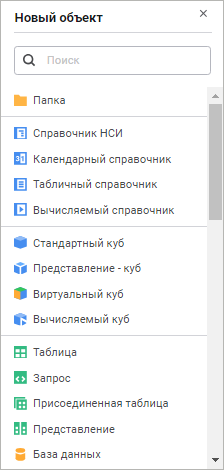
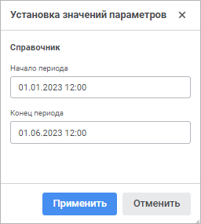
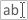

# Работа в навигаторе объектов

Работа в навигаторе объектов
-

# Работа в навигаторе объектов

При работе в [навигаторе
 объектов](GetStarted.chm::/Interface/Interface_Navigator.htm) доступна: работа с объектами, управление личными
 данными пользователя и изменение параметров продукта «Форсайт. Аналитическая платформа»:

	- работа с объектами является одной
	 из основных функций навигатора объектов. В неё входят:

		- [просмотр
		 и редактирование свойств объекта](../03_Objects/UiNav_Obj_BasicProp.htm);

		- [блокировка
		 объектов](UiNav_BlockObjects.htm). Доступна только в настольном приложении;

		- [перевод
		 наименований объектов](../03_Objects/Translate_names.htm). Доступен только в настольном приложении;

		- [поиск
		 объектов](UiNav_FindObject.htm);

		- [управление
		 отображением объектов](../GUI/View.htm);

		- [управление
		 правами доступа](UiNav_PrDo.htm). Доступно только в настольном приложении;

		- [просмотр
		 истории изменений](UiNav_ObjVer.htm). Доступен только в настольном приложении;

		- [открытие
		 и сохранение объектов из инструментов продукта «Форсайт. Аналитическая платформа»](../GUI/Open_save.htm);

		- [предварительный
		 просмотр и печать объекта](../GUI/Object_preview.htm);

	- некоторые действия по управлению данными пользователя доступны
	 при работе в навигаторе объектов:

		- [смена
		 пароля](UiNav_ChangePass.htm);

		- [просмотр
		 и изменение электронных адресов пользователя](UiNav_PersonalData.htm). Доступен только
		 в настольном приложении;

	- изменения параметров продукта «Форсайт. Аналитическая платформа»
	 позволяют настроить приложение для работы с определенной справочной
	 системой, репозиторием, модулями и прокси сервером:

		- [выбор
		 типа справочной системы](UiNav_RepoConfig_Help.htm). Доступен только в настольном приложении;

		- [изменение
		 настроек репозитория по умолчанию](Repo_Default.htm);

		- [подключение
		 к прокси-серверу](CommonSettings/ProxyServer.htm). Доступно только в настольном приложении.

Для быстрой навигации по папкам и составным объектам репозитория, таким
 как сборка, база данных временных рядов и контейнер моделирования, предназначено
 [дерево объектов](GetStarted.chm::/interface/interface_navigator.htm).
 Для разворачивания/сворачивания иерархии папки или составного объекта
 в дереве объектов:

	- используйте экспандеры около папки или объекта:

		- в веб-приложении: 
		 и ;

		- в настольном приложении: - и +;

	- дважды щёлкните по папке или объекту.

## Операции над объектами

В [навигаторе](GetStarted.chm::/Interface/Interface_Navigator.htm)
 над объектами можно производить операции:

[Создание](javascript:TextPopup(this))

	Навигатор объектов репозитория позволяет создавать неограниченное
	 количество объектов любого уровня вложенности. Это позволяет определить
	 ту структуру репозитория, которая соответствует потребностям пользователя.

	Могут быть созданы объекты заранее определенных типов. Дополнительно
	 можно определить [собственные
	 типы объектов](UiDevEnv.chm::/04_NavigatorSetting/Classes_Object/UiNav_Classes_Object.htm) . Создание и редактирование большинства
	 объектов репозитория осуществляется при помощи мастеров.

	Для создания объекта:

		- в веб-приложении:

			- Выполните одно из действий:

				- нажмите кнопку  «Создать» в [главном
				 меню](GetStarted.chm::/interface/interface_navigator.htm) навигатора объектов;

				- выполните команду «Создать»
				 в контекстном меню навигатора объектов.

			- Выберите требуемый объект из списка на открывшейся панели
			 «Новый объект»:

	

	Дальнейшая работа по созданию зависит
	 от выбранного типа объекта.

	Для поиска определённого типа объекта
	 начните вводить искомый текст в строке поиска. При вводе слова целиком
	 или его части в списке будут отображаться элементы, которые содержат
	 искомое сочетание символов.

	Для закрытия панели «Новый
	 объект» нажмите кнопку  «Закрыть» или клавишу ESC;

		- в настольном приложении:

			- нажмите кнопку  «Новый объект» в группе «Создать» на вкладке «Главная» ленты инструментов;

			- выполните команду «Создать»
			 в контекстном меню навигатора объектов.

	Примечание.
	 При создании объекта внутри объекта-контейнера будет сформирован список
	 тех объектов, которые допустимы для создания в рамках данного контейнера.

[Редактирование](javascript:TextPopup(this))

	Для редактирования выбранного объекта репозитория:

		- в веб-приложении:

			- выполните команду «Редактировать»
			 в контекстном меню объекта;

			- выполните команду «Редактировать
			 в новой вкладке» в контекстном меню объекта;

			- выполните команду «Редактировать
			 в новом окне» в контекстном меню объекта;

			- нажмите клавишу F4;

		- в настольном приложении:

			- нажмите кнопку  «Редактировать»
			 в группе «Открыть»
			 на вкладке «Главная»
			 ленты инструментов;

			- выполните команду «Редактировать»
			 в контекстном меню объекта;

			- нажмите клавишу F4.

	Дальнейшая работа по редактированию зависит от типа объекта.

	Примечание.
	 Редактирование доступно не для всех типов объектов.

	При редактировании объекта репозитория его содержимое будет автоматически
	 обновлено во всех [зависящих
	 от него объектах](../03_Objects/UiNav_Obj_BasicPropDependants.htm).

[Открытие](javascript:TextPopup(this))

	Большинство объектов репозитория можно открыть. Например, для таблиц -
	 это открытие окна просмотра данных, для форм - запуск на выполнение
	 и т.д.

	Для открытия выбранного объекта репозитория:

		- в веб-прилжении:

			- выполните команду «Открыть»
			 в контекстном меню объекта;

			- выполните команду «Открыть
			 в новой вкладке» в контекстном меню объекта;

			- выполните команду «Открыть
			 в новом окне» в контекстном меню объекта;

			- дважды щёлкните по объекту;

			- нажмите клавишу ENTER;

		- в настольном приложении:

			- нажмите кнопку  «Открыть/Просмотр», расположенную
			 в группе «Открыть»
			 на вкладке «Главная»
			 ленты инструментов;

			- выполните команду «Открыть» в
			 контекстном меню объекта;

			- дважды щёлкните по объекту.

	Примечание.
	 Экспресс-отчёт при двойном щелчке открывается в режиме редактирования.

[Открытие
 параметрических объектов](javascript:TextPopup(this))

	Большинство объектов репозитория может содержать параметры, управляющие
	 отображением их данных. Такие объекты называются параметрическими.

	При открытии параметрического объекта отобразится окно «Установка
	 значений параметров», в котором необходимо задать значения
	 параметров. Пример окна для объекта «[Табличный
	 справочник](uinavobj.chm::/reference_book/Master_Table_reference_book/Master_Table.htm)»:

	

	Вид полей для ввода параметров зависит от типа параметра. Если для
	 параметра было указано значение по умолчанию, то оно будет отображено
	 в соответствующем поле. Для остальных параметров необходимо установить
	 значения вручную.

	Примечание.
	 При работе с параметрами объекта автоматически сохраняются последние
	 введённые пользователем значения. При последующем открытии объекта
	 будут отображены сохранённые значения параметров.

[Открытие
 куба и базы данных временных рядов](javascript:TextPopup(this))

	Под открытием куба или базы данных временных рядов понимается открытие
	 одного из инструментов продукта «Форсайт. Аналитическая платформа»,
	 где в качестве источника данных используется указанный куб или база
	 данных временных рядов.

	Для открытия куба в качестве источника для экспресс-отчета и базы данных временных рядов
	 в качестве источника рабочей
	 книги:

		- в веб-прилжении:

			- выполните команду «Открыть»
			 в контекстном меню объекта;

			- выполните команду «Открыть
			 в новом окне» в контекстном меню объекта;

			- дважды щёлкните по объекту;

			- нажмите клавишу ENTER;

		- в настольном приложении:

			- выполните команду
			 «Открыть» в контекстном
			 меню куба или базы данных временных рядов;

			- нажмите кнопку  «Открыть», расположенную
			 на вкладке «Главная»
			 ленты инструментов.

	Для открытия куба или базы данных временных рядов с помощью других
	 инструментов:

		- выполните команду «Открыть
		 с помощью» в контекстном меню куба или базы данных временных
		 рядов и выберите из раскрывающегося меню нужный инструмент;

		- нажмите нижнюю часть кнопки  «Открыть», расположенной на вкладке
		 «Главная» ленты инструментов,
		 и выберите необходимый инструмент.

	Примечание.
	 Открытие куба или базы данных временных рядов с помощью других инструментов
	 доступно только в настольном приложении.

	Для куба доступно открытие с помощью инструментов:

		- Аналитические запросы
		 (OLAP);

		- Отчёты;

		- Аналитические панели.

	Примечание.
	 В веб-приложении для куба доступно открытие только с помощью инструмента
	 «Аналитические запросы (OLAP)».

	Для базы данных временных рядов доступно открытие с помощью инструментов:

		- Моделирование и прогнозирование;

		- Анализ временных рядов;

		- Аналитические запросы
		 (OLAP);

		- Отчёты;

		- Аналитические панели.

	Примечание.
	 В веб-приложении для базы данных временных рядов доступно
	 открытие только с помощью инструмента «Анализ
	 временных рядов».

	Если в навигаторе объектов было выделено несколько источников данных,
	 то при открытии через меню «Открыть
	 с помощью» будут доступны только пункты «Аналитические
	 запросы (OLAP)» и «Конструктор
	 аналитических панелей».

	Примечание.
	 Открытие нескольких объектов одновременно доступно только в настольном
	 приложении.

[Переименование](javascript:TextPopup(this))

	Для переименования выбранного объекта репозитория:

		- в веб-приложении:

			- выполните команду «Свойства»
			 в контекстном меню объекта. В открывшемся окне на вкладке
			 «[Тип
			 объекта](../03_Objects/UiNav_Obj_BasicPropGeneral.htm)» введите новое наименование объекта репозитория;

			- выполните команду «Переименовать»
			 в контекстном меню объекта;

			- нажмите клавишу F2;

		- в настольном приложении:

			- нажмите кнопку  «Переименовать», расположенную
			 в группе «Упорядочить»
			 на вкладке «Главная»
			 ленты инструментов;

			- выполните команду «Свойства»
			 в контекстном меню объекта. В открывшемся окне на вкладке
			 «[Тип
			 объекта](../03_Objects/UiNav_Obj_BasicPropGeneral.htm)» введите новое наименование объекта репозитория;

			- выполните команду «Переименовать»
			 в контекстном меню объекта;

			- выделите объект и щёлкните по его наименованию;

			- нажмите клавишу F2.

	После редактирования наименования объекта репозитория его наименование
	 будет автоматически обновлено во всех [зависящих
	 от него объектах](../03_Objects/UiNav_Obj_BasicPropDependants.htm).

[Удаление](javascript:TextPopup(this))

	Для удаления выбранного объекта репозитория:

		- в веб-приложении:

			- выполните команду «Удалить»
			 в контекстном меню объекта;

			- нажмите клавишу DELETE;

		- в настольном приложении:

			- нажмите кнопку  «Удалить», расположенную
			 в группе «Упорядочить»
			 на вкладке «Главная»
			 ленты инструментов;

			- выполните команду «Удалить»
			 в контекстном меню объекта;

			- нажмите сочетание клавиш CTRL+DELETE.

	Будет выдано подтверждение выполняемого действия.

	Примечание.
	 Если при удалении обнаружены объекты репозитория, которые зависят
	 от удаляемого объекта, или удаляемый объект является [объектом
	 репозитория по умолчанию](Repo_Default.htm), будет выдано сообщение о невозможности
	 удаления и объект не будет удалён.

[Выделение](javascript:TextPopup(this))

	Для выделения одного объекта в [списке объектов](GetStarted.chm::/Interface/Interface_Navigator.htm)
	 щёлкните по нему. Для перемещения выделения на объект выше или ниже
	 используйте клавиши UP и DOWN соответственно.

	Для выделения нескольких объектов в списке объектов зажмите клавишу
	 CTRL и поочерёдно выделите требуемые объекты. Для выделения диапазона
	 объектов выделите первый объект из требуемого диапазона, зажмите клавишу
	 SHIFT и выделите последний объект диапазона.

	Примечание.
	 При выделении нескольких объектов нажатие клавиш UP или DOWN приведёт
	 к выделению объекта, находящегося соответственно выше или ниже от
	 последнего выделенного объекта. Выделение с остальных объектов будет
	 снято.

	Для выделения всех объектов в [списке объектов](GetStarted.chm::/Interface/Interface_Navigator.htm):

		- в веб-приложении нажмите сочетание клавиш CTRL+A;

		- в настольном приложении:

			- нажмите кнопку  «Выделить
			 все», расположенную на вкладке «Главная»
			 ленты инструментов;

			- нажмите сочетание клавиш ALT+A.

	Для снятия выделения:

		- нажмите кнопку  «Снять
		 выделение», расположенную на вкладке «Главная»
		 ленты инструментов;

		- щёлкните по пустой области списка объектов.

	Примечание.
	 Снятие выделения доступно только в настольном приложении.

[Обновление
 списка объектов](javascript:TextPopup(this))

	Обновление списка объектов служит для актуализации содержимого репозитория.

	Для обновления списка объектов:

		- в веб-приложении нажмите кнопку  «Обновить» в главном меню навигатора
		 объектов или клавишу F5;

		- в настольном приложении нажмите кнопку  «Обновить», расположенную на
		 вкладке «Главная» ленты
		 инструментов, или клавишу F5.

[Синхронизировать
 с исходным объектом](javascript:TextPopup(this))

	Команда «Синхронизировать с исходным
	 объектом» служит для актуализации информации, содержащейся
	 в [ярлыке](UiNavObj.chm::/UiNavObj_label.htm),
	 с источником. Для этого выполните команду «Синхронизировать
	 с исходным объектом» в контекстном меню ярлыка.

	Примечание.
	 Синхронизация с исходным объектом доступна только в настольном приложении.

Примечание.
 Команды по работе с объектами будут недоступны или ограничены, если на
 требуемый инструмент отсутствует [единица лицензирования](Setup.chm::/08_Licensing/Admin_Licensing.htm).
 Допустимые операции над объектами определяются в зависимости от [прав
 и привилегий](UiNav_PrDo.htm), которые есть у пользователя.

См. также:

[Интерфейс
 навигатора](GetStarted.chm::/Interface/Interface_Navigator.htm) | [Работа
 с буфером обмена](UiNav_ObjectsOperations.htm)

		Справочная
		 система на версию 10.9
		 от 18/08/2025,
		 © ООО «ФОРСАЙТ»,
