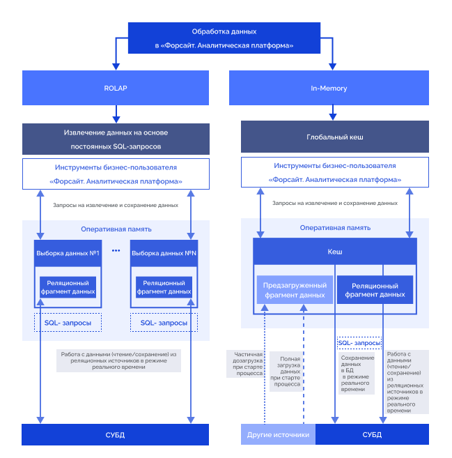

# Кеширование данных по технологии In-Memory

Кеширование данных по технологии In-Memory
-

# Кеширование данных по технологии
 In-Memory

Для реализации кеширования применяется технология In-Memory. В «Форсайт. Аналитическая платформа»
 реализованы следующие подходы к работе с данными:

	- ROLAP. Получение данных
	 SQL-запросами из различных СУБД, включая реляционные и колоночные,
	 в режиме реального времени;

	- In-Memory. Получение
	 необходимых данных из специализированных многомерных баз данных, специальных
	 файлов или реляционных СУБД в оперативную память.

## ROLAP

При каждом новом обращении к данным выполняется SQL-запрос к СУБД в
 режиме реального времени. Результат выполнения поступает на
 BI-сервер и преобразуется в матрицу данных, которая хранится в оперативной
 памяти BI-сервера. Операция обработки результата выполнения SQL-запроса
 занимает значительное время, особенно при большом количестве данных, полученных
 в результате выполнения запроса. Обработка результата происходит построчно,
 при этом скорость чтения данных ограничена скоростью конкретного типа
 СУБД. Такой подход характеризуется гибкостью и экономным расходом памяти,
 так как загрузить можно только те данные, которые необходимы сейчас.

## In-Memory

In-Memory – это технология, обеспечивающая загрузку данных из источников
 в оперативную память с последующим обращением к ним «на лету» без необходимости
 обращения к диску или СУБД, за счёт чего значительно увеличивается скорость
 доступа к данным и их обработки.

Сохраненные в специальном формате данные загружаются в оперативную память,
 при этом трансформация в матрицу не требуется, так как данные уже хранятся
 в многомерном виде. Достаточно одного запроса, чтобы получить всю матрицу
 целиком и разместить её в оперативной памяти BI-сервера. В качестве источника
 хранения многомерных данных могут выступать специализированные многомерные
 базы данных, специальные файлы или специальные структуры данных в реляционных
 СУБД.

Для кеширования данных в «Форсайт. Аналитическая платформа»
 по технологии In-Memory используются глобальный кеш.
 Для получения подробной информации о глобальном кеше обратитесь к статье
 «[Работа
 с глобальным кешем](Cache_In_Blob.htm)».

Механизмы обработки данных в «Форсайт. Аналитическая платформа»:

Сравнение механизмов обработки данных в «Форсайт. Аналитическая платформа»:

		 Критерий
		 ROLAP

		 Глобальный кеш

		 Сценарии применения при обработке данных
		 Универсальное использование

		 Частое чтение и сохранение данных.

		 Скорость создания (генерации) кеша данных
		 Кеш отсутствует

		 до 100 тыс. точек данных в 1 с.

		 Скорость загрузки кеша данных в оперативную память
		 Кеш отсутствует

		 до 1 млн. точек данных в 1 с.

		 Возможность восстановления данных после аварийной
		 ситуации
		 Не требуется. Данные хранятся в СУБД, их сохранность обеспечивается
		 средствами СУБД.

		 Есть

		 Автоматическая трансляция измененных данных в
		 многомерном кубе с данными в таблицах БД
		 Есть

		 Есть

		 Дополнительные накладные расходы при сохранении
		 данных
		 Нет

		 Нет

		 Поддерживаемые СУБД
		 Все доступные для использования в «Форсайт. Аналитическая платформа».

		 Все доступные для использования в «Форсайт. Аналитическая платформа».

Для хранения метаданных кеша дополнительно требуется
		 БД на PostgreSQL, Postgres Pro, Oracle или MS SQL Server.

См. также:

[Кеширование](UiNav_Cache.htm) |
 [Работа
 с глобальным кешем](Cache_In_Blob.htm) | [Работа
 с глобальным кешем в Fore](working_with_the_cache_from_the_fore.htm) | [Кеширование объектов репозитория](object_caching.htm)

		Справочная
		 система на версию 10.9
		 от 18/08/2025,
		 © ООО «ФОРСАЙТ»,
