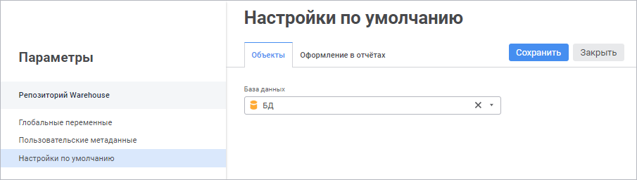
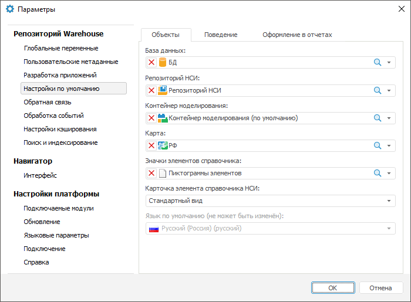
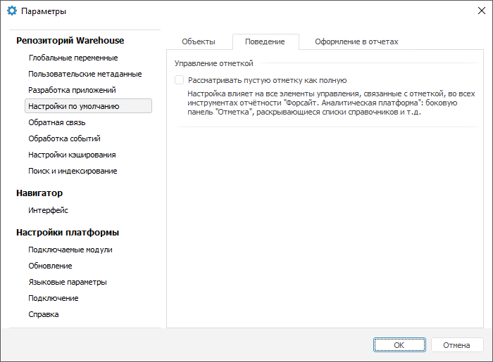
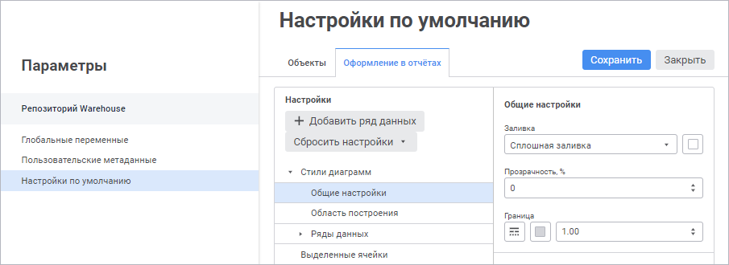
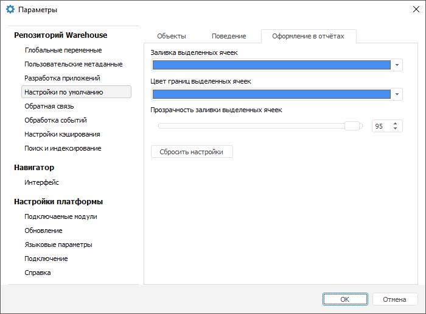

# Изменение настроек репозитория по умолчанию

Изменение настроек репозитория по умолчанию
-

# Изменение настроек репозитория по умолчанию

	Настройки репозитория по умолчанию позволяют задать объекты, поведение
	 объектов, оформление выделенных элементов таблицы в инструментах продукта
	 «Форсайт. Аналитическая платформа»
	 без необходимости их повторного выбора или настройки. Например, карта,
	 заданная по умолчанию, будет использоваться во всех отчётах.

	Примечание.
	 В веб-приложении в настройках по умолчанию доступно задание [объектов
	 репозитория ](#objects_default)и [настройка оформления
	 в отчётах](Repo_Default.htm#design).

	Для задания настроек репозитория по умолчанию используйте страницу/вкладку
	 «Настройки по умолчанию» в
	 окне «[Параметры](Setup.chm::/06_AK_Client_Config/Current_Repository_Settings.htm)».

[Для открытия
 окна](javascript:TextPopup(this))

		- в веб-приложении выполните команду  «Параметры» на боковой панели
		 [навигатора
		 объектов](GetStarted.chm::/Interface/Interface_Navigator.htm);

		- в настольном приложении выполните команду «Сервис >
		 Параметры» в главном меню навигатора объектов.

## Объекты

	Для задания объектов репозитория по умолчанию используйте вкладку
	 «Объекты».

		 Веб-приложение Настольное приложение

			

			

	Задайте параметры:

		- База данных. База
		 данных по умолчанию необходима для корректной работы инструментов
		 продукта «Форсайт. Аналитическая платформа».
		 База данных, установленная по умолчанию, будет автоматически выбрана
		 для хранения данных в [мастере
		 создания таблиц](UiNavObj.chm::/Table/Master/object_type_page.htm#create) и в [мастере
		 создания репозитория НСИ](UiNavObj.chm::/repository_RDS/RepositoryRDS.htm), а также будет использоваться
		 [мастером
		 импорта данных](UiNavObj.chm::/Data_import_wizard/Data_import_wizard.htm).

	Для быстрого поиска базы данных в репозитории
	 используйте строку поиска. В веб-приложении в зависимости от настроек
	 отображения объектов введите в строку поиска наименование, идентификатор
	 или ключ базы данных, которую необходимо найти. Поиск будет выполняться
	 автоматически по мере ввода искомого текста. В списке будут только
	 те базы данных, наименования/идентификаторы/ключи которых содержат
	 вводимый текст. Для очистки строки нажмите кнопку 
	 «Очистить» или используйте
	 клавишу BACKSPACE.

	Для настройки отображения объектов репозитория
	 на боковой панели нажмите кнопку 
	 «Отображение объекта» и выберите
	 в раскрывающемся меню вариант отображения:

			- Наименование.
			 Объекты отображаются под своими наименованиями. Вариант по
			 умолчанию;

			- Идентификатор.
			 Объекты отображаются под своими идентификаторами;

			- Ключ. Объекты
			 отображаются под своими ключами.

	Выбрать можно несколько вариантов. Идентификатор
	 и ключ будут указаны в скобках.

		- Репозиторий НСИ.
		 Установка репозитория НСИ по умолчанию необходима для работы [контейнера
		 моделирования в веб-приложении](UiModelling.chm::/Web/Work/UiModelling_w_work.htm);

		- Контейнер моделирования.
		 Контейнер моделирования, установленный по умолчанию, будет использоваться
		 при [создании
		 модели в веб-приложении](UiModelling.chm::/Web/Work/Web_Model_Work.htm);

		- Карта. Карта репозитория,
		 которая будет автоматически подставляться во все экспресс-отчёты,
		 для которых она не выбрана явно. Если карта по умолчанию не установлена,
		 то при первом просмотре карты в экспресс-отчёте будет выводиться
		 диалог выбора соответствующего объекта репозитория;

		- Значки элементов справочника.
		 Документ, содержащий графическое изображение, которое будет разбиваться
		 на пиктограммы и отображаться для элементов справочника. Графическое
		 изображение представляет собой ряд горизонтально расположенных
		 пиктограмм размером 16x16 пикселей в формате BMP;

		- Карточка элемента справочника
		 НСИ. Карточка элемента справочника НСИ, установленная по
		 умолчанию, будет использоваться при [создании
		 или редактировании элемента справочника](UiNavObj.chm::/reference_book/Work/Work_Elements.htm#addelement);

		- Язык
		 по умолчанию. Укажите язык репозитория, который будет использоваться
		 по умолчанию в инструментах продукта «Форсайт. Аналитическая платформа».
		 Язык по умолчанию можно выбрать один раз, то есть в дальнейшем
		 его нельзя будет изменить.

	Выбор языка по умолчанию доступен, если
	 он не был задан при [создании
	 репозитория](setup.chm::/05_RepoMngr/Setup_RepoMngr_CreateRepo.htm).

	Язык по умолчанию влияет на возможность
	 перевода на различные языки следующих объектов:

		-

			- [справочников
			 НСИ](../Multilanguage/UiRds_Locale.htm);

			- [наименований
			 объектов репозитория](../03_Objects/Translate_names.htm);

			- [баз
			 данных временных рядов](UiDw.chm::/FAQ/Translation.htm);

			- [объектов
			 пользовательских классов](UiDevEnv.chm::/04_NavigatorSetting/Classes_Object/UiNav_Classes_Object.htm). Выбранный язык
			 будет использоваться в качестве языка по умолчанию в ресурсах.
			 Подробнее о ресурсах вы можете узнать в разделе «[Перевод в ресурсах](../Multilanguage/Resources.htm)».

	После выполнения действий выбранные объекты по умолчанию будут использоваться
	 в инструментах продукта «Форсайт. Аналитическая платформа».

	Примечание.
	 В веб-приложении доступно только определение параметра «База
	 данных».

## Поведение

	Для настройки поведения по умолчанию используйте вкладку «Поведение»:

	

	Задайте параметры:

		- Рассматривать пустую отметку
		 как полную. По умолчанию флажок снят. Установка флажка
		 позволяет рассматривать измерения, в которых снята отметка, в
		 качестве измерений с полностью установленной отметкой. Таким образом,
		 визуализаторы будут строиться по полной отметке измерения, несмотря
		 на то, что отметка в измерении будет полностью снята.

	Для
	 получения более подробной информации о работе с отметкой измерений
	 обратитесь к разделу «[Отметка
	 элементов измерения](UiSelection.chm::/Selection/Selection_of_the_dimension_elements.htm)».

	Примечание.
	 Данное поведение не влияет на фиксированные измерения метрик.

	После выполнения действий заданное поведение по умолчанию будет
	 использоваться в инструментах продукта «Форсайт. Аналитическая платформа».

	[Ограничение
	 по использованию параметра в формах ввода](javascript:TextPopup(this))

		При добавлении новых элементов реестра в [веб-приложении](dataentryforms.chm::/Web/Work/New_entries.htm)/[настольном
		 приложении](dataentryforms.chm::/Desktop/Work/New_entries.htm) сохранение данных доступно, если
		 флажок «Рассматривать пустую
		 отметку как полную» снят.

## Оформление в отчётах

	Для настройки оформления диаграмм и таблиц в отчётах по умолчанию
	 используйте вкладку «Оформление в
	 отчётах»:

		 Веб-приложение Настольное приложение

			

			

	Примечание.
	 Настройка стилей диаграмм доступна только в веб-приложении.

### Настройка стилей диаграмм

	Для настройки стилей диаграмм в отчётах используйте группу параметров
	 «Стили диаграммы» в области
	 «Настройки» и задайте параметры:

	[Общие настройки](javascript:TextPopup(this))

		Укажите тип заливки и границы диаграммы:

			- Заливка. Выберите
			 в раскрывающемся списке тип заливки:

				- Без заливки.
				 Заливка фона диаграммы не будет использоваться;

				- Сплошная заливка.
				 Выберите цвет фона диаграммы в раскрывающейся палитре
				 цветов. При необходимости укажите процент прозрачности
				 цвета в поле «Прозрачность»;

				- Двухцветная заливка.
				 Выберите начальный и конечный цвета градиента в раскрывающейся
				 палитре цветов. При необходимости укажите процент прозрачности
				 цвета градиента в поле «Прозрачность»
				 и угол наклона в поле «Угол»;

			- Граница. Задайте
			 в соответствующих параметрах тип, цвет и толщину линии границы
			 диаграммы.

	[Область
	 построения](javascript:TextPopup(this))

		Укажите тип заливки и границы [части
		 области диаграммы](uidiagrams.chm::/Tuning_format/uidiagrams_tuning_construction_area_digramm.htm), на которой располагаются
		 ряды данных:

			- Заливка. Выберите
			 в раскрывающемся списке тип заливки:

				- Без заливки.
				 Заливка области построения диаграммы не будет использоваться;

				- Сплошная заливка.
				 Выберите цвет области построения диаграммы в раскрывающейся
				 палитре цветов. При необходимости укажите процент прозрачности
				 цвета в поле «Прозрачность»;

				- Двухцветная заливка.
				 Выберите начальный и конечный цвета градиента в раскрывающейся
				 палитре цветов. При необходимости укажите процент прозрачности
				 цвета градиента в поле «Прозрачность»
				 и угол наклона в поле «Угол»;

				- Чередование цветов.
				 Выберите первый и второй цвета, чередующиеся снизу вверх,
				 начиная с первого цвета области построения диаграммы,
				 в раскрывающейся палитре цветов. При необходимости укажите
				 процент прозрачности цвета в поле «Прозрачность»;

			- Граница. Задайте
			 в соответствующих параметрах тип, цвет и толщину линии границы
			 области построения диаграммы.

	[Ряды данных](javascript:TextPopup(this))

		Укажите настройки отображения [рядов данных](uidiagrams.chm::/Series.htm),
		 на основе которых строится диаграмма. По умолчанию доступно десять
		 рядов данных. Для каждого ряда данных задайте следующие настройки:

			- Заливка.
			 Выберите в раскрывающемся списке тип заливки:

				- Автоматическая
				 заливка. Цвет выбирается автоматически и соответствует
				 стандартному цвету ряда данных;

				- Сплошная заливка.
				 Выберите цвет ряда данных диаграммы в раскрывающейся палитре
				 цветов. При необходимости укажите процент прозрачности
				 цвета в поле «Прозрачность»;

			- Граница.
			 Задайте в соответствующих параметрах тип, цвет и толщину линии
			 границы ряда данных диаграммы.

		Примечание.
		 Для рядов данных кольцевой диаграммы применяются только настройки
		 заливки.

	Для добавления ряда данных нажмите кнопку 
	 «Добавить ряд данных». По
	 умолчанию доступно десять рядов данных.

	Для удаления выбранного ряда данных выполните команду  «Удалить
	 ряд данных» в раскрывающемся меню кнопки 
	 «Действия».

	Для изменения порядка рядов данных используйте механизм Drag&Drop.

	Настроенные стили диаграмм доступны для использования при создании
	 диаграмм в отчётах.

### Оформление выделенных ячеек таблицы

	В веб-приложении используйте группу параметров «Выделенные
	 ячейки» в области «Настройки».

	Для оформления выделенных ячеек таблицы в отчётах задайте параметры:

		- Цвет заливки выделенных
		 ячеек/Заливка выделенных ячеек. Выберите цвет заливки выделенных
		 ячеек таблицы в раскрывающейся палитре цветов. Также в настольном
		 приложении доступен выбор нового цвета с помощью кнопки «Другой». По умолчанию используется
		 синий цвет заливки;

		- Цвет границ выделенных
		 ячеек. Выберите цвет границы выделенных ячеек таблицы в
		 раскрывающейся палитре цветов. Также в настольном приложении доступен
		 выбор нового цвета с помощью кнопки «Другой».
		 По умолчанию используется синий цвет границы;

		- Прозрачность заливки выделенных
		 ячеек, %. Укажите степень прозрачности цвета заливки выделенных
		 ячеек таблицы в процентах: 100% - цвет заливки полностью прозрачен,
		 1% - цвет заливки непрозрачен. По умолчанию используется 95% прозрачности
		 цвета заливки.

	После выполнения действий настроенное оформление будет применяться
	 для выделенных ячеек таблицы во всех отчётах текущего репозитория.

### Сброс пользовательских настроек

	Для сброса пользовательских настроек и возврата к настройкам оформления
	 по умолчанию:

		- в веб-приложении выполните команду в раскрывающемся меню
		 кнопки «Сбросить настройки»:

			- Сбросить настройки диаграмм;

			- Сбросить настройки ячеек.

	После выполнения одного из действий будет
	 выдано информационное сообщение для подтверждения выполняемого действия.
	 Нажмите кнопку «Продолжить»,
	 после чего пользовательские настройки оформления диаграмм или ячеек
	 таблиц будут сброшены;

		- в настольном приложении нажмите кнопку «Сбросить
		 настройки».

См. также:

[Дополнительные
 справочные материалы](../GUI/General_principles.htm)

		Справочная
		 система на версию 10.9
		 от 18/08/2025,
		 © ООО «ФОРСАЙТ»,
