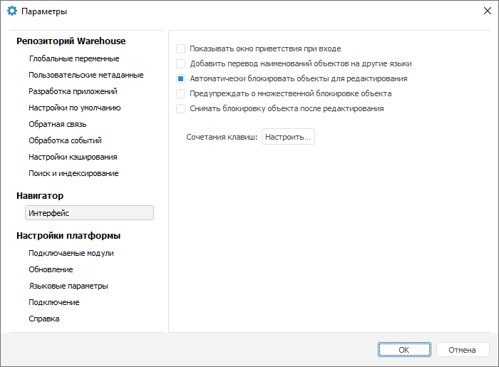
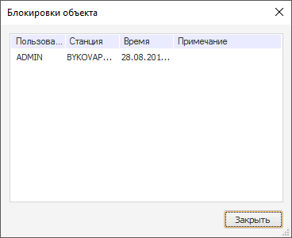

# Блокировка объектов

Блокировка объектов
-

# Блокировка объектов

К репозиторию может быть одновременно подключено несколько пользователей,
 объекты репозитория могут одновременно редактироваться несколькими пользователями.
 Для избежания редактирования объекта несколькими пользователями можно
 использовать блокировку.

Примечание.
 Блокировка объектов доступна только в настольном приложении. По умолчанию
 установлен флажок «Автоматически блокировать
 объекты для редактирования».

Для изменения настроек блокировки объектов используйте вкладку «Интерфейс» диалога «Параметры».

[Для открытия
 окна](javascript:TextPopup(this))

		- в веб-приложении выполните команду  «Параметры» на боковой панели
		 [навигатора
		 объектов](GetStarted.chm::/Interface/Interface_Navigator.htm);

		- в настольном приложении выполните команду «Сервис >
		 Параметры» в главном меню навигатора объектов.

Вкладка «Интерфейс» диалога
 «Параметры»:

Задайте параметры:

[Автоматически
 блокировать объекты для редактирования](javascript:TextPopup(this))

	Если флажок установлен, то при открытии объекта на редактирование
	 пользователю будет выдано предупреждение, в случае нахождения объекта
	 на редактировании у другого пользователя. При установленном флажке
	 сохраняется возможность редактирования объекта всеми пользователями.

	Если флажок снят, то при попытке пользователя открыть объект на
	 редактирование, будет выдано предложение о блокировке объекта.

[Предупреждать
 о множественной блокировке объектов](javascript:TextPopup(this))

	По умолчанию пользователь не уведомляется о том, что объект заблокирован
	 другим пользователем. Если флажок установлен для предупреждения пользователя
	 о блокировке объекта, то сообщение о блокировке отображается только
	 при первом редактировании объекта. Если несколько человек работают
	 с объектом под одним пользователем, то сообщение не отображается и
	 получение информации о блокировке невозможно.

[Снимать
 блокировку объекта после редактирования](javascript:TextPopup(this))

	Установка флажка позволяет автоматически снимать блокировку объекта
	 при выходе из режима редактирования объекта.

Для просмотра списка пользователей, которые заблокировали объект, выполните
 команду «Блокировки» в контекстном
 меню объекта. Будет открыто окно «Блокировки
 объекта»:

Для принудительной установки и снятия блокировки выполните команду
 «Заблокировать»/«Снять
 блокировку» в контекстном меню объекта.

Для просмотра иерархического списка заблокированных объектов в навигаторе
 используйте [плавающую
 панель](GetStarted.chm::/Interface/Interface_Description.htm#floatpane) «[Заблокированные
 объекты](../GUI/View.htm#blocking)».

См. также:

[Описание интерфейса
 навигатора](GetStarted.chm::/Interface/Interface_Navigator.htm)

		Справочная
		 система на версию 10.9
		 от 18/08/2025,
		 © ООО «ФОРСАЙТ»,
