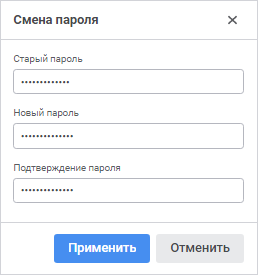
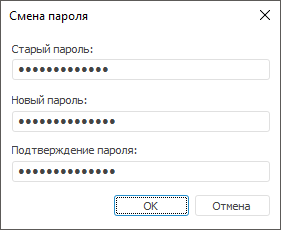

# Смена пароля

Смена пароля
-

# Смена пароля

Для смены пароля текущего пользователя:

	- Откройте окно «Смена пароля»:

		- в веб-приложении выполните команду  «Сменить пароль» на боковой панели
		 навигатора объектов;

		- в настольном приложении выполните команду «Сервис >
		 Смена пароля» в главном
		 меню навигатора объектов.

После выполнения действия будет открыто окно
 «Смена пароля».

	Веб-приложение
	 Настольное
	 приложение

		

		

	- Задайте параметры:

		- Старый пароль. Введите
		 текущий пароль пользователя;

		- Новый пароль. Введите
		 новый пароль пользователя. Пароль может начинаться с цифры, буквы
		 или символа "_" и может содержать латинские буквы (a-z,
		 A-Z), цифры 0-9, символы "_@#$&*%^" и должен соответствовать
		 установленной [парольной
		 политике](Admin.chm::/04_SecurityPolicy/Editor_of_Politicy/Security_EditorPoliticy_General_Parole.htm);

		- Подтверждение пароля.
		 Повторите ввод нового пароля пользователя.

	- Нажмите кнопку «Применить»
	 в веб-приложении или кнопку «ОК»
	 в настольном приложении.

После выполнения действий пароль пользователя будет изменён.

Примечание.
 Смена пароля пользователя доступна только при использовании [парольной аутентификации](Setup.chm::/UiWebSetup/Authentication/Authentication.htm)
 и при снятом флажке «[Запретить смену пароля пользователем](Admin.chm::/03_Admin/Users/Admin_UserProp_Common.htm)».

См. также:

[Интерфейс
 навигатора](GetStarted.chm::/Interface/Interface_Navigator.htm) | [Cмена пароля
 пользователя](Admin.chm::/03_Admin/Users/Admin_User_EditPass.htm) | [Парольная
 политика](Admin.chm::/04_SecurityPolicy/Editor_of_Politicy/Security_EditorPoliticy_General_Parole.htm)

		Справочная
		 система на версию 10.9
		 от 18/08/2025,
		 © ООО «ФОРСАЙТ»,
