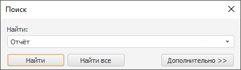
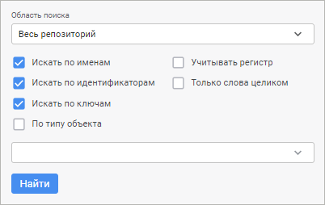
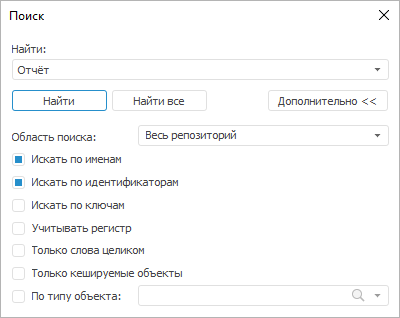
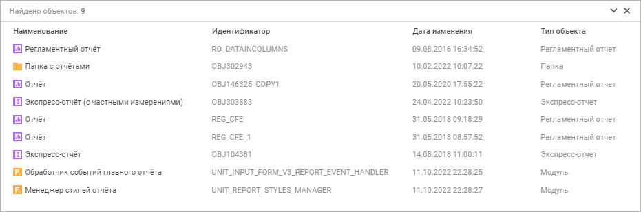
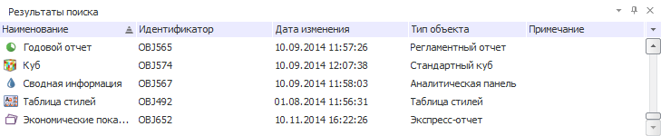

# Поиск объекта

Поиск объекта
-

# Поиск объекта

	Поиск объекта может осуществляться как по всему репозиторию, так
	 и в текущей папке. Для удобства можно найти все объекты, удовлетворяющие
	 заданным условиям. Объекты будут выведены в панель «[Результаты поиска](#search_result)».

	Поиск объекта репозитория отличается в веб- и настольном приложении.

		 Веб-приложение Настольное приложение

			Для поиска объекта репозитория используйте строку поиска,
			 расположенную в верхней части окна навигатора объектов:

			

			Введите в строку поиска наименование, идентификатор или
			 ключ объекта, который необходимо найти. После нажатия клавиши
			 ENTER будет открыта панель результатов поиска.

			Для поиска объекта репозитория используйте окно «Поиск».

			[Для
			 открытия окна](javascript:TextPopup(this))

					- нажмите на кнопку  «Поиск», расположенную
					 на вкладке «Главная»
					 ленты инструментов;

					- выполните команду «Поиск»
					 в контекстном меню в навигаторе объектов;

					- нажмите сочетание клавиш CTRL+F.

			

			В поле «Найти» введите
			 наименование объекта, который необходимо найти. После нажатия
			 кнопки «Найти» фокус
			 будет перемещён к первому найденному объекту, удовлетворяющему
			 параметрам поиска. Название кнопки изменится на «Найти
			 далее», нажатие которой приводит к поэтапному получению
			 результатов поиска.

## Параметры поиска

	Для задания дополнительных параметров поиска:

		- в веб-приложении нажмите кнопку  «Параметры поиска», после чего
		 появится панель дополнительных параметров;

		- в настольном приложении нажмите кнопку «Дополнительно»,
		 после чего в окне «Поиск»
		 отобразятся дополнительные параметры.

		 Веб-приложение Настольное приложение

			

			

	Определите параметры поиска:

		- Область поиска.
		 В раскрывающемся списке выберите область поиска:

			- Весь репозиторий.
			 Поиск будет осуществляться по всем объектам репозитория;

			- Текущая папка.
			 Поиск будет осуществляться только в текущей папке;

		- Искать по именам.
		 Флажок установлен по умолчанию. Поиск будет осуществляться по
		 именам объектов;

		- Искать по идентификаторам.
		 Флажок установлен по умолчанию. Поиск будет осуществляться по
		 идентификаторам объектов;

		- Искать по ключам.
		 Флажок установлен по умолчанию. Поиск будет осуществляться по
		 ключам объектов;

		- Учитывать регистр.
		 Поиск будет осуществляться с учётом регистра букв. Например, если
		 в поле поиска указано «Отчёт»,
		 то объекты, содержащие в наименовании и/или идентификаторе «отчёт» и «ОТЧЁТ»,
		 найдены не будут;

		- Только слова целиком.
		 Поиск будет осуществляться только по объектам, содержащим в наименовании
		 и/или идентификаторе строку, полностью и точно совпадающую со
		 строкой, введённой в поле поиска;

		- Только кешируемые объекты.
		 Флажок доступен только в настольном приложении. При установленном
		 флажке поиск будет осуществляться только по тем объектам, для
		 которых включено [кеширование](../03_Objects/UiNav_Obj_BasicPropCache.htm);

		- По типу объекта.
		 В раскрывающемся списке выберите один или несколько типов объектов.
		 Поиск будет осуществляться только среди объектов указанных типов.
		 Выбор нескольких типов доступен при зажатой клавише CTRL.

	Раскрывающийся список данного поля содержит
	 только видимые в навигаторе типы объектов. Для быстрого поиска типа
	 объекта предназначена строка поиска в верхней части раскрывающегося
	 списка.

	Примечание.
	 В настольном приложении данный поиск можно использовать, если флажок
	 «Только слова целиком» не
	 установлен.

	После задания параметров нажмите кнопку «Найти»
	 на панели параметров поиска. Результаты поиска будут отображены на
	 панели результатов поиска.

	Примечание.
	 При работе в веб-приложении ранее заданные параметры будут отображаться
	 при следующем запуске поиска.

## Результаты поиска

	При осуществлении поиска в веб-приложении или при нажатии кнопки
	 «Найти все» в настольном приложении
	 найденные объекты выводятся на панель результатов поиска.

		 Веб-приложение Настольное приложение

			

			

	На панели отображается количество найденных объектов, а также информация
	 о каждом объекте:

		- Наименование. Наименование
		 объекта;

		- Идентификатор. Идентификатор
		 объекта;

		- Дата изменения.
		 Дата последнего изменения объекта;

		- Тип объекта. Тип
		 найденного объекта;

		- Примечание. Доступно
		 только в настольном приложении.

	[Переход
	 к найденному объекту](javascript:TextPopup(this))

		Для перехода к найденному объекту в навигаторе:

			- в веб-приложении:

				- дважды щёлкните по объекту;

				- выполните команду  «Показать в навигаторе»
				 в контекстном меню объекта;

			- в настольном приложении:

				- нажмите клавишу ENTER:

				- дважды щёлкните по объекту;

				- выполните команду «Показать
				 в навигаторе» в контекстном меню объекта.

		В результате в списке объектов навигатора будет выделен выбранный
		 объект из результатов поиска.

	[Операции
	 над объектами на панели результатов](javascript:TextPopup(this))

		На панели результатов доступны операции над объектами:

			- [открытие
			 объекта](General_Principles_of_Work.htm#open_object);

			- [редактирование
			 объекта](General_Principles_of_Work.htm#edit_object);

			- [переименование
			 объекта](General_Principles_of_Work.htm#rename_object);

			- [удаление
			 объекта](General_Principles_of_Work.htm#del);

			- [работа с буфером
			 обмена](UiNav_ObjectsOperations.htm);

			- [просмотр
			 и редактирование свойств объекта](../03_Objects/UiNav_Obj_BasicProp.htm).

	[Настройка
	 отображения панели результатов](javascript:TextPopup(this))

		Для настройки отображения панели результатов:

			- в веб-приложении используйте кнопки  «Свернуть» и  «Развернуть»;

			- в настольном приложении используйте кнопку  «Результаты
			 поиска» на вкладке «[Вид](../GUI/View.htm)» ленты инструментов.

	Для закрытия панели результатов нажмите кнопку  «Закрыть».

См. также:

[Работа
 в навигаторе объектов](General_Principles_of_Work.htm) | [Интерфейс
 навигатора](GetStarted.chm::/Interface/Interface_Navigator.htm)

		Справочная
		 система на версию 10.9
		 от 18/08/2025,
		 © ООО «ФОРСАЙТ»,
