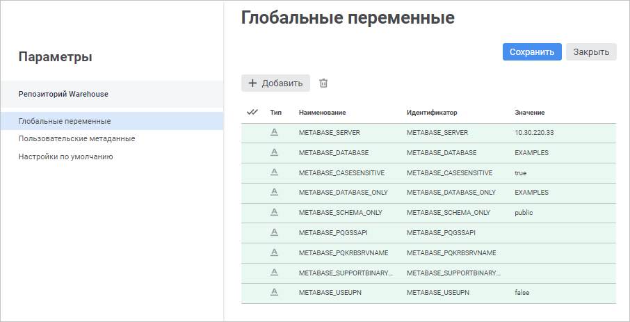
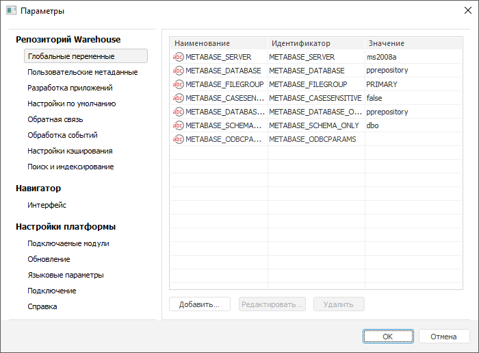

# Управление глобальными переменными

Управление глобальными переменными
-

# Управление глобальными переменными

Глобальные переменные могут использоваться в различных инструментах
 продукта «Форсайт. Аналитическая платформа»:
 создание колонтитулов отчетов, задание значений параметров или составление
 выражений. Значения глобальных переменных можно задавать из навигатора
 объектов или с помощью языка Fore (подробнее смотрите в описании интерфейса
 [ISharedParams](KeFore.chm::/Interface/ISharedParams/ISharedParams.htm)).
 Значения глобальных переменных одинаковы для всех пользователей репозитория.

Примечание.
 При использовании механизма мандатного разграничения доступа в репозитории
 возможность создавать и изменять глобальные переменные будет только у
 администратора и у пользователей, входящих в группу администраторов.

Для работы с глобальными переменными используйте страницу/вкладку «Глобальные переменные» в диалоге
 «Параметры».

[Для открытия
 окна](javascript:TextPopup(this))

		- в веб-приложении выполните команду  «Параметры» на боковой панели
		 [навигатора
		 объектов](GetStarted.chm::/Interface/Interface_Navigator.htm);

		- в настольном приложении выполните команду «Сервис >
		 Параметры» в главном меню навигатора объектов.

	 Веб-приложение Настольное приложение

		

		

На вкладке «Глобальные переменные»
 расположена таблица, содержащая список глобальных переменных и их параметров.

По умолчанию в списке всегда присутствуют системные глобальные переменные,
 которые нельзя удалить или отредактировать:

	- METABASE_SERVER. Значение
	 переменной соответствует псевдониму
	 сервера, на котором хранится репозиторий;

	- METABASE_DATABASE. Значение
	 переменной соответствует идентификатору базы данных (репозиторию).;

	- METABASE_FILEGROUP.
	 Значение переменной соответствует пользовательской файловой группе
	 базы данных сервера Microsoft SQL Server. Переменная отображается,
	 если в настройках репозитория указан тип драйвера Microsoft SQL Server;

	- METABASE_CASESENSITIVE.
	 Значение переменной соответствует использованию флажка «[Учитывать
	 регистр при работе с СУБД](Setup.chm::/06_AK_Client_Config/UiNav_RepoConfig_repo1.htm#more)» в настройках репозитория
	 для типов драйвера Microsoft SQL Server, Microsoft SQL Server (ODBC),
	 PostgreSQL;

	- METABASE_DATABASE_ONLY.
	 Значение переменной соответствует идентификатору базы данных;

	- METABASE_ODBCPARAMS.
	 Значение переменной соответствует дополнительным параметрам, заданным
	 в [строке
	 подключения](Setup.chm::/06_AK_Client_Config/UiNav_RepoConfig_repo1.htm#more), если в настройках репозитория указан
	 тип драйвера Microsoft SQL Server (ODBC). При подключении к [базе данных](UiNavObj.chm::/database/UiDb_database.htm)
	 и добавлении [связи
	 с репозиторием](UiNavObj.chm::/Link_with/UiDb_relational_LinkWith.htm) переменная автоматически добавляется
	 в строку подключения.

## Операции с глобальными переменными

[Добавление
 глобальной переменной](javascript:TextPopup(this))

	Для добавления переменной:

		- в веб-приложении нажмите кнопку  «Добавить». Будет добавлена новая
		 строка в список переменных;

		- в настольном приложении:

			- нажмите кнопку «Добавить»;

			- выполните команду «Добавить»
			 в контекстном меню пустой области списка;

			- дважды щёлкните по пустой области списка;

			- нажмите клавишу INSERT.

	Будет отображён диалог «[Создание глобальной переменной](UiNav_GlobalVariables_Edit.htm)».

[Редактирование
 глобальной переменной](javascript:TextPopup(this))

	Для редактирования выбранной переменной:

		- в веб-приложении измените настройки в соответствующих столбцах
		 нужной переменной;

		- в настольном приложении:

			- нажмите кнопку «Редактировать»;

			- выполните команду «Редактировать» в
			 контекстном меню глобальной переменной;

			- дважды щёлкните по переменной.

	Будет отображён диалог «[Редактирование глобальной переменной](UiNav_GlobalVariables_Edit.htm)».

[Удаление глобальной
 переменной](javascript:TextPopup(this))

	Для удаления одной или нескольких выбранных переменных:

		- в веб-приложении нажмите кнопку  «Удалить»;

		- в настольном приложении:

			- нажмите кнопку «Удалить»;

			- выполните команду «Удалить»
			 в контекстном меню переменной.

	После подтверждения действия глобальная переменная будет удалена.

	Примечание.
	 Глобальная переменная удаляется только из параметров репозитория.
	 Если удаленная переменная использовалась в каких-либо объектах, то
	 необходимо самостоятельно удалить её из них для продолжения корректной
	 работы объектов.

## Дополнительные глобальные переменные

Кроме системных глобальных переменных существует ряд дополнительных
 переменных, при создании которых определенным образом может измениться
 механизм работы «Форсайт. Аналитическая платформа».
 В таблице ниже представлен список этих переменных и их описание:

		 Идентификатор
		 Тип значения
		 Описание

		 AUTORUN_OBJECT_AS_MAIN
		 Любой
		 Данная глобальная переменная может использоваться, если для
		 репозитория определен [объект
		 автозапуска](Admin.chm::/04_SecurityPolicy/Editor_of_Politicy/Security_EditorPoliticy_General.htm). При входе в репозиторий окно объекта
		 автозапуска является главным. Из прикладного кода могут открываться
		 другие окна (прикладные формы или системные окна, например, навигатор
		 объектов), но при закрытии окна объекта автозапуска, все остальные
		 окна также будут закрыты.

Если прикладная логика требует закрытия только
		 окна объекта автозапуска, то создайте глобальную переменную AUTORUN_OBJECT_AS_MAIN
		 и установите для неё значение 0.

		 METABASE_OLEDBPARAMS
		 Строковый
		 Данная глобальная переменная используется для типа драйвера
		 Microsoft SQL Server c использованием OLE DB. Переменная предназначена
		 для хранения заданных дополнительных параметров подключения и
		 автоматически добавляется в строку подключения:

			- при добавлении [источника](UiETL.chm::/Desktop/03_ETLObjects/02_Inputs/UiEtl_Inputs_OleDB.htm)/[приёмника
			 данных](UiETL.chm::/Desktop/03_ETLObjects/03_Outputs/OleDB/UiEtl_Outputs_OleDB.htm) OLE DB в [задаче
			 ETL](UiETL.chm::/Desktop/01_General_Info/UiETL_General.htm);

			- при выборе источника данных OLE DB в [мастере
			 импорта](UiNavObj.chm::/Data_import_wizard/Select_and_configure_the_data_source.htm#other).

		При подключении к [базе данных](UiNavObj.chm::/database/UiDb_database.htm)
		 и добавлении [связи
		 с репозиторием](UiNavObj.chm::/Link_with/UiDb_relational_LinkWith.htm) переменная задается вручную.

		 NEW_D_CUBE
		 Целочисленный
		 Данная глобальная переменная используется для определения [типа
		 фильтрации](DataEntryForms.chm::/Desktop/Table/Table_Area_Structure.htm#filtering) для форм ввода.

Для использования нового типа фильтрации при
		 редактировании табличной области установите значение 1.

Для включения нового типа фильтрации для всех
		 табличных областей при открытии формы ввода на редактирование
		 установите значение 2.

Для использования старого типа фильтрации установите
		 любое другое значение, также старый тип фильтрации используется
		 при отсутствии значения.

См. также:

[Настройка
 колонтитулов регламентного отчета](UiReport.chm::/Desktop/Tuning/ParamPage/UiReport_Tuning_ParamPage_3.htm) | [Настройка
 заголовка регламентного отчета](UiReport.chm::/Desktop/Tuning/ParamPage/UiReport_Tuning_ParamPage_5.htm) | [Настройка
 колонтитулов экспресс-отчета](UiExpress.chm::/Express/ParamPage/UiExpress_Express_ParamPage3.htm) | [Настройка
 заголовка экспресс-отчета](UiExpress.chm::/Setup_express_report/UiExpress_Purpose_Toolbar_Title.htm)

		Справочная
		 система на версию 10.9
		 от 18/08/2025,
		 © ООО «ФОРСАЙТ»,
