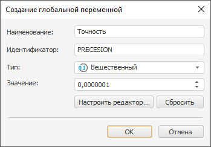

# Параметры глобальной переменной

Параметры глобальной переменной
-

# Параметры глобальной переменной

Окно создания/редактирования глобальной переменной будет открыто при
 нажатии одной из соответствующих кнопок «Добавить/Редактировать»
 на вкладке «[Глобальные
 переменные](UiNav_GlobalVariables.htm)» в настольном приложении:

Параметры глобальной переменной в веб-приложении задаются на странице
 «[Глобальные
 переменные](UiNav_GlobalVariables.htm)» диалога «Параметры».

Для глобальной переменной можно задать параметры:

	- Наименование;

	- Идентификатор;

	- Тип. Выбор
	 производится из раскрывающегося списка:

		- Строка;

		- Целый;

		- Вещественный;

		- Дата;

	- Значение.
	 Для ввода значения переменной используется редактор, вид которого
	 зависит от типа переменной. Для настройки редактора значений используется
	 кнопка «Настроить редактор»,
	 при нажатии которой открывается диалог настройки редактора «[Параметры редактора значений](../GUI/ValueEditorParameters.htm)». При
	 нажатии кнопки «Сбросить»
	 пользовательская настройка редактора значений будет сброшена и он
	 будет возвращен в состояние по умолчанию.

Примечание.
 Если «Форсайт. Аналитическая платформа»
 запущен с помощью PP.exe, то для редактирования будет доступно только
 поле «Значение».

См. также:

[Глобальные переменные](UiNav_GlobalVariables.htm)

		Справочная
		 система на версию 10.9
		 от 18/08/2025,
		 © ООО «ФОРСАЙТ»,
