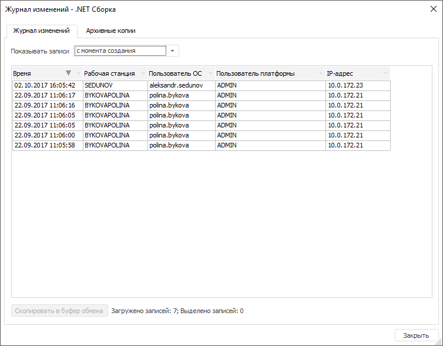

# Просмотр истории изменений

Просмотр истории изменений
-

# Просмотр истории изменений

История изменений объекта позволяет получить информацию о том, кто изменял
 объект за определённый промежуток времени.

Примечание.
 История изменений объекта доступна только в настольном приложении.

Для просмотра истории выбранного объекта следует выполнить команду «Журнал изменений» в контекстном
 меню. Будет открыт диалог, содержащий две вкладки: «Журнал
 изменений» и «Архивные копии».

## Журнал изменений

На вкладке отображается выдержка из [протокола
 доступа](Admin.chm::/05_AccessProtocol/Admin_AccessProtocol.htm): успешные и неуспешные изменения объекта. По
 умолчанию загружаются записи за последний день. При длительной загрузке
 данных в нижней части окна будет отображена индикация процесса.

Данные отображаются в виде таблицы, для которой можно настроить отображение
 и размер столбцов, сортировку и фильтрацию данных.

Для выбора выбрать промежутка времени, за который необходимо загрузить
 записи, используйте раскрывающийся список «Показывать
 записи»:

	- за последний день;

	- за последние 2 дня;

	- за последнюю неделю;

	- за последний месяц;

	- за последний год;

	- с момента создания;

	- за указанный период. При выборе этого варианта необходимо указать
	 диапазон дат и нажать кнопку «Применить»
	 для загрузки данных.

Для копирования отображаемой информации в буфер обмена:

	- нажмите кнопку «Скопировать
	 в буфер обмена»;

	- выберите пункт «Копировать»
	 в контекстном меню;

	- нажмите сочетание клавиш CTRL+C или CTRL+INSERT.

## Архивные копии

Если для объекта настроено ведение истории, то при каждом изменении
 объекту присваивается новая версия.
 Подробнее о ведении истории объекта написано в разделе «[Классы
 объектов](admin.chm::/04_SecurityPolicy/Admin_Object_Classes.htm)».

На вкладке отображаются параметры:

	- Версия. Порядковый номер
	 версии объекта;

	- Пользователь. Пользователь,
	 который произвел изменения;

	- Рабочая станция. Рабочая
	 станция, с которой производились изменения;

	- Дата. Дата изменения
	 объекта;

	- Примечание. Дополнительная
	 информация.

См. также:

[Настройка
 разрешений](Admin.chm::/04_SecurityPolicy/Admin_PermSep_AuditPermission.htm)

		Справочная
		 система на версию 10.9
		 от 18/08/2025,
		 © ООО «ФОРСАЙТ»,
