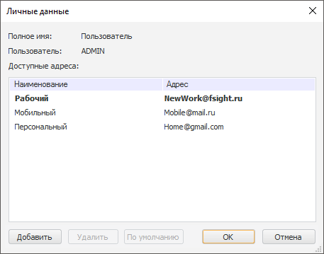
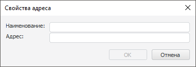
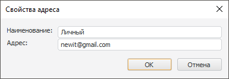

# Просмотр и изменение электронных адресов пользователя

Просмотр и изменение электронных адресов пользователя
-

# Просмотр и изменение электронных адресов пользователя

В навигаторе объектов доступна работа с электронными адресами пользователей
 с помощью диалога «Личные данные».

Примечание.
 Работа с личными данными доступна только в настольном приложении.

Личные данные содержат электронные адреса для отправки на них результата
 о выполненной задаче [контейнера
 запланированных задач](UiAppSrv.chm::/Getting_Started.htm), если в окне «[Параметры электронной почты](UiAppSrv.chm::/3_Work_Tasks/UiAppSrv_Work_Tasks_CreateTask_Rezult_Params.htm)»
 контейнера задач установлен переключатель «Выбрать
 для всех получателей», и выбраны необходимые адреса получателя.

Диалог «Личные данные» может
 содержать:

	- основные адреса: рабочий, мобильный, персональный;

	- пользовательские адреса.

[Для вызова диалога](javascript:TextPopup(this))

	Выполните команду «Сервис >
	 Личные данные» в главном меню навигатора объектов.

## Операции с адресами

[Добавление
 адресов](javascript:TextPopup(this))

	Для добавления нового адреса:

		- Нажмите кнопку «Добавить».
		 Будет отображён диалог:

	

		- Введите наименование и адрес электронной почты.

	В результате будет добавлен новый адрес.

[Редактирование
 адресов](javascript:TextPopup(this))

	Для редактирования адреса:

		- Дважды щёлкните по наименованию требуемого адреса. Будет
		 отображён диалог:

	

		- Внесите необходимые изменения.

	В результате адрес будет отредактирован.

	Примечание.
	 Доступно редактирование наименований всех адресов, кроме наименований
	 основных.

[Удаление
 адресов](javascript:TextPopup(this))

	Для удаления адреса:

		- Выберите необходимый адрес.

		- Нажмите кнопку «Удалить».

	Удаление адреса произойдёт без подтверждения.

	Примечание.
	 Доступно удаление всех адресов, кроме основных.

[Выбор
 адреса по умолчанию](javascript:TextPopup(this))

	Адрес по умолчанию используется для отправки на него результата
	 о выполненной задаче [контейнера
	 запланированных задач](UiAppSrv.chm::/Getting_Started.htm), если в окне «[Параметры электронной почты](UiAppSrv.chm::/3_Work_Tasks/UiAppSrv_Work_Tasks_CreateTask_Rezult_Params.htm)»
	 контейнера задач установлен переключатель «Основной
	 адрес получателя».

	Для задания нового адреса по умолчанию:

		- Выберите необходимый адрес.

		- Нажмите кнопку «По умолчанию».

	Адрес по умолчанию будет выделен жирным шрифтом.

См. также:

[Интерфейс
 навигатора](GetStarted.chm::/Interface/Interface_Navigator.htm)

		Справочная
		 система на версию 10.9
		 от 18/08/2025,
		 © ООО «ФОРСАЙТ»,
