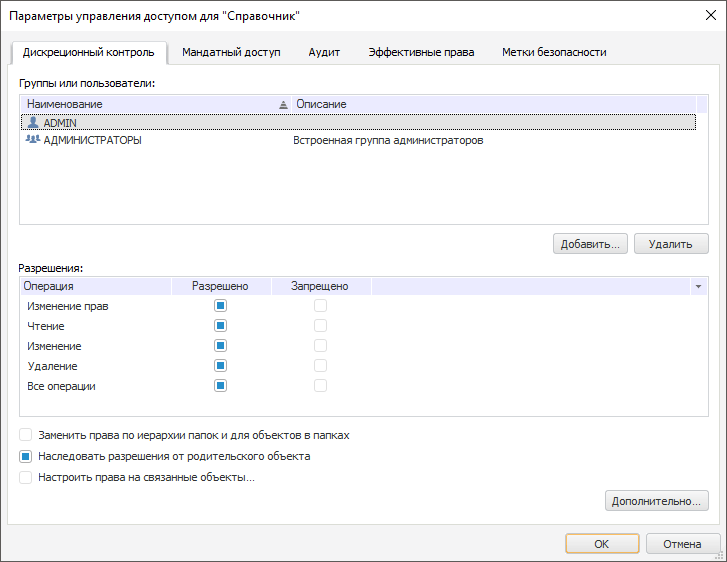

# Управление правами доступа

Управление правами доступа
-

# Управление правами доступа

Для каждого объекта репозитория возможно определение прав доступа. Определить
 права доступа можно как для групп пользователей, так и для отдельных пользователей.

Примечание.
 Управление правами доступа осуществляется только в настольном приложении
 и доступно пользователям, обладающим соответствующей привилегией.

Установка и редактирование прав доступа осуществляется в окне «Параметры управления доступом»,
 которое вызывается при выполнении команды контекстного меню «Права
 доступа» выбранного объекта:

Набор вкладок окна «Параметры управления
 доступом» зависит от настроенной политики безопасности и может
 содержать вкладки:

	- [Дискреционный
	 контроль](Admin.chm::/03_Admin/Admin_AdminObjects_Discretionary.htm);

	- [Мандатный
	 доступ](Admin.chm::/03_Admin/Admin_AdminObjects_Mandate.htm);

	- [Аудит](Admin.chm::/03_Admin/Admin_AdminObjects_Audit.htm);

	- [Эффективные
	 права](Admin.chm::/03_Admin/Admin_AdminObjects_Effective.htm);

	- [Метки
	 безопасности](Admin.chm::/03_Admin/Admin_AdminObjects_Marks.htm).

Более подробная информация об управлении
 доступом содержится в разделе «Администрирование
 и контроль доступа»: [Параметры управления
 доступом](Admin.chm::/03_Admin/Admin_AdminObjects.htm).

См. также:

[Интерфейс
 навигатора](GetStarted.chm::/Interface/Interface_Navigator.htm)

		Справочная
		 система на версию 10.9
		 от 18/08/2025,
		 © ООО «ФОРСАЙТ»,
