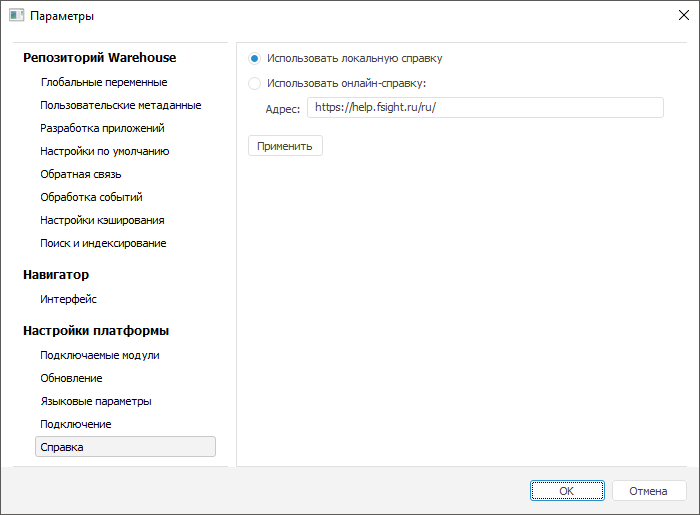

# Выбор типа справочной системы

Выбор типа справочной системы
-

# Выбор типа справочной системы

Продукт «Форсайт. Аналитическая платформа»
 может быть настроен на разные типы справочной системы:

	- локальная справка:

		- в ОС Linux поставляется для веб-приложения по запросу через
		 техническую поддержку по адресу [support@fsight.ru](mailto:support@fsight.ru)
		 или через [сервисы
		 технической поддержки](https://www.fsight.ru/support/), которые доступны после регистрации
		 на сайте;

		- в ОС Windows поставляется в [комплекте](setup.chm::/02_AK_Install/DistributionKit.htm)
		 с настольным приложением в виде набора chm-файлов;

	- онлайн-справка.

Выбор типа справочной системы в веб- и настольном приложениях отличаются.

	 Веб-приложение Настольное приложение

		По умолчанию используется адрес онлайн-справки:
		 https://help.fsight.ru.

		При [установке
		 локальной справки](setup.chm::/02_AK_Install/Installing_help_system.htm#help_linux) в ОС Linux используется адрес:
		 http://<веб-сервер>:<номер порта>/fp10.x/help/ru/help.htm.

		При необходимости для изменения адреса справочной системы добавьте
		 поле [helpUrl](setup.chm::/UiWebSetup/03_Setup_Web/PP_config_Java.htm#helpurl)
		 в файл конфигурации [config.json](setup.chm::/UiWebSetup/03_Setup_Web/PP_config_Java.htm#config_json).

		Для выбора типа справочной системы выполните команду «Сервис > Параметры»
		 в главном меню [навигатора объектов](GetStarted.chm::/Interface/Interface_Navigator.htm). После чего будет открыто окно «Параметры»:

		

		Установите один из переключателей:

			- Использовать
			 локальную справку. Будет использоваться локальная версия
			 справки, поставляемая вместе с «Форсайт. Аналитическая платформа»;

			- Использовать
			 онлайн-справку. Будет использоваться веб-версия справки.
			 В поле «Адрес» укажите
			 путь к папке на сервере либо на локальном диске, где хранится
			 онлайн-справка: [https://help.fsight.ru/ru/](https://help.fsight.ru/ru/).
			 В конце пути обязательно наличие слеша для корректной работы
			 контекстной справки.

		Примечание.
		 При нажатии на кнопку «Применить»
		 происходит проверка указанного адреса с действительным адресом
		 справочной системы продукта «Форсайт. Аналитическая платформа».
		 Если указанный адрес не соответствует, то тип справки не изменяется.

		Для применения выбранного типа справки нажмите кнопку «Применить».

Указанный адрес справочной системы для онлайн-справки или локальная
 справка вызываются:

	- при выполнении команды  «Справка» на боковой панели навигатора
	 объектов в веб-приложении;

	- при выполнении команды «Справка >
	 Содержание» в главном меню навигатора объектов в настольном
	 приложении;

	- при нажатии клавиши F1;

	- при открытии [инспектора
	 классов](uidevenv.chm::/01_development_environment/03_windows_of_development_environment/inspector_class.htm).

Язык используемой справки определяется в [языковых параметрах
 продукта «Форсайт. Аналитическая платформа»](GetStarted.chm::/Interface/Intro_Language.htm).

См. также:

[Дополнительные
 справочные материалы](../GUI/General_principles.htm)

		Справочная
		 система на версию 10.9
		 от 18/08/2025,
		 © ООО «ФОРСАЙТ»,
