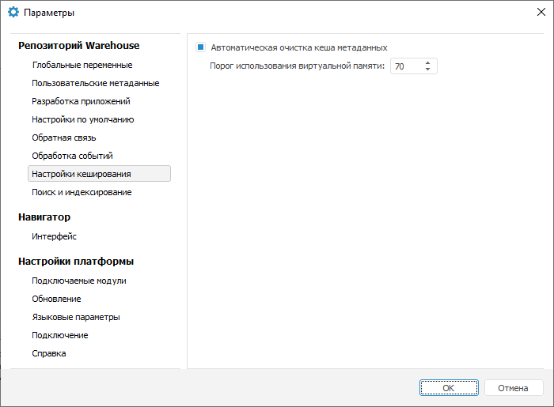

# Кеширование метаданных

Кеширование метаданных
-

# Кеширование метаданных

Для ускорения навигации по репозиторию кешируются метаданные объектов.

Различные параметры кеширования задаются в параметрах репозитория на
 вкладке «Настройки кеширования».
 Для открытия вкладки выполните действия:

	- Перейдите в навигатор объектов.

	- Выполните команду главного меню «Сервис >
	 Параметры».

	- В открывшемся диалоге выберите пункт «Настройки
	 кеширования».

В результате будет открыта вкладка «Настройки
 кеширования» окна «Параметры»:

Метаданные объектов, с которыми осуществляется работа, кешируются в
 оперативной памяти компьютера. Если объектов много, то обращение к ним
 может привести к использованию под кеш большого объема памяти. Чтобы такого
 не возникло, в «Форсайт. Аналитическая платформа»
 реализован механизм автоматической очистки кеша метаданных. По умолчанию
 автоматическая очистка производится при заполнении 70% доступной виртуальной
 памяти. Флажок «Автоматическая очистка
 кеша метаданных» позволяет изменить параметры работы механизма
 автоматической очистки кеша метаданных. Если флажок установлен, то в поле
 «Порог использования виртуальной памяти»
 в процентах можно указать объем используемой виртуальной памяти, при превышении
 которого будет включаться механизм очистки.

Значение порога использования виртуальной памяти сохраняется в [настройках
 BI-сервера](Setup.chm::/UiWebSetup/03_Setup_Web/BI_Server_Settings.htm) и используется им при работе во всех репозиториях.

Примечание.
 Данная настройка доступна при работе под пользователем ОС, который имеет
 права на редактирование системной ветки реестра (HKEY_LOCAL_MACHINE).

См. также:

[Кеширование](UiNav_Cache.htm)

		Справочная
		 система на версию 10.9
		 от 18/08/2025,
		 © ООО «ФОРСАЙТ»,
