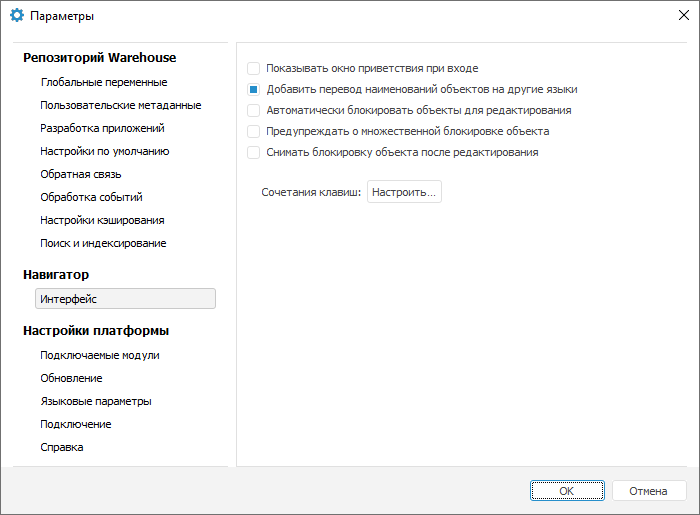
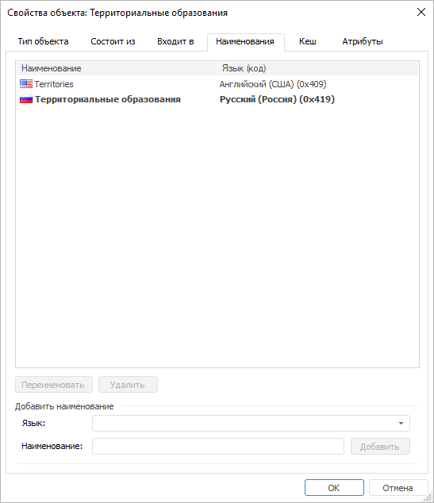
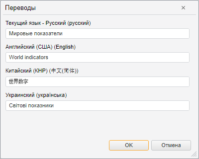

# Перевод наименований объектов репозитория на другие языки

Перевод наименований объектов репозитория на другие языки
-

# Перевод наименований объектов репозитория на другие языки

Для наименований объектов в репозитории можно создавать переводы на
 различные языки. Таким образом, при изменении [языка
 репозитория](setup.chm::/06_AK_Client_Config/UiNav_RepoConfig_repo1.htm#more) наименования объектов будут отображаться
 на выбранном языке в настольном приложении и веб-приложении.

Примечание.
 Перевод наименований объектов доступен только в настольном приложении.

## В настольном приложении

В настольном приложении можно настроить перевод наименований всех объектов
 репозитория. Переводы наименований объектов репозитория, заданные в настольном
 приложении, будут отображаться в веб-приложении при выборе соответствующего
 [языка](GetStarted.chm::/GetStarted/Get_Started.htm).

Для настройки переводов:

	- Откройте диалог «Параметры».
	 Для этого выполните команду «Сервис >
	 Параметры» в главном меню навигатора объектов.

		- Перейдите на вкладку «[Настройки
		 по умолчанию](../02_Navigator/Repo_Default.htm)» и убедитесь, что для репозитория задан
		 язык по умолчанию. Если язык не задан, то задайте его. Обратите
		 внимание, что язык репозитория по умолчанию выбирается один раз
		 и в дальнейшем не может быть изменен.

		- Перейдите на вкладку «Интерфейс» и убедитесь, что
		 установлен флажок «Добавить перевод
		 наименований объектов на другие языки»:

		

		Примечание.
		 При установке флажка в [свойствах
		 объекта](UiNav_Obj_BasicProp.htm) появится дополнительная вкладка «[Наименования](UiNav_Obj_BasicPropNames.htm)», на которой
		 будут отображены все имеющиеся наименования объекта на других
		 языках. По умолчанию флажок снят.

		- Закройте диалог «Параметры» с сохранением сделанных
		 изменений.

	- В навигаторе объектов выберите объект, для которого требуется
	 добавить перевод наименования. Выполните команду «Свойства»
	 в контекстном меню объекта. Будет открыт диалог «[Свойства
	 объекта](UiNav_Obj_BasicProp.htm)».

	- Перейдите на вкладку «[Наименования](UiNav_Obj_BasicPropNames.htm)».
	 На вкладке будет отображаться наименование объекта на языке, выбранном
	 по умолчанию для репозитория.

	- В списке «Язык» выберите
	 язык, на который требуется перевести наименование объекта.

	- В поле «Наименование»
	 введите наименование объекта на выбранном языке.

	- Нажмите кнопку «Добавить».

Наименование объекта на выбранном языке будет добавлено в список наименований:

При изменении [языка
 репозитория для пользователя](setup.chm::/06_ak_client_config/uinav_repoconfig_repo1.htm#more) будет изменяться наименование
 объекта.

Совет. Если вы используете
 несколько языков репозитория для пользователя, то задайте наименования
 на всех используемых языках. Если для объекта не задано наименование на
 языке репозитория для пользователя, то будет использоваться наименование
 объекта на языке репозитория по умолчанию.

## В веб-приложении

В веб-приложении отображается перевод наименований объектов репозитория,
 заданных в настольном приложении, при изменении [языка
 репозитория для текущего пользователя](setup.chm::/06_ak_client_config/uinav_repoconfig_repo1.htm#more).

Настройка переводов наименований в веб-приложении доступна только для
 объектов:

	- экспресс-отчёт;

	- аналитическая панель;

	- рабочая книга;

	- модель.

Для настройки переводов:

	- Откройте объект в режиме редактирования.

	- Выполните команду главного меню «Сохранить
	 как».

	- В открывшемся диалоге «Сохранить»
	 нажмите кнопку  «Переводы».

	- В открывшемся диалоге «Переводы»
	 введите наименование объекта на доступных языках:

Примечание. Список доступных языков задается в
 файле [PP.xml](Setup.chm::/UiWebSetup/03_Setup_Web/PP_config_Java.htm)
 в разделе <cultures>.

	- Нажмите кнопку «ОК».

При [изменении
 языковых настроек веб-приложения](GetStarted.chm::/GetStarted/Get_Started.htm) наименование объекта будет
 изменяться в соответствии с выбранным языком приложения.

См. также:

[Настройка
 мультиязычности](../Multilanguage/Multilanguage_setting.htm) | [Наименования](UiNav_Obj_BasicPropNames.htm)

		Справочная
		 система на версию 10.9
		 от 18/08/2025,
		 © ООО «ФОРСАЙТ»,
