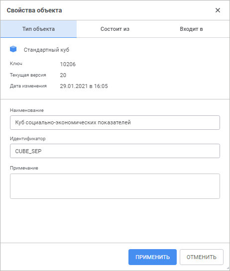
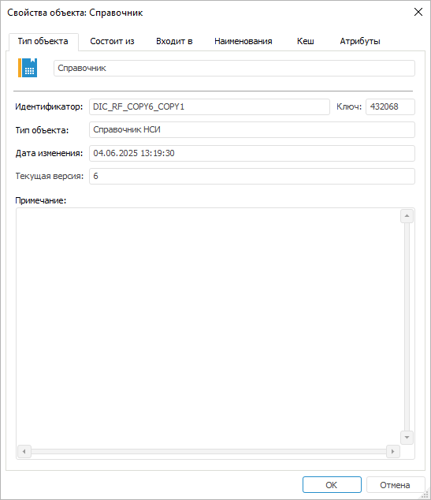

# Просмотр и редактирование свойств объекта

Просмотр и редактирование свойств объекта
-

# Просмотр и редактирование свойств
 объекта

Для просмотра и редактирования свойств объекта репозитория используйте
 окно «Свойства объекта» в [навигаторе
 объектов](GetStarted.chm::/Interface/Interface_Navigator.htm).

[Для открытия
 окна](javascript:TextPopup(this))

		- в веб-приложении:

			- выполните команду  «Свойства» в контекстном
			 меню объекта;

			- нажмите сочетание клавиш ALT+ENTER;

		- в настольном приложении выполните команду «Свойства»
		 в контекстном меню объекта.

	Веб-приложение Настольное приложение

		

		

Окно содержит вкладки:

	- [Тип
	 объекта](UiNav_Obj_BasicPropGeneral.htm). Просмотр и редактирование общей информации об объекте;

	- [Состоит
	 из](UiNav_Obj_BasicPropConsist.htm). Просмотр иерархии объектов, из которых состоит объект;

	- [Входит
	 в](UiNav_Obj_BasicPropDependants.htm). Просмотр иерархии объектов, которые ссылаются на объект;

	- [Наименования](UiNav_Obj_BasicPropNames.htm).
	 Добавление наименований объекта на других языках. Доступно только
	 в настольном приложении;

Примечание.
 Вкладка отображается, если для объектов репозитория настроен [перевод
 наименований на другие языки](Translate_names.htm).

	- [Кеш](UiNav_Obj_BasicPropCache.htm).
	 Управление работой кеша объекта. Доступно только в настольном приложении;

	- [Атрибуты](UiNav_Obj_BasicPropAttributes.htm).
	 Редактирование списка атрибутов объекта при использовании [атрибутного метода
	 разграничения доступа](admin.chm::/04_SecurityPolicy/Admin_ABAC.htm). Доступно только в настольном
	 приложении.

См. также:

[Работа
 в навигаторе объектов](../02_Navigator/General_Principles_of_Work.htm)

		Справочная
		 система на версию 10.9
		 от 18/08/2025,
		 © ООО «ФОРСАЙТ»,
