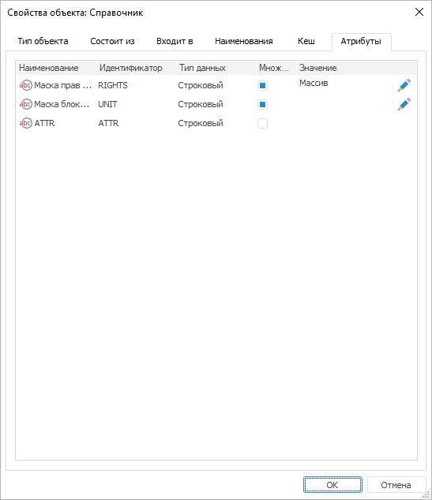
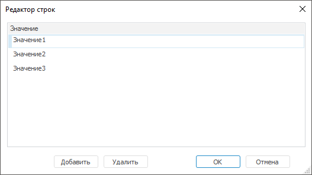

# Атрибуты: Свойства объекта репозитория

Атрибуты: Свойства объекта репозитория
-

# Атрибуты

На вкладке «Атрибуты» содержатся
 атрибуты объекта, добавленные для [классов
 объектов](Admin.chm::/04_SecurityPolicy/Creating_attributes.htm) и [типов
 объектов](Admin.chm::/04_SecurityPolicy/Admin_PermSep_Attributes.htm).

Примечание.
 Вкладка «Атрибуты» доступна только
 в настольном приложении.

Атрибуты задаются пользователю при выборе [атрибутного метода](admin.chm::/04_SecurityPolicy/Admin_ABAC.htm)
 разграничения доступа для дальнейшей проверки доступа пользователей к
 объекту в структуре политики [атрибутного
 доступа](admin.chm::/04_SecurityPolicy/Admin_AttributeAccess.htm).

Примечание.
 При [разделении
 ролей](admin.chm::/04_securitypolicy/editor_of_politicy/security_editorpoliticy_adm.htm) вкладка «Атрибуты»
 будет доступна только администратору информационной безопасности с [привилегией](admin.chm::/04_SecurityPolicy/Admin_Priv.htm)
 «Изменение прав пользователей, раздача
 ролей, изменение политики», «Изменение
 метки безопасности и списка контроля доступа любого объекта».

[Для открытия
 вкладки](javascript:TextPopup(this))

	Выполните команду «Свойства»
	 в контекстном меню объекта.

В таблице отображается список всех атрибутов объекта.
 Наименование, идентификатор и тип данных определяется при добавлении
 атрибутов для [классов
 объектов](Admin.chm::/04_SecurityPolicy/Creating_attributes.htm) и [типов
 объектов](admin.chm::/04_SecurityPolicy/Admin_PermSep_Attributes.htm).

На вкладке можно редактировать или добавлять
 значение атрибута:

	- при нажатии в поле «Значение».
	 Устанавливается единственное значение атрибута;

	- при установке флажка в столбце «Множественный».
	 Устанавливается несколько значений атрибута с помощью окна «Редактор строк»:

Для открытия окна «Редактор
 строк» нажмите кнопку  «Редактировать»
 в поле «Значение».

Введите в каждой строке значение, соответствующее
 типу данных атрибута, с помощью кнопки «Добавить».
 При необходимости удалите строку со значением с помощью кнопки «Удалить».

После редактирования или добавления значения нажмите кнопку «ОК»
 для сохранения изменений.

Заданные значения атрибутам объекта используйте для дальнейшей проверки
 доступа к объектам в [свойствах](admin.chm::/04_SecurityPolicy/Admin_AttributeAccess.htm#properties)
 элементов атрибутного доступа: [цель](admin.chm::/04_SecurityPolicy/Target.htm),
 [условие](admin.chm::/04_SecurityPolicy/Creating_conditions.htm).

См. также:

[Просмотр и редактирование свойств объекта](UiNav_Obj_BasicProp.htm)

		Справочная
		 система на версию 10.9
		 от 18/08/2025,
		 © ООО «ФОРСАЙТ»,
