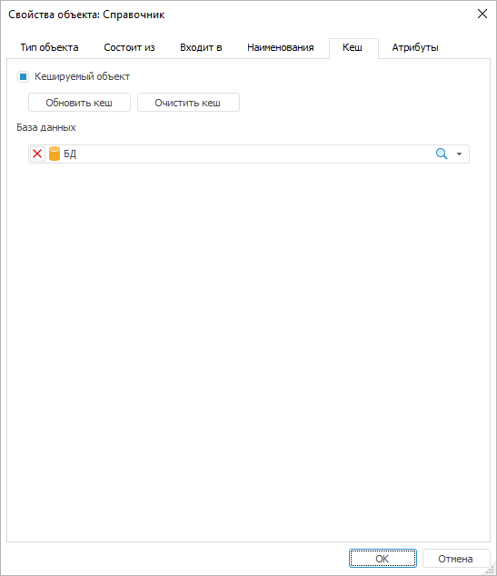

# Кеш: Свойства объекта репозитория

Кеш: Свойства объекта репозитория
-

# Кеш

На вкладке «Кеш» содержатся
 операции для управления работой кеша.

Примечание.
 Вкладка «Кеш» доступна только
 в настольном приложении.

Объекты репозитория, которые оперируют данными из СУБД, для ускорения
 своей работы используют различные виды [кеширования](../02_Navigator/UiNav_Cache.htm).
 Если объект параметрический, то сохраняются экземпляры для каждого набора
 параметров. При открытии объекта необходимый экземпляр данных будет взят
 из кеша. Если были изменены какие-либо данные, то они будут обновлены
 в кеше и в СУБД. При изменении структуры объекта использование сохранённых
 экземпляров кеша будет недоступно.

Примечание.
 После изменения структуры рекомендуется удалить сохраненные экземпляры,
 используя кнопку «Очистить кеш».
 После этого будут сохраняться экземпляры для новой структуры объекта.

[Для открытия
 вкладки](javascript:TextPopup(this))

	Выполните команду «Свойства»
	 в контекстном меню объекта.

Для управления работой кеша доступны операции:

[Кеширование
 объектов](javascript:TextPopup(this))

	Для кеширования объекта:

		- Установите флажок «Кешируемый
		 объект».

		- Выберите базу данных, в которой будет храниться кеш. Если
		 база данных не выбрана, то кеш сохраняется в базу текущего репозитория.

	Примечание.
	 Параметр «База данных» отображается
	 при работе с [глобальным
	 кешем](../02_Navigator/Cache_In_Blob.htm). Если в разделе InMem
	 в файле [settings.xml](Setup.chm::/UiWebSetup/03_Setup_Web/BI_Server_Settings_XML.htm#inmem)
	 или в [настройках
	 системного реестра](Setup.chm::/UiWebSetup/03_Setup_Web/BI_Server_Registry_Key.htm#inmem) для параметра CacheType
	 установлено значение file,
	 то параметр «База данных»
	 не отображается.

	В результате будет настроено кеширование объекта.

	Примечание.
	 Кеширование куба происходит по [варианту
	 отображения](UiNavObj.chm::/Cube/CreateCube/Master_Standart/UiMd_Cube_CreateCube_Master_Standart_7.htm#agr), установленному по умолчанию. При изменении
	 варианта отображения по умолчанию проведите повторное кеширование
	 куба. Различные виды справочников и справочников НСИ по умолчанию
	 используют собственный механизм [кеширования](../02_Navigator/object_caching.htm#rds).

[Обновление
 кеша объекта](javascript:TextPopup(this))

	Для обновления кеша нажмите кнопку «Обновить
	 кеш».

	Совет. Для обновления
	 кеша по расписанию используйте [планировщик задач](UiAppSrv.chm::/UiAppSrv_purpose.htm).

[Сброс
 кеша объекта](javascript:TextPopup(this))

	Для сброса кеша нажмите на кнопку «Очистить
	 кеш».

Примечание.
 База данных, в которой будут храниться кешированные объекты, должна быть
 основана на одной из следующих СУБД: Microsoft SQL Server, Oracle, PostgreSQL/Postgres
 Pro. Версия СУБД должна соответствовать одной из [поддерживаемых версий](Setup.chm::/01_SysReq/database_Support.htm).

См. также:

[Просмотр и редактирование свойств объекта](UiNav_Obj_BasicProp.htm)

		Справочная
		 система на версию 10.9
		 от 18/08/2025,
		 © ООО «ФОРСАЙТ»,
