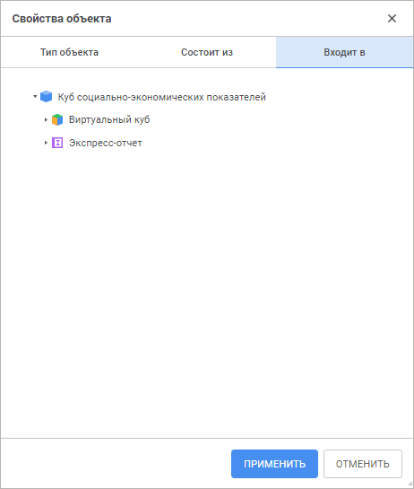
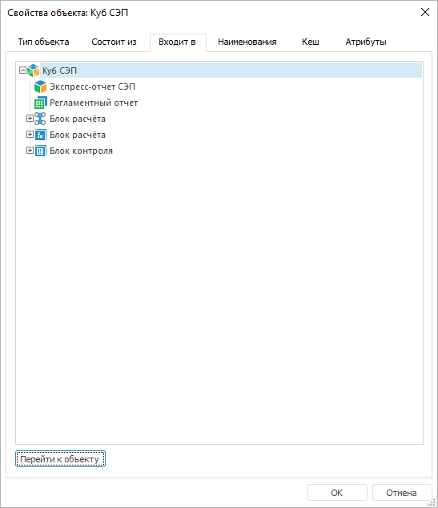

# Входит в: Свойства объекта репозитория

Входит в: Свойства объекта репозитория
-

# Входит в

На вкладке «Входит в» содержится
 иерархия объектов, которые ссылаются на текущий объект. Функция позволяет
 выполнять анализ влияния изменений для источников данных. Например, для
 таблицы отображаются измерения, кубы и отчёты, построенные на основе данных
 из этой таблицы.

Примечание.
 Объект не может быть удалён из репозитория, пока на него ссылается хотя
 бы один другой объект.

[Для открытия
 вкладки](javascript:TextPopup(this))

		- в веб-приложении:

			- выполните команду  «Свойства» в контекстном
			 меню объекта;

			- нажмите сочетание клавиш ALT+ENTER;

		- в настольном приложении выполните команду «Свойства»
		 в контекстном меню объекта.

	Веб-приложение Настольное приложение

		

		

Для работы с иерархией объектов доступны операции:

[Сворачивание/разворачивание
 иерархии объектов](javascript:TextPopup(this))

	Для сворачивания/разворачивания иерархии объектов:

		- используйте экспандеры:

			- в веб-приложении:  и ;

			- в настольном приложении: + и -;

		- используйте команды «Свернуть
		 всю иерархию» и «Развернуть
		 всю иерархию» в контекстном меню объекта.

[Смена вида отображения
 объектов](javascript:TextPopup(this))

	Для смены вида отображения объектов используйте команды в контекстном
	 меню объекта:

		- Отображать наименования;

		- Отображать идентификаторы;

		- Отображать наименования и идентификаторы.

	По умолчанию отображаются наименования объектов репозитория.

[Открытие объекта](javascript:TextPopup(this))

	Для открытия объекта на просмотр выполните команду «Открыть
	 объект» в контекстном меню объекта. После чего объект будет
	 открыт на отдельной вкладке браузера.

	Примечание.
	 Доступно только в веб-приложении.

[Редактирование
 объекта](javascript:TextPopup(this))

	Для открытия объекта на редактирование выполните команду «Редактировать» в контекстном меню
	 объекта. После чего объект будет открыт на отдельной вкладке браузера.

	Примечание.
	 Доступно только в веб-приложении.

[Просмотр и редактирование
 свойств объекта](javascript:TextPopup(this))

	Для просмотра и редактирования свойств объекта выполните команду
	 «Свойства» в контекстном меню
	 объекта. После чего будет открыто окно «[Свойства
	 объекта](UiNav_Obj_BasicProp.htm)».

	Примечание.
	 Доступно только в веб-приложении.

[Переход к объекту](javascript:TextPopup(this))

	Для поиска и перехода к выбранному объекту в навигаторе объектов
	 нажмите кнопку «Перейти к объекту».

	Примечание.
	 Доступно только в настольном приложении.

См. также:

[Просмотр и редактирование свойств объекта](UiNav_Obj_BasicProp.htm)

		Справочная
		 система на версию 10.9
		 от 18/08/2025,
		 © ООО «ФОРСАЙТ»,
