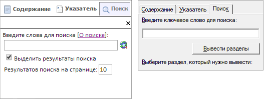

# Какие возможности поиска есть в справочной системе продукта «Форсайт. Аналитическая платформа»?

Какие возможности поиска есть в справочной системе продукта «Форсайт. Аналитическая платформа»?
-

# Какие возможности поиска есть в справочной системе продукта «Форсайт. Аналитическая платформа»?

«Форсайт. Аналитическая платформа»
 предусматривает различные виды справочных систем:

	- локальная справка:

		- в ОС Linux поставляется по запросу через техническую поддержку
		 по адресу [support@fsight.ru](mailto:support@fsight.ru)
		 или через [сервисы
		 технической поддержки](https://www.fsight.ru/support/), которые доступны после регистрации
		 на сайте;

		- в ОС Windows поставляется в комплекте с настольным приложением
		 «Форсайт. Аналитическая платформа»;

	- онлайн-справка.

Поиск информации возможен и в онлайн, и в локальной справочной системе.

[Для
 открытия справочной системы](javascript:TextPopup(this))

		- в веб-приложении выполните команду 
		 «Справка» на боковой панели
		 [навигатора
		 объектов](GetStarted.chm::/Interface/Interface_Navigator.htm);

		- в настольном приложении выполните команду «Справка
		 > Содержание» в главном меню [навигатора
		 объектов](GetStarted.chm::/Interface/Interface_Navigator.htm).

	После выполнения действия будет открыта справочная система, указанная
	 в [настройках платформы](../02_Navigator/UiNav_RepoConfig_Help.htm).

[Для
 выполнения поиска](javascript:TextPopup(this))

		- Откройте справочную систему.

		- Перейдите на вкладку «Поиск».
		 Вид вкладки в онлайн-справке (слева) и в локальной справке (справа):

	

		- Введите искомую фразу в строку поиска.

		- В онлайн-справке задайте дополнительные параметры поиска:

			- для выделения на странице найденных фраз установите
			 флажок «Выделить результаты
			 поиска»;

			- для ограничения количества результатов поиска, отображаемых
			 на вкладке «Поиск»,
			 используйте поле «Результатов
			 поиска на странице».

		- Выполните поиск:

			- в локальной справке.
			 Нажмите клавишу ENTER или кнопку «Вывести
			 разделы»;

			- в онлайн-справке.
			 Нажмите клавишу ENTER или кнопку .

	Поиск будет выполнен. Результаты поиска будут отображены на вкладке
	 «Поиск». В онлайн-справке
	 результаты поиска отображаются в порядке убывания соответствия искомой
	 строке, в локальной справке результаты поиска отображаются в алфавитном
	 порядке.

Примечание.
 В ОС Linux поиск в локальной справке доступен только по ключевым словам
 в указателе.

## Возможности поиска

Возможности поиска в справочной системе продукта «Форсайт. Аналитическая платформа»
 позволяют гибко управлять результатами поиска и выполнять его более эффективно.
 Ниже приведены основные возможности управления поиском путем использования
 простого синтаксиса запросов. Если поисковый запрос не вернул удовлетворительных
 результатов, попробуйте уточнить его, используя описанные ниже возможности.

Особенности поиска:

	- поиск не учитывает регистр, то есть является регистронезависимым.
	 Например, если в строке поиска указано «Отчет»,
	 то будут найдены страницы, содержащие слова «Отчет»,
	 «отчет», «ОТЧЕТ»
	 и так далее;

	- поиск в онлайн-справке выполняется с учетом различных форм слова
	 (морфологии). Например, если в строке поиска указано «отчет»,
	 то будут найдены страницы, содержащие слова «отчет»,
	 «отчеты», «отчетный»
	 и так далее;

	- поиск в локальной справке выполняется по слову целиком. Например,
	 если в строке поиска указано «отчет»,
	 то будут найдены страницы, содержащие только слово «отчет»;

	- поиск в онлайн-справке выполняется без учёта стоп-слов. Стоп-слова
	 самостоятельно не несут никакой смысловой нагрузки. К подобным словам
	 относятся предлоги, междометия, частицы, союзы и прочие.

Русские стоп-слова: а, безо, без, близ, ведь,
 вместо, вне, вот, во, в, даже, да, для, до, если, зато, за, изо, из, из-за,
 из-под, или, итак, и, когда, ко, кроме, к, ли, лишь, между, меж, надо,
 над, на, нет, неужели, не, ни, но, обо, об, ото, оттого, от, о, передо,
 перед, подо, под, поэтому, по, предо, пред, при, про, ради, разве, сквозь,
 со, среди, с, также, тоже, только, уже, у, через, чрез, чтобы.

Английские стоп-слова: a, an, and, are, as,
 at, be, but, by, for, if, in, into, is, it, no, not, of, on, or, s, such,
 t, that, the, their, then, there, these, they, this, to, was, will, with,
 per.

Возможности управления поиском:

[Поиск
 отдельных слов и словосочетаний](javascript:TextPopup(this))

	Для поиска отдельных слов или сочетаний введите требуемые слова
	 в строку поиска.

	Пример:

			 Искомая фраза
			 Результат

			 объекты
			 Будут найдены страницы, содержащие слово «объекты».

			 параметры форматирования
			 Будут найдены страницы, содержащие оба слова: «параметры»
			 и «форматирования»,
			 - а также страницы, содержащие или слово «параметры»,
			 или слово «форматирования».

[Поиск
 фразы целиком](javascript:TextPopup(this))

	Для поиска точной фразы заключите её в двойные кавычки.

	Пример:

			 Искомая фраза
			 Результат

			 "параметры форматирования"
			 Будут найдены страницы, содержащие словосочетание «параметры форматирования».

[Управление
 вхождением отдельных слов или словосочетаний](javascript:TextPopup(this))

	Для управления вхождением отдельных слов или словосочетаний в результаты
	 поиска используйте логические операторы «AND», «OR», «NOT».

	Примечание.
	 Логические операторы обязательно должны быть написаны в верхнем регистре.

	Для того чтобы результат:

		- содержал одновременно все
		 слова или фразы. Используйте оператор «AND»;

		- содержал хотя бы одно слово
		 или фраза. Используйте оператор «OR»;

		- не содержал определенное
		 слово или фразу. Используйте оператор «NOT».

	Пример:

			 Искомая фраза
			 Результат

			 синхронизация AND измерений
			 Будут найдены страницы, содержащие слова «синхронизация»
			 и «измерений».

			 синхронизация OR измерений
			 Будут найдены страницы, содержащие оба слова «синхронизация»
			 и «измерений» или
			 содержащие какое-либо одно из этих слов.

			 синхронизация NOT измерений
			 Будут найдены страницы, содержащие слово «синхронизация»
			 и не содержащие слово «измерений».

[Поиск
 с использованием составных запросов](javascript:TextPopup(this))

	Для создания составных запросов с использованием [логических
	 операторов](#logic) используйте группировку, заключая слова или фразы в
	 круглые скобки.

	Примечание.
	 Данная возможность доступна только в онлайн-справке.

	Пример:

			 Искомая фраза
			 Результат

			 (переход OR гиперссылка) AND отчет
			 Будут найдены страницы, содержащие:

				- слова «переход»
				 и «отчет»;

				- слова «гиперссылка»
				 и «отчет»;

				- слова «гиперссылка»,
				 «переход» и «отчет».

[Поиск
 по маске](javascript:TextPopup(this))

	Для поиска слов по заданной маске используйте символы:

		- «*». Означает любое количество любых символов в данной позиции;

		- «?». Означает один любой символ в данной позиции.

	В запросе можно одновременно использовать несколько символов маски.

	Примечание.
	 Поиск по маске не поддерживается при поиске [фразы целиком](#all).

	Пример:

			 Искомая фраза
			 Результат

			 систем*
			 Будут найдены страницы, содержащие слова, начинающиеся
			 с «систем». Например:
			 «системный», «системные», «систематизация»
			 и др.

			 систем?
			 Будут найдены страницы, содержащие слова, начинающиеся
			 с «систем» и содержащие
			 еще один символ. Например: «система»,
			 «системы», «системе» и др.

[Управление
 расстоянием между словами](javascript:TextPopup(this))

	Для поиска слов, находящихся на определенном расстоянии между собой,
	 используйте спецификацию расстояния: ~N,
	 где N - максимально желаемое
	 количество позиций между словами (расстояние). Слова, между которыми
	 задается расстояние, должны быть заключены в двойные кавычки.

	Примечание.
	 Данная возможность доступна только в онлайн-справке.

	Пример:

			 Искомая фраза
			 Результат

			 "переход гиперссылка"~3
			 Будут найдены страницы, содержащие не более трех слов между
			 словами «переход»
			 и «гиперссылка».
			 Данные слова могут быть в любой форме. Например: «переход
			 по гиперссылке», «отсутствует
			 указанная гиперссылка» и т.д.

[Управление
 важностью отдельных слов или фраз](javascript:TextPopup(this))

	Для управления расположением результатов поиска используйте спецификацию
	 значимости: ^K, где K - коэффициент значимости. Чем
	 выше коэффициент значимости, тем выше расположена страница в результатах
	 поиска. По умолчанию все коэффициенты значимости в запросах считаются
	 равными единице.

	Примечание.
	 Данная возможность доступна только в онлайн-справке.

	Пример:

			 Искомая фраза
			 Результат

			 импорт^3 куб
			 Будут найдены страницы, содержащие слова «импорт»
			 и «куб» в любой форме.
			 В результатах поиска первыми будут идти страницы, содержащие
			 наибольшее количество слов «импорт».

См. также:

[Вопросы и ответы](FAQ.htm) | [Выбор типа справочной
 системы](../02_Navigator/UiNav_RepoConfig_Help.htm)

		Справочная
		 система на версию 10.9
		 от 18/08/2025,
		 © ООО «ФОРСАЙТ»,
