# Выделение ячеек

Выделение ячеек
-

# Выделение ячеек

Принцип выделения ячеек таблицы и табличного листа регламентного отчета
 одинаковый. Шапка и боковик таблицы являются аналогом заголовков столбцов
 и строк табличного листа регламентного отчёта.

Примечание.
 Работа с выделенным диапазоном возможна только в [режиме
 редактирования](uiexpress.chm::/purpose/UiExpress_Purpose_Starting.htm) отчета.

При установке флажка «[Запретить
 выделение](Format/UiReport_Table_Attribute_Others.htm)» в группе элементов «Защита»
 вкладки «Прочее» ячейка станет
 невыделяемой при открытии отчета в режиме просмотра. Контекстное меню
 для такой ячейки вызываться не будет.

Способы выделения ячеек:

[Единичная ячейка](javascript:TextPopup(this))

	Для выделения произвольной ячейки:

		- щёлкните по ней;

		- перейдите к ней с помощью клавиш UP, DOWN, RIGHT, LEFT.

	Для выделения верхней левой ячейки таблицы используйте сочетание
	 клавиш CTRL+HOME.

	Для выделения крайней левой ячейки текущей строки используйте:

		- клавишу HOME;

		- сочетание клавиш CTRL+LEFT.

	Для выделения крайней правой ячейки текущей строки используйте сочетание
	 клавиш CTRL+RIGHT.

	Для выделения крайней верхней ячейки текущего столбца используйте
	 сочетание клавиш CTRL+PAGE UP.

	Для выделения крайней нижней ячейки текущего столбца используйте
	 сочетание клавиш CTRL+PAGE DOWN.

	Для выделения самой правой непустой ячейки в строке используйте
	 клавишу END.

[Строка/столбец
 целиком](javascript:TextPopup(this))

	Для выделения строки целиком:

		- щёлкните по заголовку строки;

		- выделите любую ячейку необходимой строки и нажмите сочетание
		 клавиш SHIFT+ПРОБЕЛ.

	После выполнения одного из действий будет выделена строка:

	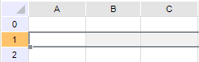

	Для выделения столбца целиком:

		- щёлкните по заголовку столбца;

		- выделите любую ячейку необходимого столбца и нажмите сочетание
		 клавиш CTRL+ПРОБЕЛ.

	После выполнения одного из действий будет выделен столбец:

	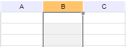

[Несколько строк/столбцов](javascript:TextPopup(this))

	Для выделения нескольких строк выполните одно из действий:

		- щёлкните по заголовку необходимой строки и, удерживая кнопку
		 мыши зажатой, переместите курсор к заголовку желаемой строки;

		- щёлкните по заголовку необходимой строки и, удерживая зажатой
		 клавишу SHIFT, щёлкните по заголовку желаемой строки, после чего
		 отпустите клавишу SHIFT.

	После выполнения одного из действий будет выделено несколько строк:

	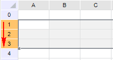

	Для выделения нескольких столбцов выполните одно из действий:

		- щёлкните по заголовку необходимого столбца и, удерживая
		 кнопку мыши зажатой, переместите курсор к заголовку желаемого
		 столбца;

		- щёлкните по заголовку необходимого столбца и, удерживая
		 зажатой клавишу SHIFT, щёлкните по заголовку желаемого столбца,
		 после чего отпустите клавишу SHIFT.

	После выполнения одного из действий будет выделено несколько столбцов:

	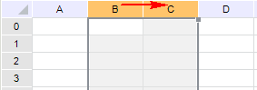

[Диапазон
 ячеек](javascript:TextPopup(this))

	Для выделения диапазона щёлкните по необходимой ячейке и:

		- удерживая зажатой кнопку мыши, переместите курсор к противоположному
		 углу, отпустите кнопку мыши:

	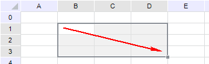

		- удерживая клавишу SHIFT, щёлкните по желаемой ячейке;

		- удерживая клавишу SHIFT, нажмите клавиши UP, DOWN, LEFT,
		 RIGHT.

[Комбинированная
 область](javascript:TextPopup(this))

	Комбинированная область - область, состоящая из нескольких
	 непересекающихся диапазонов и/или единичных ячеек.

	Для получения комбинированной области:

		- Выделите необходимый диапазон ячеек или единичную ячейку.

		- Удерживая зажатой клавишу CTRL, выделите другие необходимые
		 диапазоны/единичные ячейки.

	После выполнения указанных действий будет выделена комбинированная
	 область:

	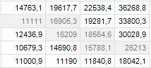

[Весь
 лист](javascript:TextPopup(this))

	Для выделения всего листа данных:

		- щёлкните по левому верхнему углу таблицы, находящемуся на
		 пересечении заголовков строк и столбцов;

	Примечание.
	 Выделение таким способом актуально только для регламентного отчета.

		- нажмите сочетание клавиш CTRL+A или CTRL+SHIFT+ПРОБЕЛ.

	Примечание.
	 Если сфокусированная ячейка не относится к какой-либо области данных,
	 происходит выделение всех ячеек табличного листа. Если сфокусированная
	 ячейка находится внутри области данных, сначала происходит выделение
	 диапазона области данных. При повторном использовании комбинации выделятся
	 все ячейки табличного листа.

	После выполнения одного из действий будет выделен весь лист данных:

	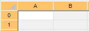

Примечание.
 Для перемещения по ячейкам выделенной области используйте клавишу ENTER.
 При этом снятие рамки выделенной области не произойдет.

## Маркер заполнения

Маркер заполнения - квадратный маркер, находящийся в углу контура
 выделенной области или одиночной ячейки.

В зависимости от выбранного способа выделения ячеек маркер заполнения
 может располагаться по-разному:

	- при выделении диапазона или одиночной ячейки маркер заполнения
	 будет находиться в правом нижнем углу:

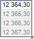

	- при выделении одного столбца или нескольких столбцов маркер
	 заполнения будет находиться в правом верхнем углу:

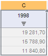

	- при выделении одной строки или нескольких строк маркер заполнения
	 будет находиться в левом нижнем углу:

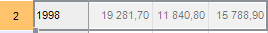

## Возможные операции с выделенными диапазонами

	- Перемещение
	 диапазона. Для перемещения выделенного диапазона:

		- Установите курсор над границей рамки выделенного диапазона.
		 Курсор примет вид указателя - 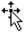.

		- Зажмите кнопку мыши и перетащите выделенный диапазон в необходимое
		 место таблицы.

Примечание.
 При перемещении выделенного диапазона в любую объединенную ячейку появится
 предупреждающее сообщение. Перемещение при этом будет отменено.

	- Копирование
	 диапазона. Для копирования выделенного диапазона:

		- Установите курсор над границей рамки выделенного диапазона
		 и зажмите клавишу CTRL. Курсор примет вид указателя - 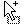.

		- Зажмите кнопку мыши и перетащите выделенный диапазон в необходимое
		 место таблицы.

Примечание.
 При копировании выделенного диапазона в любую объединенную ячейку появится
 предупреждающее сообщение. Копирование будет отменено.

	- [Автоматическое заполнение
	 ячеек данными](UiExpress_Tabl_Operation_AutoFillData.htm).

## Особенности при работе с выделенными
 диапазонами

При выполнении вышеуказанных операций из выделенного диапазона помимо
 данных копируются:

	- оформление ячеек:

		- цвет фона ячейки таблицы;

		- цвет линии границ ячеек таблицы;

		- тип линии границ ячеек таблицы;

		- толщину линии границ ячеек таблицы;

		- формат отображения данных в ячейке таблицы;

		- шрифт текста в ячейке таблицы;

		- выравнивание текста в ячейке таблицы по горизонтали;

		- параметры гиперссылки в ячейке;

		- формат отображения данных в ячейке таблицы с учетом текущей
		 локализации системы, в соответствии с настройками региональных
		 параметров;

		- отступы текста в ячейке таблицы в миллиметрах;

		- узор фона ячейки таблицы;

		- цвет узора фона ячейки таблицы;

		- выравнивание текста в ячейке таблицы по вертикали;

		- способ переноса текста в ячейках таблицы;

		- объединение выделенных ячеек таблицы в одну ячейку;

	- формулы, заданные в адресе ячеек. Формулы при выполнении операций
	 с выделенными диапазонами автоматически корректируются. Для отмены
	 автоматической корректировки при выполнении операций используйте знак
	 «$» в адресе ячейки, который не позволяет меняться соответствующей
	 части формулы.

См. также:

[Работа
 с интерактивными возможностями таблицы](Table_Work.htm) | [Автозаполнение
 ячеек данными](UiExpress_Tabl_Operation_AutoFillData.htm) | [Особенности ввода
 значений в ячейку](Parse_string.htm)

		Справочная
		 система на версию 10.9
		 от 18/08/2025,
		 © ООО «ФОРСАЙТ»,
